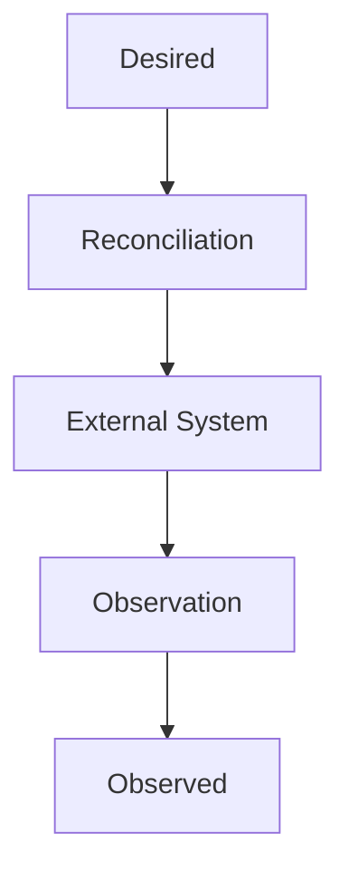
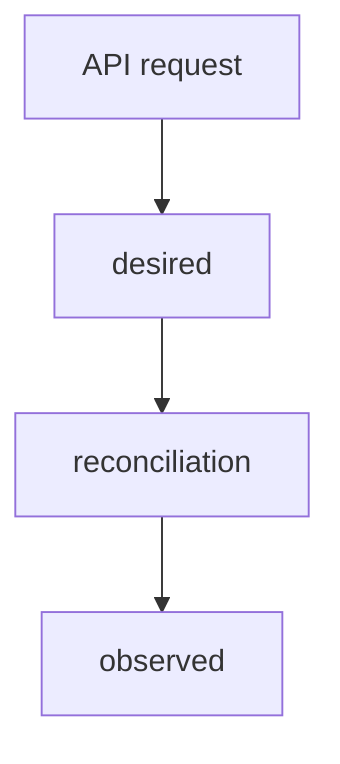
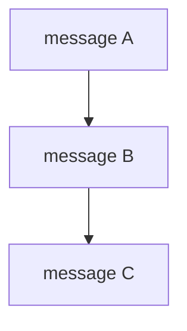
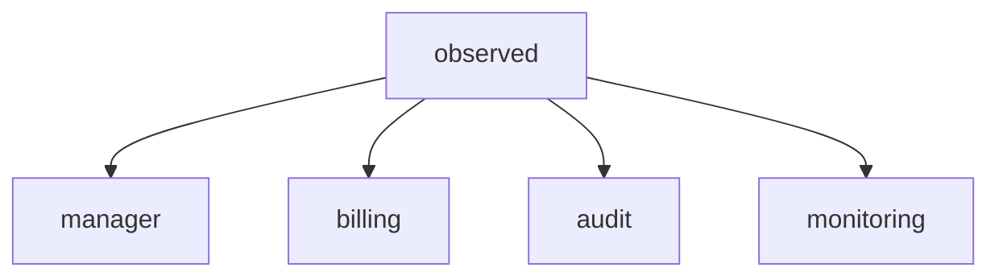
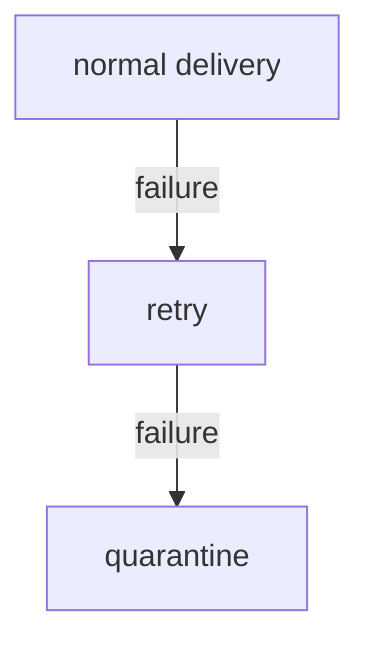
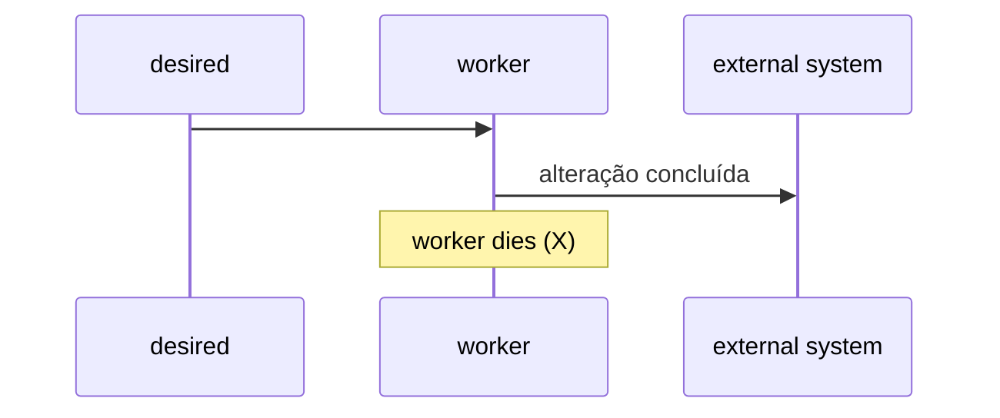

# Modelo Semântico de Mensageria

# 1. Introdução

Este documento define o modelo semântico oficial para comunicação assíncrona entre componentes da plataforma. O modelo é independente do mecanismo de transporte e deve permanecer válido mesmo quando a tecnologia de mensageria for substituída.

A implementação de referência em NATS e NATS JetStream é definida separadamente em `NATS.md`.

Este documento é a fonte de verdade para a semântica, o significado, o endereçamento lógico e os contratos das mensagens.

# 2. Objetivos

O objetivo é estabelecer um modelo consistente, explícito, idempotente e evolutivo para comunicação assíncrona, capaz de representar estado desejado (`desired`) e estado observado (`observed`), suportar diferentes padrões de entrega e permitir a implementação do mesmo contrato em diferentes mecanismos de mensageria.

# 3. Princípios

## 3.1 Semântica antes do transporte

O contrato deve permanecer válido mesmo que o mecanismo de mensageria seja substituído.

Uma abstração própria do broker é uma implementação, não uma definição de domínio.

## 3.2 Emissor explícito

A identidade semântica de uma mensagem começa pelo emissor.

O destinatário não faz parte da identidade semântica da mensagem. O interesse do consumidor é expresso por subscription, binding, consumer, grupo de consumidores, filtro ou mecanismo equivalente do transporte.

A distinção é deliberada:

```text
emissor = quem produziu a mensagem
consumidor = quem possui interesse na mensagem
```

## 3.3 `desired` e `observed`

O modelo possui dois tipos semânticos principais:

- `desired`: estado pretendido pelo sistema;
- `observed`: estado efetivamente observado.

`desired` não é um comando imperativo.

`observed` não é uma confirmação de transporte nem simplesmente um log de execução. É uma representação factual da observação de um recurso.

## 3.4 Declarativo sobre imperativo

Sempre que o problema puder ser modelado como estado, representar o estado desejado em vez de uma sequência de comandos.

Preferir:

```text
manager.desired.underlay.node.node-01
```

como representação lógica de um estado desejado, em vez de transformar o endereço em uma chamada RPC como:

```text
manager.task.underlay.node.update.node-01
```

A operação necessária para alcançar o estado desejado é responsabilidade do reconciler ou worker.

## 3.5 Explícito sobre implícito

Usar nomes que expressem o significado do campo.

Preferir:

```text
messageId
resourceId
resourceType
semanticType
schemaVersion
desiredGeneration
observedGeneration
occurredAt
publishedAt
observedAt
```

Evitar nomes genéricos como:

```text
id
type
version
state
timestamp
```

quando o significado não for inequívoco.

## 3.6 Separação entre identidade da mensagem e identidade do recurso

`messageId` identifica uma mensagem.

`resourceId` identifica um recurso.

Eles nunca devem ser tratados como equivalentes.

## 3.7 Idempotência como requisito

Consumidores de mensagens persistentes devem ser capazes de processar a mesma mensagem mais de uma vez sem corromper o estado ou produzir efeitos cumulativos indevidos.

Não utilizar exatamente-uma-entrega como requisito arquitetural da aplicação.

## 3.8 Falhas são normais

O modelo assume que podem ocorrer:

- duplicação;
- reentrega;
- atraso;
- indisponibilidade temporária;
- reinício do produtor;
- reinício do consumidor;
- perda de conectividade;
- mensagens fora da ordem global;
- falha depois da interação com o sistema externo e antes da publicação de `observed`.

A aplicação deve permanecer correta sob essas condições.

# 4. Modelo conceitual

O ciclo declarativo é:



A mensageria transporta representações de `desired` e `observed` entre componentes.

A aceitação da publicação não significa que o recurso convergiu.

A confirmação de convergência depende da observação processada e persistida pelo sistema responsável.

# 5. Tipos semânticos

## 5.1 `desired`

`desired` representa o estado que o sistema pretende obter.

Características:

- declarativo;
- versionado por `desiredGeneration` quando o recurso possui geração;
- idempotente;
- independente de uma sequência específica de comandos;
- suficientemente completo para que o reconciler determine o delta necessário;
- capaz de representar presença, alteração e ausência do recurso.

Exemplo:

```json
{
  "messageId": "msg-01",
  "schemaVersion": "1.0",
  "semanticType": "desired",
  "emitter": "manager",
  "scope": "underlay",
  "resourceType": "node",
  "resourceId": "node-01",
  "desiredGeneration": 12,
  "occurredAt": "2026-10-03T22:00:00Z",
  "publishedAt": "2026-10-03T22:00:01Z",
  "data": {
    "lifecycle": "present",
    "cpuCount": 16,
    "memoryBytes": 68719476736
  }
}
```

## 5.2 `observed`

`observed` representa o estado efetivamente observado no sistema externo ou no componente que possui autoridade para realizar a observação.

Características:

- factual;
- identifica quando a observação aconteceu;
- pode identificar qual `desiredGeneration` foi observada, quando aplicável;
- deve ser segura para replay;
- pode ser consumida por vários componentes independentes;
- não deve afirmar convergência sem evidência compatível com o contrato do recurso.

Exemplo:

```json
{
  "messageId": "msg-02",
  "schemaVersion": "1.0",
  "semanticType": "observed",
  "emitter": "worker.platform",
  "scope": "underlay",
  "resourceType": "node",
  "resourceId": "node-01",
  "observedGeneration": 12,
  "occurredAt": "2026-10-03T22:00:00Z",
  "publishedAt": "2026-10-03T22:00:02Z",
  "observedAt": "2026-10-03T22:00:00Z",
  "data": {
    "lifecycle": "present",
    "cpuCount": 16,
    "memoryBytes": 68719476736,
    "ready": true
  }
}
```

# 6. Endereçamento lógico

O modelo define um endereço lógico como uma sequência de dimensões semânticas:

```text
<emitter>.<semanticType>.<scope>.<resourceType>[.<resourceId>]
```

A representação acima é uma convenção lógica legível. Um transporte pode representá-la como subject, topic, routing key, destination, headers ou uma combinação desses mecanismos.

## 6.1 `emitter`

Identifica o componente lógico que produziu a mensagem.

Exemplos:

```text
manager
worker.platform
worker.storage
worker.identity
worker.vault
worker.agent
worker.runner
worker.tools
```

O emissor deve representar uma identidade funcional estável, não o identificador efêmero de uma instância de processo.

Quando uma instância específica for relevante para diagnóstico, sua identificação pertence aos metadados de observabilidade.

## 6.2 `semanticType`

Valores principais:

```text
desired
observed
```

A introdução de novos tipos semânticos exige decisão arquitetural explícita. Não criar novos tipos apenas para representar operações locais do consumidor.

## 6.3 `scope`

Representa o contexto arquitetural ou funcional ao qual a mensagem pertence.

Exemplos:

```text
underlay
overlay
identity
platform
```

A lista deve permanecer pequena. O `scope` não deve ser utilizado para codificar atributos arbitrários de tenancy, região, ambiente ou infraestrutura.

## 6.4 `resourceType`

Identifica o conceito de recurso que está sendo desejado ou observado.

Exemplos:

```text
node
vpc
subnet
volume
vm
agent
runner
tool
vault
identityProvider
```

## 6.5 `resourceId`

Identifica o recurso dentro de seu domínio de identidade.

Regras:

- deve ser estável dentro do ciclo de vida do recurso;
- não deve ser confundido com `messageId`;
- não deve carregar informações de roteamento que já tenham dimensão própria;
- não deve depender de uma instância específica do worker.

## 6.6 Identificadores e separadores

Quando o endereço for materializado em um sistema hierárquico que usa separadores, o identificador deve respeitar as regras sintáticas daquele transporte.

Na implementação NATS, especificamente, `.` separa tokens de Subject. Portanto, `resourceId` usado no Subject não deve conter `.`. Essa restrição é do mapeamento NATS e não do modelo semântico.

# 7. Destinatários e consumidores

O modelo não define um destinatário fixo dentro da identidade da mensagem.

Exemplo semântico:

```text
manager.desired.underlay.node.node-01
```

Pode ser consumido por:

```text
worker.platform
```

e, em paralelo, por outro componente que precise acompanhar mudanças de `desired`.

Isso permite que o produtor não conheça todos os consumidores e que novos consumidores sejam adicionados sem alterar o produtor.

A autorização, entretanto, deve restringir quem pode publicar e consumir cada classe de mensagem.

# 8. Envelope da mensagem

Toda mensagem persistente deve possuir um envelope explícito.

Estrutura mínima recomendada:

```json
{
  "messageId": "01J...",
  "schemaVersion": "1.0",
  "semanticType": "desired",
  "emitter": "manager",
  "scope": "underlay",
  "resourceType": "node",
  "resourceId": "node-01",
  "desiredGeneration": 12,
  "correlationId": "01J...",
  "causationId": "01J...",
  "occurredAt": "2026-10-03T22:00:00Z",
  "publishedAt": "2026-10-03T22:00:01Z",
  "data": {}
}
```

## 8.1 Campos

| Campo | Obrigatório | Aplicação | Definição |
|---|---:|---|---|
| `messageId` | Sim | Todos | Identidade única da mensagem |
| `schemaVersion` | Sim | Todos | Versão do contrato da mensagem |
| `semanticType` | Sim | Todos | `desired` ou `observed` |
| `emitter` | Sim | Todos | Emissor lógico |
| `scope` | Sim | Todos | Escopo semântico |
| `resourceType` | Sim | Todos | Tipo de recurso |
| `resourceId` | Condicional | Recursos identificáveis | Identidade do recurso |
| `desiredGeneration` | Sim para `desired`, quando aplicável | Desired | Geração do estado desejado |
| `observedGeneration` | Condicional | Observed | Geração desejada efetivamente relacionada à observação |
| `correlationId` | Recomendado | Fluxos correlacionados | Identificador do fluxo lógico |
| `causationId` | Recomendado | Mensagens causadas por outra | `messageId` da causa |
| `occurredAt` | Sim | Todos | Momento em que a intenção ou fato ocorreu |
| `publishedAt` | Sim | Todos | Momento em que a mensagem foi publicada |
| `observedAt` | Sim para `observed` | Observed | Momento da observação factual |
| `data` | Sim | Todos | Conteúdo semântico específico do recurso |

## 8.2 `schemaVersion`

Versiona o contrato da mensagem.

Não representa:

- versão do recurso;
- versão do estado desejado;
- versão da aplicação;
- versão do broker.

Mudanças incompatíveis exigem nova versão major ou mecanismo equivalente definido pela política de versionamento do projeto.

## 8.3 `desiredGeneration`

Representa a geração lógica do estado desejado.

Uma alteração material em `desired` incrementa a geração.

Exemplo:

```text
Desired generation 10
       ↓
Desired generation 11
       ↓
Desired generation 12
```

A geração é propriedade do recurso/SSOT, não da camada de transporte.

## 8.4 `observedGeneration`

Representa qual geração desejada está relacionada à observação.

Não deve ser preenchido artificialmente apenas para eliminar uma condição de drift.

## 8.5 `resourceVersion`

Quando o domínio utilizar controle otimista de concorrência, `resourceVersion` pode ser incluído como metadado do recurso.

`resourceVersion` não substitui `desiredGeneration` ou `observedGeneration`.

## 8.6 `correlationId`

Relaciona mensagens pertencentes ao mesmo fluxo lógico.

Exemplo:



Todas podem compartilhar o mesmo `correlationId`.

## 8.7 `causationId`

Identifica a mensagem que causou diretamente a produção da mensagem atual.

Exemplo:



Nesse caso:

```text
B.causationId = A.messageId
C.causationId = B.messageId
```

# 9. Conteúdo de `data`

`data` pertence ao contrato do recurso.

O envelope não deve duplicar campos do domínio sem necessidade.

O contrato do recurso deve definir:

- propriedades válidas;
- tipos;
- obrigatoriedade;
- mutabilidade;
- semântica;
- limites;
- regras de compatibilidade.

JSON não deve ser tratado como ausência de schema. Um payload flexível continua precisando de contrato explícito.

# 10. Presença e ausência de recursos

Sistemas declarativos devem representar a ausência desejada sem transformar `delete` em um comando obrigatório do transporte.

Exemplo:

```json
{
  "semanticType": "desired",
  "resourceType": "vm",
  "resourceId": "vm-01",
  "desiredGeneration": 8,
  "data": {
    "lifecycle": "absent"
  }
}
```

O reconciler decide quais operações concretas são necessárias.

Isso preserva a diferença entre:

```text
desired = absent
```

e:

```text
execute delete now
```

# 11. Tenancy e contexto

`organizationId`, `projectId` e outros dados de tenancy devem estar no contexto semântico do recurso ou em metadados explicitamente definidos pelo contrato.

Não inserir tenancy arbitrariamente no endereço de roteamento.

Por exemplo:

```json
{
  "data": {
    "organizationId": "org-01",
    "projectId": "project-01"
  }
}
```

Quando um mecanismo suportar autorização por sujeito, tenant ou namespace, essa capacidade pode ser utilizada no transporte sem contaminar o contrato semântico.

# 12. Padrões de entrega

A semântica da mensagem e o modelo de entrega são dimensões independentes.

## 12.1 Work Distribution

Uma mensagem deve ser processada por uma única instância lógica dentro de um grupo de consumidores concorrentes.

Uso típico:

```text
desired -> reconciliation worker
```

Escalar significa adicionar instâncias ao mesmo grupo lógico de processamento.

## 12.2 Fanout

A mesma mensagem deve ser disponibilizada para consumidores independentes.

Uso típico:



Cada consumidor mantém sua própria progressão.

## 12.3 Request/Reply

Pode ser utilizado quando a interação realmente exige solicitação e resposta síncrona ou semissíncrona.

Não utilizar request/reply para substituir um fluxo que semanticamente é declarativo e assíncrono.

# 13. Idempotência e deduplicação

A aplicação deve ser correta mesmo quando uma mensagem é entregue novamente.

A deduplicação pode ocorrer:

- pelo `messageId`;
- por `resourceId + generation`;
- por versão da observação;
- por chave natural do domínio;
- por constraint transacional no armazenamento.

A estratégia deve ser escolhida pela semântica da operação.

Não depender exclusivamente de deduplicação do broker.

# 14. Ordenação

A ordenação deve ser definida somente quando houver requisito de negócio ou de consistência.

Quando necessária, a unidade de ordenação deve ser explícita:

```text
resourceId
aggregateId
partitionKey
```

O sistema não deve assumir ordenação global entre produtores independentes.

Um consumidor deve ser capaz de reconhecer uma mensagem antiga por geração, versão ou outro mecanismo explícito do domínio.

Regras típicas:

- ignorar `desiredGeneration` inferior à última geração consolidada;
- não sobrescrever `observed` mais recente com observação comprovadamente antiga;
- não usar apenas `publishedAt` como mecanismo de ordering lógico.

# 15. Retry, quarentena e reprocessamento

Falhas transitórias devem permitir retry com backoff.

Falhas permanentes ou mensagens poison devem poder ser encaminhadas a uma área de quarentena.

A quarentena é diferente da perda da mensagem:



Uma mensagem em quarentena deve preservar, quando possível:

- `messageId`;
- endereço lógico original;
- payload original;
- número de tentativas;
- motivo da quarentena;
- timestamps relevantes;
- identidade do consumidor;
- identificação da falha.

Replay deve ser explícito, controlado e auditável.

# 16. Falha após a escrita externa

Um caso crítico ocorre quando o worker altera o sistema externo e falha antes de publicar `observed`.

Exemplo:



A mensagem `desired` deve poder ser reentregue.

O reconciler deve consultar o sistema externo e, ao identificar o estado correto, publicar `observed`.

Isso é uma das razões pelas quais operações de reconciliação devem ser idempotentes.

# 17. Transação entre mensageria e banco

Não assumir transação ACID distribuída entre banco de dados e broker, salvo quando a plataforma específica oferecer mecanismo confiável e isso for uma decisão explícita.

Quando houver necessidade de garantir publicação após uma alteração persistida, utilizar padrões como Outbox/Inbox ou mecanismo equivalente.

A escolha deve considerar complexidade, custo operacional e necessidade real.

Não adicionar uma outbox apenas por padrão arquitetural se o problema não existir.

# 18. Evolução de contratos

Mudanças de contrato devem preservar consumidores existentes quando compatível.

Regras:

- adicionar campos opcionais é preferível a alterar o significado de campos existentes;
- nunca reutilizar um campo para outro significado;
- mudanças incompatíveis devem possuir estratégia explícita de versionamento;
- consumidores devem ignorar extensões que não compreendam, quando o formato permitir;
- produtores devem evitar depender de consumidores conhecerem campos futuros.

# 19. Segurança

Mensagens devem conter apenas os dados necessários para o processamento.

Não transportar:

- senhas;
- tokens secretos;
- chaves privadas;
- credenciais reutilizáveis;
- dados sensíveis sem necessidade explícita.

Segredos devem ser referenciados por identificadores seguros ou recuperados de um sistema especializado de secrets management.

Autenticação, autorização, criptografia em trânsito e, quando aplicável, criptografia em repouso são responsabilidades complementares do transporte e da plataforma.

# 20. Observabilidade

A publicação e o consumo devem ser observáveis sem alterar a semântica da mensagem.

Métricas mínimas recomendadas:

```text
messages_published
messages_consumed
messages_failed
messages_retried
messages_quarantined
processing_duration
publish_duration
consumer_lag
redelivery_count
```

Logs e traces devem correlacionar:

```text
messageId
correlationId
causationId
emitter
resourceId
resourceType
semanticType
```

# 21. Regras de naming

Nomes devem ser:

- explícitos;
- estáveis;
- semanticamente precisos;
- independentes de implementação;
- livres de abreviações desnecessárias.

Preferir:

```text
worker.platform
worker.storage
worker.runner
```

a nomes ambíguos como:

```text
w1
worker-a
processor
handler
service
```

A identificação da instância concreta do processo não deve substituir a identidade funcional do emissor.

# 22. Anti-padrões

## 22.1 Proibido: tratar `desired` como comando

```text
desired = execute create
```

`desired` representa estado pretendido.

## 22.2 Proibido: tratar ACK como convergência

```text
ACK transport
    !=
resource converged
```

## 22.3 Proibido: depender de ordenação global

## 22.4 Proibido: usar `messageId` como `resourceId`

## 22.5 Proibido: colocar detalhes do broker no contrato de domínio

Exemplos:

```text
jetstreamConsumerName
kafkaPartition
rabbitRoutingKey
```

não pertencem ao contrato semântico genérico.

## 22.6 Proibido: colocar segredos no payload

## 22.7 Proibido: criar um novo tipo semântico para cada ação

Evitar uma taxonomia como:

```text
create
update
delete
reported
completed
failed
```

quando esses fatos já puderem ser expressos por `desired`, `observed`, condições e dados do recurso.

# 23. Exemplos completos

## 23.1 Desired de um node

Endereço lógico:

```text
manager.desired.underlay.node.node-01
```

Envelope:

```json
{
  "messageId": "msg-100",
  "schemaVersion": "1.0",
  "semanticType": "desired",
  "emitter": "manager",
  "scope": "underlay",
  "resourceType": "node",
  "resourceId": "node-01",
  "desiredGeneration": 14,
  "correlationId": "flow-100",
  "occurredAt": "2026-10-03T22:00:00Z",
  "publishedAt": "2026-10-03T22:00:01Z",
  "data": {
    "lifecycle": "present",
    "cpuCount": 32,
    "memoryBytes": 137438953472
  }
}
```

## 23.2 Observed de um node

Endereço lógico:

```text
worker.platform.observed.underlay.node.node-01
```

Envelope:

```json
{
  "messageId": "msg-101",
  "schemaVersion": "1.0",
  "semanticType": "observed",
  "emitter": "worker.platform",
  "scope": "underlay",
  "resourceType": "node",
  "resourceId": "node-01",
  "observedGeneration": 14,
  "correlationId": "flow-100",
  "causationId": "msg-100",
  "occurredAt": "2026-10-03T22:00:10Z",
  "publishedAt": "2026-10-03T22:00:11Z",
  "observedAt": "2026-10-03T22:00:10Z",
  "data": {
    "lifecycle": "present",
    "cpuCount": 32,
    "memoryBytes": 137438953472,
    "ready": true
  }
}
```

# 24. Matriz semântica

| Dimensão | `desired` | `observed` |
|---|---|---|
| Significado | Estado pretendido | Estado observado |
| Natureza | Declarativa | Factual |
| Origem típica | Manager / controlador | Worker / adapter / observer |
| Pode ser republicada | Sim | Sim |
| Deve ser idempotente | Sim | Sim |
| Conclui operação | Não | Pode fornecer evidência de convergência |
| Geração típica | `desiredGeneration` | `observedGeneration` |
| Consumo típico | Work distribution | Fanout |
| Conteúdo | Estado alvo | Estado real |

# 25. Responsabilidades por camada

| Camada | Responsabilidade |
|---|---|
| `MESSAGING.md` | Semântica e contrato lógico |
| Contrato do recurso | Modelo de `data` e regras do domínio |
| Aplicação | Publicação, consumo, reconciliação e idempotência |
| Transporte | Entrega, persistência, retry e mecanismos de distribuição |
| `NATS.md` | Implementação de transporte em NATS |
| Infraestrutura | Topologia, recursos, certificados, storage e deployment |

# 26. Critérios de conformidade

Uma implementação está conforme quando:

- diferencia explicitamente `desired` de `observed`;
- identifica o emissor de forma estável;
- não exige destinatário no contrato semântico;
- separa `messageId` de `resourceId`;
- utiliza gerações quando o domínio exige versionamento declarativo;
- suporta reentrega sem corrupção;
- não depende de ordering global;
- não trata ACK de transporte como convergência;
- mantém contratos versionáveis;
- não transporta segredos sem necessidade;
- consegue mapear a semântica para mais de um mecanismo de mensageria.

# 27. Fonte de verdade

Este documento é a fonte de verdade para a **semântica de mensageria**.

Decisões específicas do NATS são definidas em `NATS.md`.

Quando houver conflito entre a semântica definida aqui e uma limitação ou convenção específica do transporte, o transporte deve ser adaptado ou a decisão arquitetural deve ser registrada explicitamente. O broker não redefine o significado do domínio.
