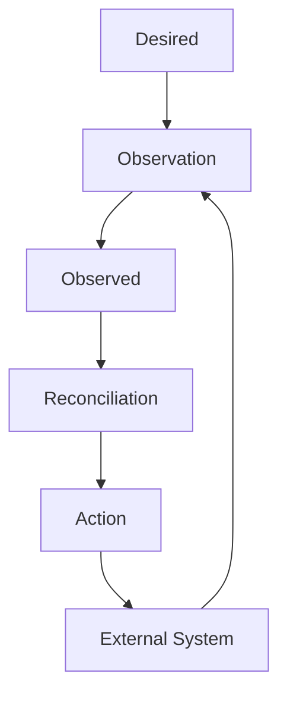
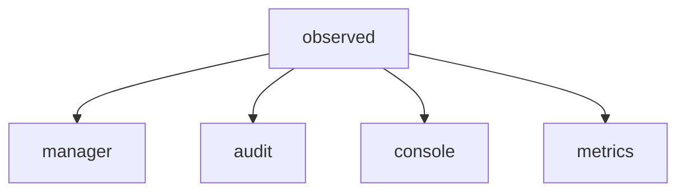
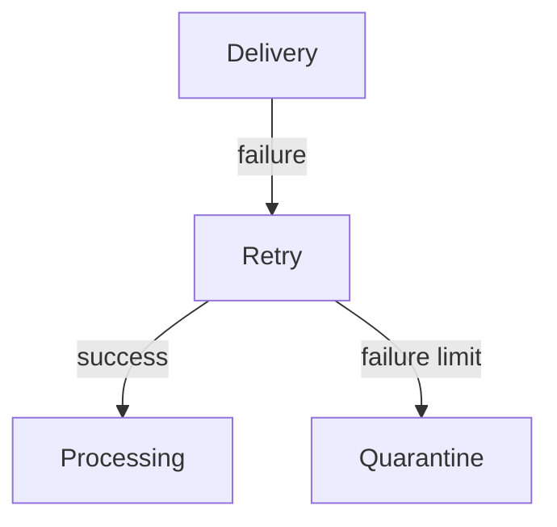
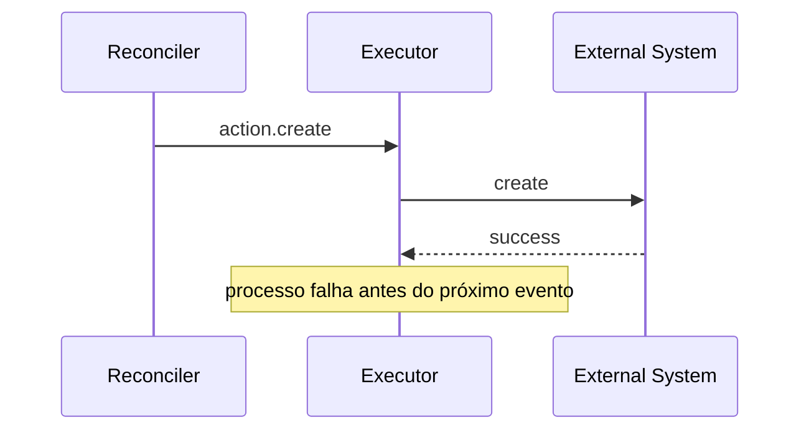

# Modelo Semântico de Mensageria

# 1. Introdução

Este documento define o modelo semântico oficial para comunicação assíncrona entre componentes da plataforma.

O modelo é independente do mecanismo de transporte e deve permanecer válido mesmo quando a tecnologia de mensageria for substituída.

A implementação de referência em NATS e NATS JetStream é definida separadamente em `NATS.md`.

Este documento é a fonte de verdade para:

- semântica das mensagens;
- tipos de mensagens;
- endereçamento lógico;
- identificação do emissor;
- identificação do recurso;
- operações associadas;
- envelope das mensagens;
- idempotência;
- ordenação;
- correlação;
- evolução de contratos;
- responsabilidades entre aplicação e transporte.

# 2. Objetivos

O objetivo é estabelecer um modelo consistente, explícito, idempotente e evolutivo para comunicação assíncrona.

O modelo deve:

- representar estado desejado (`desired`) e estado observado (`observed`);
- representar solicitações, ações e resultados quando semanticamente necessário;
- permitir endereçamento lógico por emissor, módulo, recurso e operação;
- permitir múltiplos consumidores independentes;
- suportar diferentes padrões de entrega;
- permitir implementação em diferentes mecanismos de mensageria;
- suportar reentrega, retry e replay;
- permitir evolução controlada dos contratos;
- preservar a separação entre domínio e tecnologia de transporte.

# 3. Princípios

## 3.1 Semântica antes do transporte

O contrato deve permanecer válido mesmo que o mecanismo de mensageria seja substituído.

Uma abstração própria do broker é uma implementação, não uma definição de domínio.

Exemplos de conceitos que não pertencem ao modelo semântico:

```text
JetStream Consumer
Kafka Partition
RabbitMQ Exchange
Kafka Offset
NATS Stream
```

Esses conceitos pertencem à implementação do transporte.

## 3.2 Emissor explícito

A identidade semântica de uma mensagem começa pelo emissor.

O destinatário não faz parte da identidade semântica da mensagem.

A distinção é deliberada:

```text
emitter   = quem produziu a mensagem
consumer  = quem possui interesse na mensagem
```

O interesse do consumidor é expresso por subscription, consumer, grupo de consumidores, filtro, binding ou mecanismo equivalente do transporte.

Exemplo:

```text
manager.desired.ipm.tenant.<resourceId>.changed
```

O subject não afirma que a mensagem é destinada exclusivamente a um determinado consumidor.

## 3.3 Tipos semânticos explícitos

Cada mensagem deve declarar claramente **o que ela representa**.

O modelo utiliza um vocabulário controlado de `messageType`:

```text
requested
desired
observed
action
completed
updated
failed
```

O `messageType` não identifica a operação.

A operação é representada separadamente pelo último token do endereço:

```text
<messageType> ... <operation>
```

Exemplo:

```text
reconciler.action.ipm.tenant.<id>.create
```

onde:

```text
action = tipo da mensagem
create = operação associada
```

## 3.4 `desired` e `observed`

O modelo possui dois tipos semânticos fundamentais:

- `desired`: estado pretendido pelo sistema;
- `observed`: estado efetivamente observado.

`desired` não é um comando imperativo.

`observed` não é uma confirmação de transporte nem simplesmente um log de execução.

`observed` representa uma evidência factual sobre a realidade de um recurso.

## 3.5 Declarativo sobre imperativo

Sempre que o problema puder ser modelado como estado, representar o estado desejado em vez de uma sequência de comandos.

Preferir:

```text
manager.desired.ipm.tenant.<tenantId>.changed
```

quando a mensagem representa o estado desejado para um Tenant.

A operação concreta necessária para alcançar esse estado é responsabilidade do reconciler e do executor.

Não transformar o endereço de mensageria em uma API RPC imperativa.

## 3.6 Explícito sobre implícito

Usar nomes que expressem o significado do campo.

Preferir:

```text
messageId
resourceId
resourceType
messageType
schemaVersion
desiredGeneration
observedGeneration
occurredAt
publishedAt
observedAt
correlationId
causationId
```

Evitar:

```text
id
type
version
state
timestamp
```

quando o significado não for inequívoco.

## 3.7 Separação entre identidade da mensagem e identidade do recurso

`messageId` identifica uma mensagem.

`resourceId` identifica um recurso.

Eles nunca devem ser tratados como equivalentes.

```text
messageId  != resourceId
```

## 3.8 Idempotência como requisito

Consumidores de mensagens persistentes devem ser capazes de processar a mesma mensagem mais de uma vez sem corromper o estado ou produzir efeitos cumulativos indevidos.

Não utilizar exatamente-uma-entrega como requisito arquitetural da aplicação.

## 3.9 Falhas são normais

O modelo assume que podem ocorrer:

- duplicação;
- reentrega;
- atraso;
- indisponibilidade temporária;
- reinício do produtor;
- reinício do consumidor;
- perda de conectividade;
- mensagens fora da ordem global;
- falha depois da interação com o sistema externo e antes da publicação de `observed`.

A aplicação deve permanecer correta sob essas condições.

# 4. Modelo conceitual

O ciclo declarativo é:



A mensageria transporta representações dos diferentes fatos e estados desse ciclo.

O fluxo típico é:

```text
Requested
    ↓
Manager
    ↓
Desired
    ↓
Observer
    ↓
Observed
    ↓
Reconciler
    ↓
Action
    ↓
Executor
    ↓
External System
    ↓
Observed
    ↓
Manager
    ↓
Updated
```

A aceitação da publicação não significa que o recurso convergiu.

A convergência depende de uma observação compatível com o estado desejado e processada pelo componente responsável.

# 5. Tipos de mensagem

## 5.1 `requested`

Representa uma solicitação recebida para iniciar uma operação sobre um recurso.

Exemplo:

```text
api.requested.ipm.tenant.<tenantId>.create
```

Semântica:

> A API recebeu e aceitou uma solicitação para criação do recurso.

`requested` normalmente representa a entrada de um fluxo assíncrono.

A validação interna da solicitação não precisa gerar uma mensagem `validated`.

## 5.2 `desired`

Representa o estado desejado estabelecido pelo componente responsável pelo SSOT.

Exemplo:

```text
manager.desired.ipm.tenant.<tenantId>.changed
```

Características:

- declarativo;
- versionado por `desiredGeneration`;
- idempotente;
- independente de uma sequência específica de comandos;
- suficientemente completo para que o reconciler determine o delta necessário;
- uma mensagem de estado: o `desired` mais recente do recurso (maior `desiredGeneration`) substitui os anteriores. A operação é sempre `changed`.

## 5.3 `observed`

Representa uma observação factual sobre a realidade.

Exemplo:

```text
observer.observed.ipm.tenant.<tenantId>.changed
```

O resultado da observação não faz parte do endereço. Ele é informado no campo `presence` do envelope:

| `presence` | Significado |
|---|---|
| `present` | O recurso foi lido e existe. |
| `absent` | O provider confirmou, de forma inequívoca, que o recurso não existe. |
| `unknown` | A leitura falhou ou foi inconclusiva. |

Características:

- factual;
- identifica quando a observação ocorreu (`observedAt`, obrigatório);
- uma mensagem de estado: a observação mais recente do recurso substitui as anteriores. A operação é sempre `changed`;
- pode identificar qual `desiredGeneration` está relacionada à observação;
- deve ser segura para replay;
- pode ser consumida por vários componentes.

## 5.4 `action`

Representa uma decisão de reconciliação que deve ser executada.

Exemplo:

```text
reconciler.action.ipm.tenant.<tenantId>.create
```

`action` é diferente de `desired`.

```text
desired = o estado que queremos
action  = o que o reconciler decidiu fazer para chegar ao estado desejado
```

O `action` é uma mensagem operacional derivada do processo de reconciliação.

Toda `action` possui um `actionId` determinístico, derivado de `resourceId`, `desiredGeneration`, `operation` e da observação que motivou a decisão (o `messageId` do `observed` utilizado). A mesma decisão sobre o mesmo estado e a mesma observação produz o mesmo `actionId`, o que permite deduplicar reentregas e reemissões. Uma nova observação produz um novo `actionId`, para que a correção de um drift não seja descartada como duplicata.

O Reconciler decide.

O Executor executa.

## 5.5 `completed`

Representa a conclusão da execução de uma operação.

Exemplo:

```text
executor.completed.ipm.tenant.<tenantId>.create
```

`completed` não significa necessariamente convergência do recurso.

Ele significa que a operação executada foi concluída conforme o contrato do Executor.

A convergência deve continuar sendo determinada por `observed`.

## 5.6 `updated`

Representa uma alteração consolidada no recurso ou no seu estado persistido.

Exemplo:

```text
manager.updated.ipm.tenant.<tenantId>.changed
```

O `updated` é útil para consumidores interessados em projeções, auditoria, métricas ou notificações.

Não deve ser utilizado como substituto de `desired` ou `observed`.

## 5.7 `failed`

Representa falha na execução ou processamento associado à operação.

Exemplo:

```text
executor.failed.ipm.tenant.<tenantId>.create
```

O último token continua representando a operação:

```text
create
```

O resultado é:

```text
failed
```

`failed` e `completed` representam resultados distintos da mesma operação.

## 5.8 Classes de mensagem

Os tipos de mensagem pertencem a três classes, que determinam o modelo de entrega e de retenção esperado:

| Classe | Tipos | Característica | Entrega |
|---|---|---|---|
| Trabalho | `requested`, `action` | Deve ser processada uma vez por um grupo de instâncias e deixa de existir após o processamento | Work Distribution |
| Estado | `desired`, `observed` | A mais recente por recurso substitui as anteriores e deve estar disponível para novos consumidores e após restart | Fanout, com retenção do último estado por recurso |
| Fato | `completed`, `failed`, `updated` | Registro imutável de algo que ocorreu, consumido por vários consumidores independentes | Fanout, com retenção por tempo |

Mensagens de estado utilizam sempre a operação `changed`, de modo que cada recurso possua um único endereço por tipo de estado. A mensagem de estado mais recente é identificada por geração (`desiredGeneration`) ou por `observedAt`, nunca apenas por `publishedAt`.

O mapeamento das classes para retenção e Streams pertence à implementação do transporte (`NATS.md`).

# 6. Endereçamento lógico

O endereço lógico oficial é:

```text
<emitter>.<messageType>.<module>.<resourceType>.<resourceId>.<operation>
```

Exemplo:

```text
manager.desired.ipm.tenant.0199c8a4.changed
```

A representação acima é uma convenção lógica legível.

Um transporte pode representá-la como:

- subject;
- topic;
- routing key;
- destination;
- headers;
- combinação desses mecanismos.

## 6.1 `emitter`

Identifica o componente lógico que produziu a mensagem.

Exemplos:

```text
api
manager
observer
reconciler
executor
worker.platform
worker.storage
worker.identity
worker.vault
worker.agent
worker.runner
worker.tools
```

O emissor deve representar uma identidade funcional estável.

A identificação da instância concreta do processo pertence aos metadados de observabilidade.

## 6.2 `messageType`

Identifica o significado da mensagem.

Valores oficiais iniciais:

```text
requested
desired
observed
action
completed
updated
failed
```

O conjunto deve permanecer pequeno.

Não criar um novo `messageType` apenas para representar cada operação.

## 6.3 `module`

Identifica o módulo funcional da plataforma ao qual a mensagem pertence.

Exemplos:

```text
ipm
agent
runner
tool
platform
```

O módulo permite separar domínios independentes sem introduzir detalhes específicos do transporte.

Exemplo:

```text
api.requested.ipm.tenant.<id>.create
```

## 6.4 `resourceType`

Identifica o tipo de recurso.

Exemplos:

```text
tenant
agent
runner
tool
node
vpc
subnet
volume
vm
```

O `resourceType` deve utilizar a terminologia oficial do domínio.

## 6.5 `resourceId`

Identifica o recurso.

Regras:

- deve ser estável durante o ciclo de vida do recurso;
- deve ser opaco;
- não deve carregar significado de negócio;
- não deve ser confundido com `messageId`;
- não deve ser substituído pelo nome amigável do recurso;
- não deve depender da instância do consumidor.

UUIDv7 é o padrão adotado para `resourceId` quando aplicável.

## 6.6 `operation`

Identifica a operação semântica relacionada à mensagem.

Valores iniciais:

```text
create
update
delete
changed
reconcile
noop
```

A lista deve ser controlada pelo domínio.

A operação não representa necessariamente uma chamada direta a um sistema externo.

`desired` e `observed` são mensagens de estado e utilizam sempre `changed`. O resultado da observação (`present`, `absent`, `unknown`) pertence ao campo `presence`, e não à operação.

Exemplos:

```text
manager.desired.ipm.tenant.<id>.changed
```

```text
observer.observed.ipm.tenant.<id>.changed
```

```text
reconciler.action.ipm.tenant.<id>.create
```

```text
manager.updated.ipm.tenant.<id>.changed
```

A operação deve ser interpretada em conjunto com o `messageType`.

Assim:

```text
observed + changed, com presence = absent
```

significa:

> o recurso foi observado como ausente.

Enquanto:

```text
action + create
```

significa:

> o reconciler determinou a execução de uma criação.

# 7. Exemplo do fluxo completo

Para criação de um Tenant:

```text
1. api.requested.ipm.tenant.<id>.create

2. manager.desired.ipm.tenant.<id>.changed

3. observer.observed.ipm.tenant.<id>.changed

4. reconciler.action.ipm.tenant.<id>.create

5. executor.completed.ipm.tenant.<id>.create

6. observer.observed.ipm.tenant.<id>.changed

7. manager.updated.ipm.tenant.<id>.changed
```

Os passos 3 e 6 possuem o mesmo endereço. Eles se distinguem pelo campo `presence` (`absent` e `present`) e por `observedAt`.

Em caso de falha:

```text
executor.failed.ipm.tenant.<id>.create
```

O fluxo não deve interpretar `completed` como convergência automática.

A convergência continua sendo determinada por:

```text
Desired
    =
Observed
```

de acordo com as regras específicas do recurso.

# 8. Destinatários e consumidores

O modelo não define um destinatário fixo dentro da identidade da mensagem.

Exemplo:

```text
manager.desired.ipm.tenant.<id>.changed
```

Pode ser consumido por:

```text
observer
audit
console
metrics
reconciler
```

conforme o contrato e o interesse de cada consumidor.

O produtor não deve precisar conhecer todos os consumidores.

Novos consumidores podem ser adicionados sem alterar o produtor.

A autorização deve, entretanto, restringir quem pode publicar e consumir cada classe de mensagem.

# 9. Envelope da mensagem

Toda mensagem persistente deve possuir um envelope explícito.

Estrutura mínima:

```json
{
  "messageId": "01J...",
  "schemaVersion": "1.0",
  "messageType": "desired",
  "emitter": "manager",
  "module": "ipm",
  "resourceType": "tenant",
  "resourceId": "01J...",
  "operation": "changed",
  "desiredGeneration": 1,
  "requestedBy": "01J...",
  "correlationId": "01J...",
  "causationId": "01J...",
  "occurredAt": "2026-10-04T00:00:00Z",
  "publishedAt": "2026-10-04T00:00:01Z",
  "data": {}
}
```

Para `observed`:

```json
{
  "messageId": "01J...",
  "schemaVersion": "1.0",
  "messageType": "observed",
  "emitter": "observer",
  "module": "ipm",
  "resourceType": "tenant",
  "resourceId": "01J...",
  "operation": "changed",
  "presence": "present",
  "observedGeneration": 1,
  "correlationId": "01J...",
  "causationId": "01J...",
  "occurredAt": "2026-10-04T00:00:10Z",
  "publishedAt": "2026-10-04T00:00:11Z",
  "observedAt": "2026-10-04T00:00:10Z",
  "data": {}
}
```

# 10. Campos do envelope

| Campo | Obrigatório | Aplicação | Definição |
|---|---:|---|---|
| `messageId` | Sim | Todos | Identidade única da mensagem |
| `schemaVersion` | Sim | Todos | Versão do contrato da mensagem |
| `messageType` | Sim | Todos | Tipo semântico da mensagem |
| `emitter` | Sim | Todos | Emissor lógico |
| `module` | Sim | Todos | Módulo funcional |
| `resourceType` | Sim | Recursos | Tipo de recurso |
| `resourceId` | Sim | Mensagens específicas de recurso | Identidade do recurso |
| `operation` | Sim | Todos | Operação ou resultado semântico associado |
| `desiredGeneration` | Condicional | `desired` | Geração do estado desejado |
| `observedGeneration` | Condicional | `observed` | Geração desejada relacionada à observação |
| `presence` | Sim | `observed` | Resultado da observação: `present`, `absent` ou `unknown` |
| `actionId` | Condicional | `action`, `completed`, `failed` | Identidade determinística da decisão de reconciliação |
| `requestedBy` | Condicional | Fluxo originado por uma solicitação | Identificador opaco do solicitante autenticado |
| `correlationId` | Recomendado | Fluxos correlacionados | Identificador do fluxo lógico |
| `causationId` | Recomendado | Mensagens causadas por outra | `messageId` da causa |
| `occurredAt` | Sim | Todos | Momento em que o fato ocorreu |
| `publishedAt` | Sim | Todos | Momento em que foi publicada |
| `observedAt` | Sim | `observed` | Momento da observação |
| `data` | Sim | Todos | Conteúdo específico do recurso |

## 10.1 Regras dos campos de decisão e rastreabilidade

- **`presence`:** `unknown` indica leitura falha ou inconclusiva (timeout, 5xx, 401/403, limite de taxa) e nunca deve ser tratado como `absent`. Somente a confirmação inequívoca do provider é `absent`.
- **`actionId`:** derivado de `resourceId`, `desiredGeneration`, `operation` e do `messageId` do `observed` que motivou a decisão. O formato é definido pelo contrato do recurso. É a chave de deduplicação da `action` e acompanha `completed` e `failed`.
- **`causationId` em `observed`:** uma observação feita em consequência de `completed` ou `failed` tem como `causationId` o `messageId` desse resultado. O Reconciler usa essa relação para saber que a leitura é posterior à execução, sem depender de relógios sincronizados entre serviços.
- **`requestedBy`:** identifica quem pediu a alteração, e não quem a executou (o executor é identificado por `emitter`). É definido pela API a partir do solicitante autenticado e propagado sem alteração. Não contém credenciais.

# 11. `schemaVersion`

Versiona o contrato estrutural e semântico da mensagem.

Não representa:

- versão do recurso;
- versão do estado desejado;
- versão da aplicação;
- versão do broker;
- `resourceVersion`.

Mudanças incompatíveis exigem estratégia explícita de versionamento.

# 12. `desiredGeneration`

Representa a geração lógica do estado desejado.

Uma alteração material em `desired` incrementa a geração.

Exemplo:

```text
desiredGeneration = 10
        ↓
desiredGeneration = 11
        ↓
desiredGeneration = 12
```

A geração é propriedade do recurso/SSOT, não do transporte.

# 13. `observedGeneration`

Representa a geração desejada à qual a observação está relacionada.

Não deve ser preenchido artificialmente.

Exemplo:

```text
desiredGeneration  = 12
observedGeneration = 11
```

indica que a observação ainda está relacionada a uma geração anterior.

Uma observação compatível com a geração atual pode indicar:

```text
desiredGeneration  = 12
observedGeneration = 12
```

Isso, isoladamente, não garante convergência. As condições e demais regras do recurso também precisam ser consideradas.

# 14. `resourceVersion`

Quando o domínio utilizar controle otimista de concorrência, `resourceVersion` pode ser incluído no recurso ou no envelope conforme o contrato.

`resourceVersion` é uma string opaca.

Não deve ser interpretado como:

- número sequencial;
- timestamp;
- geração;
- ordenação global.

Não substitui:

```text
desiredGeneration
observedGeneration
messageId
```

# 15. `correlationId`

Relaciona mensagens pertencentes ao mesmo fluxo lógico.

Exemplo:

```text
api.requested
       │
       ├── manager.desired
       │
       ├── observer.observed
       │
       ├── reconciler.action
       │
       └── executor.completed
```

Todas podem compartilhar:

```text
correlationId = flow-001
```

`correlationId` não substitui `messageId`.

# 16. `causationId`

Identifica a mensagem que causou diretamente a produção da mensagem atual.

Exemplo:

```text
Message A
    ↓
Message B
    ↓
Message C
```

Então:

```text
B.causationId = A.messageId
C.causationId = B.messageId
```

Isso permite reconstruir causalidade sem transformar a mensageria em um log de execução obrigatório.

# 17. Conteúdo de `data`

`data` pertence ao contrato do recurso.

O envelope não deve duplicar campos do domínio sem necessidade.

O contrato do recurso deve definir:

- propriedades válidas;
- tipos;
- obrigatoriedade;
- mutabilidade;
- semântica;
- limites;
- regras de compatibilidade.

JSON não deve ser tratado como ausência de schema.

Um payload flexível continua precisando de contrato explícito.

# 18. Presença e ausência de recursos

Sistemas declarativos devem representar a ausência desejada sem transformar `delete` em um comando obrigatório do transporte.

Exemplo:

```json
{
  "messageType": "desired",
  "module": "ipm",
  "resourceType": "tenant",
  "resourceId": "tenant-01",
  "operation": "changed",
  "desiredGeneration": 8,
  "data": {
    "lifecycle": "absent"
  }
}
```

O reconciler decide quais ações concretas são necessárias.

Da mesma forma, uma observação pode representar a ausência:

```text
observer.observed.ipm.tenant.<id>.changed
presence = absent
```

A diferença é:

```text
desired + lifecycle = absent
```

representa intenção.

```text
observed + presence = absent
```

representa realidade observada.

# 19. Tenancy e contexto

Dados de tenancy pertencem ao contexto semântico do recurso ou ao contrato específico do domínio.

Exemplo:

```json
{
  "data": {
    "organizationId": "org-01",
    "projectId": "project-01"
  }
}
```

Não inserir tenancy arbitrariamente no endereço de roteamento.

Quando o transporte possuir mecanismos de autorização por tenant ou namespace, eles podem ser utilizados sem alterar a semântica da mensagem.

# 20. Padrões de entrega

A semântica da mensagem e o modelo de entrega são dimensões independentes.

## 20.1 Work Distribution

Uma mensagem deve ser processada por uma única instância lógica dentro de um grupo de consumidores concorrentes.

Aplica-se às mensagens de trabalho (`requested`, `action`).

Uso típico:

```text
requested → Manager
action    → Executor
```

Escalar significa adicionar instâncias ao mesmo grupo lógico.

## 20.2 Fanout

A mesma mensagem deve estar disponível para consumidores independentes.

Aplica-se às mensagens de estado e de fato (`desired`, `observed`, `completed`, `failed`, `updated`).

Uso típico:



Cada consumidor mantém sua própria progressão.

## 20.3 Request/Reply

Pode ser utilizado quando a interação realmente exige solicitação e resposta.

Não utilizar request/reply para substituir um fluxo que semanticamente é declarativo e assíncrono.

# 21. Idempotência e deduplicação

A aplicação deve permanecer correta quando uma mensagem for entregue novamente.

A deduplicação pode utilizar:

- `messageId`;
- `resourceId + desiredGeneration`;
- `resourceId + observedGeneration`;
- `actionId`;
- chave natural do domínio;
- constraint transacional;
- combinação desses mecanismos.

A estratégia deve ser definida pela semântica da operação.

Não depender exclusivamente da deduplicação do broker.

# 22. Ordenação

A ordenação deve ser utilizada somente quando houver requisito de negócio ou consistência.

Quando necessária, a unidade de ordenação deve ser explícita:

```text
resourceId
aggregateId
orderingKey
```

Não assumir ordenação global entre produtores independentes.

O consumidor deve ser capaz de identificar uma mensagem antiga por:

- geração;
- versão;
- sequência específica do domínio;
- outro mecanismo explícito.

Nunca utilizar apenas `publishedAt` como mecanismo de ordering lógico.

Nas mensagens de estado, a mais recente é identificada por `desiredGeneration` (`desired`) ou por `observedAt` (`observed`). Uma mensagem de estado mais antiga que a já conhecida é ignorada.

# 23. Retry, quarentena e replay

Falhas transitórias devem permitir retry com backoff.

Falhas permanentes ou mensagens poison devem poder ser encaminhadas para quarentena.



Uma mensagem em quarentena deve preservar, quando possível:

- `messageId`;
- endereço lógico original;
- payload original;
- número de tentativas;
- motivo da quarentena;
- timestamps;
- identidade do consumidor;
- identificação da falha.

Replay deve ser explícito, controlado e auditável.

# 24. Falha após a escrita externa

Um caso crítico ocorre quando o Executor altera o sistema externo e falha antes de publicar `completed` ou antes de uma nova observação.

Exemplo:



O `desired` original deve continuar podendo ser processado.

O Observer deve consultar o sistema externo.

Se identificar que o recurso existe, deve publicar:

```text
observer.observed.ipm.tenant.<id>.changed
presence = present
```

Isso permite recuperar o estado sem depender da confirmação perdida.

Por esse motivo, a execução e a reconciliação devem ser idempotentes.

# 25. Transação entre mensageria e banco

Não assumir transação ACID distribuída entre banco de dados e broker.

Quando houver necessidade de garantir publicação após uma alteração persistida, utilizar:

- Outbox;
- Inbox;
- ou mecanismo equivalente.

No caso do Manager:

```text
persist Resource
persist Outbox
        ↓
transaction commit
        ↓
publish Desired
```

A implementação deve evitar o estado:

```text
database = committed
broker    = not published
```

sem mecanismo de recuperação.

A adoção de Outbox deve considerar simplicidade e necessidade real, mas o risco de split-brain entre persistência e publicação deve ser tratado explicitamente.

# 26. Evolução de contratos

Mudanças de contrato devem preservar consumidores existentes quando compatível.

Regras:

- adicionar campos opcionais é preferível a alterar o significado de campos existentes;
- nunca reutilizar um campo para outro significado;
- mudanças incompatíveis devem possuir estratégia explícita de versionamento;
- consumidores devem ignorar extensões quando o formato permitir;
- produtores não devem depender de consumidores conhecerem campos futuros;
- `messageType` e `operation` devem possuir vocabulário controlado.

Não utilizar `operation` para introduzir uma nova categoria semântica de mensagem.

# 27. Segurança

Mensagens devem conter apenas os dados necessários para processamento.

Não transportar:

- senhas;
- tokens secretos;
- chaves privadas;
- credenciais reutilizáveis;
- secrets sem necessidade explícita.

Segredos devem ser referenciados por identificadores seguros ou recuperados de um sistema especializado de secrets management.

`requestedBy` é um identificador opaco do solicitante, e não uma credencial.

Autenticação, autorização, criptografia em trânsito e, quando aplicável, criptografia em repouso são responsabilidades complementares do transporte e da plataforma.

# 28. Observabilidade

A publicação e o consumo devem ser observáveis sem alterar a semântica da mensagem.

Métricas mínimas recomendadas:

```text
messages_published
messages_consumed
messages_failed
messages_retried
messages_quarantined
processing_duration
publish_duration
consumer_lag
redelivery_count
```

Logs e traces devem correlacionar:

```text
messageId
correlationId
causationId
actionId
emitter
module
resourceId
resourceType
messageType
operation
```

A identidade da instância do processo pode ser registrada separadamente.

# 29. Naming

Os nomes devem ser:

- explícitos;
- estáveis;
- semanticamente precisos;
- independentes de implementação;
- livres de abreviações desnecessárias.

Preferir:

```text
worker.platform
worker.storage
worker.runner
```

a:

```text
w1
worker-a
processor
handler
service
```

A identidade funcional do emissor não deve ser substituída pela identidade efêmera da instância.

Todos os tokens do subject devem utilizar lowercase.

Exemplo:

```text
api.requested.ipm.tenant.0199c8a4.create
```

e não:

```text
API.Requested.IPM.Tenant.0199c8a4.Create
```

# 30. Restrições do transporte

O modelo semântico deve ser independente do broker.

Entretanto, cada transporte pode impor restrições ao seu mapeamento.

Na implementação NATS, por exemplo, `.` é utilizado para separar tokens de Subject.

Portanto, um `resourceId` utilizado diretamente no Subject NATS não deve conter `.`.

Essa é uma restrição da implementação NATS e não uma propriedade semântica do `resourceId`.

Quando um identificador não puder respeitar as restrições do transporte, deve existir uma representação de transporte explicitamente definida.

# 31. Anti-padrões

## 31.1 Tratar `desired` como comando

Evitar:

```text
desired = execute create
```

`desired` representa estado pretendido.

## 31.2 Tratar ACK como convergência

```text
ACK transport
    !=
resource converged
```

## 31.3 Usar `validated` como mensagem sem necessidade

Validação interna não precisa gerar:

```text
api.validated...
```

quando nenhum consumidor possuir interesse nesse fato.

A validação pode ser simplesmente uma etapa interna do componente.

## 31.4 Usar `write` como operação genérica

Evitar:

```text
api.requested.ipm.tenant.<id>.write
```

Preferir:

```text
api.requested.ipm.tenant.<id>.create
```

ou:

```text
api.requested.ipm.tenant.<id>.update
```

A operação deve ser semanticamente precisa.

## 31.5 Colocar destinatário no subject

Evitar:

```text
manager-to-executor.action.ipm.tenant.<id>.create
```

Preferir:

```text
reconciler.action.ipm.tenant.<id>.create
```

O consumidor é determinado pela subscription.

## 31.6 Depender de ordenação global

A arquitetura não deve pressupor que mensagens de diferentes recursos ou emissores estejam globalmente ordenadas.

## 31.7 Usar `messageId` como `resourceId`

São identidades diferentes.

## 31.8 Colocar detalhes do broker no contrato de domínio

Exemplos:

```text
jetstreamConsumerName
kafkaPartition
rabbitRoutingKey
natsStreamName
```

não pertencem ao contrato semântico genérico.

## 31.9 Colocar segredos no payload

Segredos devem permanecer em sistemas especializados.

## 31.10 Criar um novo `messageType` para cada operação

Evitar:

```text
tenant-created
tenant-updated
tenant-deleted
tenant-reconciled
tenant-create-failed
```

quando o mesmo significado puder ser representado por:

```text
<messageType> + <operation>
```

Exemplos:

```text
executor.completed.ipm.tenant.<id>.create
executor.failed.ipm.tenant.<id>.create
manager.updated.ipm.tenant.<id>.changed
```

## 31.11 Usar o resultado da observação como operação

Evitar:

```text
observer.observed.ipm.tenant.<id>.changed
observer.observed.ipm.tenant.<id>.changed
```

Preferir:

```text
observer.observed.ipm.tenant.<id>.changed
```

com `presence` no envelope. Dois endereços para o mesmo recurso impedem que o transporte retenha apenas o último estado.

## 31.12 Tratar falha de leitura como ausência

Um timeout, um 5xx ou um 401/403 do provider resulta em `presence = unknown`, e não em `absent`.

# 32. Exemplos completos

## 32.1 API solicita criação de Tenant

Subject:

```text
api.requested.ipm.tenant.0199c8a4.create
```

Envelope:

```json
{
  "messageId": "0199c8b1-...",
  "schemaVersion": "1.0",
  "messageType": "requested",
  "emitter": "api",
  "module": "ipm",
  "resourceType": "tenant",
  "resourceId": "0199c8a4-...",
  "operation": "create",
  "requestedBy": "0199c8a0-...",
  "correlationId": "0199c8b2-...",
  "occurredAt": "2026-10-04T00:00:00Z",
  "publishedAt": "2026-10-04T00:00:00Z",
  "data": {
    "resourceName": "acme",
    "displayName": "ACME"
  }
}
```

## 32.2 Manager estabelece Desired

Subject:

```text
manager.desired.ipm.tenant.0199c8a4.changed
```

Envelope:

```json
{
  "messageId": "0199c8c0-...",
  "schemaVersion": "1.0",
  "messageType": "desired",
  "emitter": "manager",
  "module": "ipm",
  "resourceType": "tenant",
  "resourceId": "0199c8a4-...",
  "operation": "changed",
  "desiredGeneration": 1,
  "requestedBy": "0199c8a0-...",
  "correlationId": "0199c8b2-...",
  "causationId": "0199c8b1-...",
  "occurredAt": "2026-10-04T00:00:01Z",
  "publishedAt": "2026-10-04T00:00:01Z",
  "data": {
    "lifecycle": "present",
    "reconciliation": "active",
    "resourceName": "acme",
    "displayName": "ACME"
  }
}
```

## 32.3 Observer identifica ausência

Subject:

```text
observer.observed.ipm.tenant.0199c8a4.changed
```

Envelope:

```json
{
  "messageId": "0199c8d0-...",
  "schemaVersion": "1.0",
  "messageType": "observed",
  "emitter": "observer",
  "module": "ipm",
  "resourceType": "tenant",
  "resourceId": "0199c8a4-...",
  "operation": "changed",
  "presence": "absent",
  "observedGeneration": 1,
  "correlationId": "0199c8b2-...",
  "causationId": "0199c8c0-...",
  "occurredAt": "2026-10-04T00:00:02Z",
  "publishedAt": "2026-10-04T00:00:02Z",
  "observedAt": "2026-10-04T00:00:02Z",
  "data": {
    "provider": "zitadel"
  }
}
```

## 32.4 Reconciler determina criação

Subject:

```text
reconciler.action.ipm.tenant.0199c8a4.create
```

Envelope:

```json
{
  "messageId": "0199c8e0-...",
  "schemaVersion": "1.0",
  "messageType": "action",
  "emitter": "reconciler",
  "module": "ipm",
  "resourceType": "tenant",
  "resourceId": "0199c8a4-...",
  "operation": "create",
  "actionId": "0199c8a4.1.create.0199c8d0",
  "desiredGeneration": 1,
  "requestedBy": "0199c8a0-...",
  "correlationId": "0199c8b2-...",
  "causationId": "0199c8d0-...",
  "occurredAt": "2026-10-04T00:00:03Z",
  "publishedAt": "2026-10-04T00:00:03Z",
  "data": {
    "reason": "organizationNotFound"
  }
}
```

## 32.5 Executor conclui criação

Subject:

```text
executor.completed.ipm.tenant.0199c8a4.create
```

Envelope:

```json
{
  "messageId": "0199c8f0-...",
  "schemaVersion": "1.0",
  "messageType": "completed",
  "emitter": "executor",
  "module": "ipm",
  "resourceType": "tenant",
  "resourceId": "0199c8a4-...",
  "operation": "create",
  "actionId": "0199c8a4.1.create.0199c8d0",
  "desiredGeneration": 1,
  "requestedBy": "0199c8a0-...",
  "correlationId": "0199c8b2-...",
  "causationId": "0199c8e0-...",
  "occurredAt": "2026-10-04T00:00:05Z",
  "publishedAt": "2026-10-04T00:00:05Z",
  "data": {
    "provider": "zitadel",
    "providerResourceType": "organization",
    "providerResourceId": "zitadel-org-abc"
  }
}
```

## 32.6 Observer confirma existência

Subject:

```text
observer.observed.ipm.tenant.0199c8a4.changed
```

Envelope:

```json
{
  "messageId": "0199c900-...",
  "schemaVersion": "1.0",
  "messageType": "observed",
  "emitter": "observer",
  "module": "ipm",
  "resourceType": "tenant",
  "resourceId": "0199c8a4-...",
  "operation": "changed",
  "presence": "present",
  "observedGeneration": 1,
  "correlationId": "0199c8b2-...",
  "causationId": "0199c8f0-...",
  "occurredAt": "2026-10-04T00:00:06Z",
  "publishedAt": "2026-10-04T00:00:06Z",
  "observedAt": "2026-10-04T00:00:06Z",
  "data": {
    "provider": "zitadel",
    "providerResourceType": "organization",
    "providerResourceId": "zitadel-org-abc"
  }
}
```

## 32.7 Manager publica alteração consolidada

Subject:

```text
manager.updated.ipm.tenant.0199c8a4.changed
```

O Manager atualiza o SSOT e os consumidores podem construir suas próprias projeções.

# 33. Matriz semântica

| `messageType` | Significado | Emissor típico | Operação típica |
|---|---|---|---|
| `requested` | Solicitação aceita | API | `create`, `update`, `delete` |
| `desired` | Estado pretendido | Manager | `changed` |
| `observed` | Estado observado | Observer | `changed` |
| `action` | Decisão de reconciliação | Reconciler | `create`, `update`, `delete`, `noop` |
| `completed` | Operação concluída | Executor | `create`, `update`, `delete` |
| `updated` | Recurso alterado | Manager | `changed` |
| `failed` | Operação/processamento falhou | Executor / componente | operação relacionada |

A tabela representa o vocabulário inicial da plataforma.

Novos tipos devem ser introduzidos somente quando representarem uma distinção semântica real.

# 34. Matriz `desired` × `observed`

| Dimensão | `desired` | `observed` |
|---|---|---|
| Significado | Estado pretendido | Estado observado |
| Natureza | Declarativa | Factual |
| Classe | Estado | Estado |
| Operação | `changed` | `changed` |
| Substituição | O `desired` de maior geração substitui o anterior | A observação mais recente (`observedAt`) substitui a anterior |
| Origem típica | Manager | Observer |
| Pode ser republicada | Sim | Sim |
| Deve ser idempotente | Sim | Sim |
| Conclui operação | Não | Não diretamente |
| Pode fornecer evidência de convergência | Sim, como alvo | Sim |
| Geração típica | `desiredGeneration` | `observedGeneration` |
| Consumidores típicos | Reconciler / Workers | Manager / Reconciler / Consumers |

# 35. Responsabilidades por camada

| Camada | Responsabilidade |
|---|---|
| `MESSAGING.md` | Semântica e contrato lógico |
| Contrato do recurso | Modelo de `data` e regras do domínio |
| Aplicação | Publicação, consumo, reconciliação e idempotência |
| Manager | SSOT, lifecycle e estabelecimento de `desired` |
| Observer | Observação da realidade |
| Reconciler | Comparação entre `desired` e `observed` e decisão da ação |
| Executor | Execução de ações contra sistemas externos |
| Transporte | Entrega, persistência, retry e distribuição |
| `NATS.md` | Implementação do modelo em NATS |
| Infraestrutura | Topologia, certificados, storage e deployment |

# 36. Critérios de conformidade

Uma implementação está conforme quando:

- diferencia explicitamente `desired` de `observed`;
- identifica o emissor de forma estável;
- utiliza `messageType` controlado;
- separa `messageType` de `operation`;
- utiliza a operação `changed` em `desired` e `observed`, e informa o resultado da observação em `presence`;
- trata `presence = unknown` como inconclusivo, nunca como ausência;
- identifica o solicitante (`requestedBy`) e a decisão (`actionId`) quando aplicável;
- utiliza o formato lógico de subject definido neste documento;
- não exige destinatário no contrato semântico;
- separa `messageId` de `resourceId`;
- utiliza gerações quando o domínio exige versionamento declarativo;
- suporta reentrega sem corrupção;
- não depende de ordering global;
- não trata ACK de transporte como convergência;
- mantém contratos versionáveis;
- não transporta segredos sem necessidade;
- permite mapear a semântica para mais de um mecanismo de mensageria.

# 37. Fonte de verdade

Este documento é a fonte de verdade para a **semântica de mensageria** da plataforma.

A gramática oficial de endereçamento é:

```text
<emitter>.<messageType>.<module>.<resourceType>.<resourceId>.<operation>
```

O vocabulário inicial de `messageType` é:

```text
requested
desired
observed
action
completed
updated
failed
```

O vocabulário de `operation` é controlado pelo domínio e deve permanecer semanticamente preciso.

Decisões específicas do NATS são definidas em `NATS.md`.

Quando houver conflito entre a semântica definida aqui e uma limitação ou convenção específica do transporte, o transporte deve ser adaptado ou a decisão arquitetural deve ser registrada explicitamente.

O broker não redefine o significado do domínio.