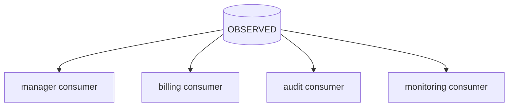
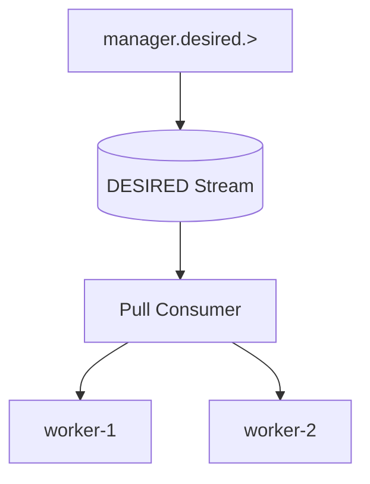
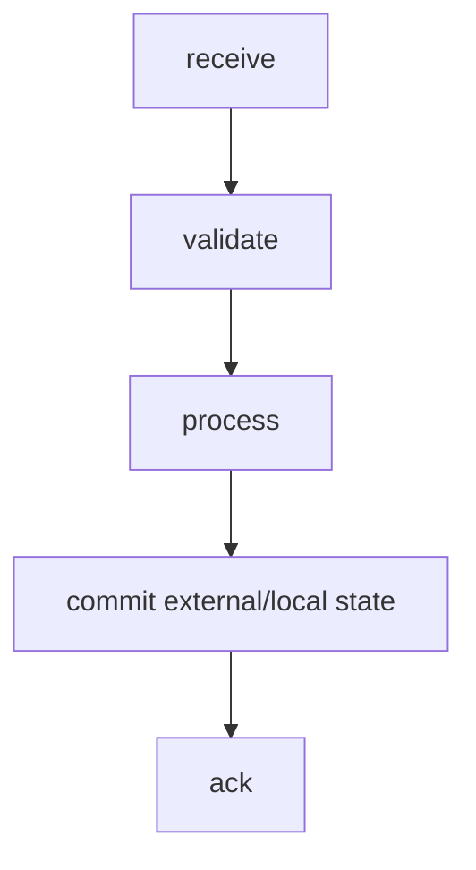
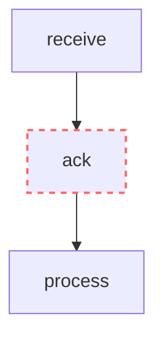
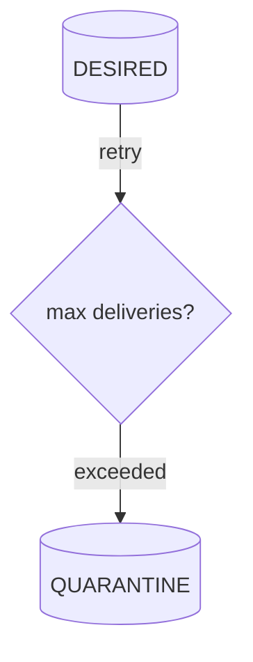
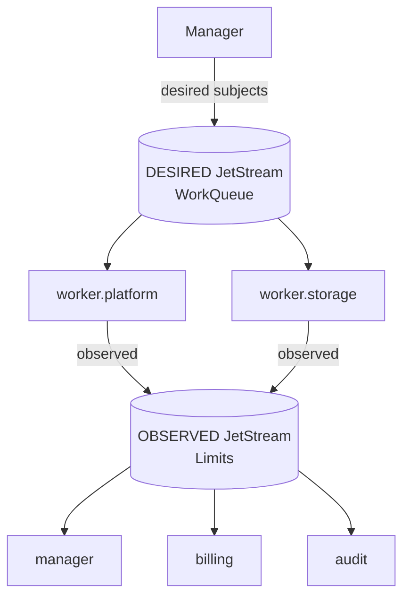
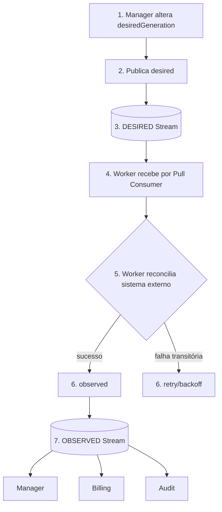

# NATS

# 1. Introdução

Este documento define a implementação de referência do modelo de mensageria em NATS e NATS JetStream. A semântica das mensagens é definida exclusivamente em `MESSAGING.md`.

NATS é uma tecnologia de transporte. Este documento descreve como o contrato semântico é materializado em Subjects, Streams, Consumers e demais recursos do NATS.

# 2. Objetivos

O objetivo é estabelecer uma implementação NATS consistente, previsível, segura e resiliente para os contratos definidos em `MESSAGING.md`, incluindo roteamento, persistência, consumo, distribuição, retry, quarentena, replay, segurança e observabilidade.

# 3. Princípios de implementação

## 3.1 Respeitar o modelo semântico

A implementação NATS deve preservar:

```text
emitter
semanticType
scope
resourceType
resourceId
```

conforme definido em `MESSAGING.md`.

## 3.2 Subject como materialização do endereço lógico

No NATS, o endereço lógico é materializado em um Subject hierárquico.

Formato de referência:

```text
<emitter>.<semanticType>.<scope>.<resourceType>[.<resourceId>]
```

Exemplos:

```text
manager.desired.underlay.node.node-01
manager.desired.overlay.vm.vm-01
worker.platform.observed.underlay.node.node-01
worker.storage.observed.underlay.volume.volume-01
worker.agent.observed.overlay.agent.agent-01
```

## 3.3 Emissor primeiro

O primeiro nível representa o emissor.

Para workers especializados, a identidade funcional pode ser composta por dois tokens:

```text
worker.platform
worker.storage
worker.identity
worker.vault
worker.agent
worker.runner
worker.tools
```

Isso permite filtros eficientes usando wildcard de um token:

```text
worker.*.observed.underlay.>
```

## 3.4 Destinatário não é codificado no Subject

Não utilizar:

```text
manager.worker.desired...
worker.manager.observed...
```

para representar destinatário.

O consumidor manifesta interesse por meio de subscription ou JetStream Consumer.

## 3.5 `resourceId` no Subject

Quando `resourceId` fizer parte do Subject, ele deve respeitar a sintaxe de Subject do NATS.

Em particular, `.` é separador de tokens e, portanto, não deve aparecer no `resourceId` usado no Subject.

A regra semântica de identidade de recurso continua pertencendo a `MESSAGING.md`; a restrição de caracteres é específica da implementação NATS.

# 4. Core NATS e JetStream

Core NATS entrega mensagens aos subscribers conectados e não fornece persistência para reprocessamento posterior. Quando mensagens precisam sobreviver a reinícios, aguardar consumidores ou ser reproduzidas, a implementação deve utilizar JetStream. citeturn267294search1turn267294search0

## 4.1 Uso recomendado

Para mensagens de negócio relacionadas a `desired` e `observed` que tenham requisito de durabilidade, replay, retry ou tolerância a indisponibilidade do consumidor, utilizar JetStream.

Core NATS pode ser utilizado para interações que explicitamente sejam efêmeras, como sinais operacionais ou request/reply de baixo risco, desde que isso não viole o contrato de `MESSAGING.md`.

# 5. Subjects

## 5.1 Subject canônico

```text
<emitter>.<semanticType>.<scope>.<resourceType>[.<resourceId>]
```

## 5.2 Exemplos

```text
manager.desired.underlay.node.node-01
manager.desired.underlay.volume.volume-01
manager.desired.overlay.vm.vm-01

worker.platform.observed.underlay.node.node-01
worker.storage.observed.underlay.volume.volume-01
worker.runner.observed.overlay.vm.vm-01
```

## 5.3 Wildcards

Wildcards devem ser restritos ao escopo necessário.

Exemplos:

```text
manager.desired.>
manager.desired.underlay.>
manager.desired.overlay.>

worker.*.observed.>
worker.*.observed.underlay.>
worker.platform.observed.underlay.node.>
```

Evitar subscriptions genéricas como:

```text
>
* 
```

em componentes de produção.

## 5.4 Identificadores

Quando `resourceId` estiver no Subject:

```text
worker.platform.observed.underlay.node.node-01
```

não utilizar:

```text
worker.platform.observed.underlay.node.node.01
```

porque o segundo exemplo cria dois tokens adicionais.

# 6. Streams JetStream

Streams são o mecanismo de persistência e replay do JetStream. O desenho do Stream deve seguir o modelo de entrega desejado, e não apenas a conveniência de agrupar Subjects. JetStream suporta políticas de retenção `limits`, `interest` e `workqueue`, além de consumidores, replay e replicação. citeturn267294search0turn267294search2

## 6.1 Stream `DESIRED`

Responsável pela persistência das mensagens `desired` utilizadas como trabalho de reconciliação.

Mapeamento de referência:

```text
Stream: DESIRED
Subjects:
  manager.desired.>
```

Retenção de referência:

```text
WorkQueuePolicy
```

A semântica é de distribuição de trabalho: dentro de um grupo lógico, uma mensagem deve ser processada por uma instância concorrente por vez.

## 6.2 Stream `OBSERVED`

Responsável pela persistência das mensagens `observed`.

Mapeamento de referência:

```text
Stream: OBSERVED
Subjects:
  worker.*.observed.>
```

Retenção de referência:

```text
LimitsPolicy
```

Isso permite múltiplos consumidores independentes, cada um mantendo seu próprio progresso e sua própria retenção de consumo.

## 6.3 Stream `AUDIT`

Auditoria é opcional e não faz parte da semântica básica da mensagem.

Quando necessário, pode existir um Stream dedicado para retenção histórica, replay controlado e investigações.

Exemplo:

```text
Stream: AUDIT
Subjects:
  audit.>
```

A forma de popular `AUDIT` deve ser escolhida explicitamente. Não assumir que `Source`, `Mirror` ou `RePublish` são semanticamente equivalentes.

## 6.4 Evitar streams excessivamente fragmentados

Não criar um Stream por recurso ou por componente sem necessidade operacional.

A divisão deve considerar:

- política de retenção;
- modelo de consumo;
- requisitos de durabilidade;
- recuperação;
- segurança;
- volume;
- ciclo de vida operacional.

# 7. Consumers

Consumers mantêm o estado de entrega por leitor e controlam como mensagens persistidas são disponibilizadas. JetStream suporta pull consumers, replay, ACK, redelivery e escalabilidade entre várias instâncias de um mesmo consumer. citeturn498353view0L58-L79

## 7.1 `DESIRED`: Pull Consumer

Para trabalho de reconciliação, utilizar Pull Consumer como padrão.

Motivos:

- backpressure controlado pelo worker;
- lote de mensagens controlado pelo consumidor;
- escala horizontal simples;
- comportamento operacional previsível.

## 7.2 `OBSERVED`: Consumers independentes

Cada função que precisa receber `observed` deve possuir seu próprio consumer durável quando a informação precisar sobreviver ao reinício do componente.

Exemplo:



## 7.3 Durable Consumers

Consumidores responsáveis por processamento de produção devem utilizar identidade durável e estável quando a continuidade do progresso for necessária.

O nome do consumer deve representar sua função, não uma instância efêmera.

# 8. Work Distribution para `desired`

O padrão recomendado é:



As instâncias concorrem sobre o mesmo fluxo lógico de trabalho.

O worker confirma a mensagem somente depois de executar o processamento definido pela aplicação.

A confirmação de transporte não substitui a publicação de `observed`.

# 9. Fanout para `observed`

O padrão recomendado é:

```text
worker.*.observed.>
          |
          v
     OBSERVED
      /  |  \
     /   |   \
 manager billing audit
```

Cada consumidor mantém seu próprio estado de leitura.

Um consumidor lento não deve bloquear semanticamente os demais consumidores.

# 10. ACK e processamento

JetStream rastreia a entrega por consumer e considera a mensagem processada quando há ACK apropriado. Mensagens não confirmadas podem ser entregues novamente. citeturn545275search1

## 10.1 Regra de ACK

Para processamento de negócio:



Evitar:



quando a perda de uma falha após ACK puder causar inconsistência.

## 10.2 ACK não é convergência

```text
JetStream ACK
      !=
Desired converged
```

Convergência é determinada pelo ciclo de reconciliação e pelas observações persistidas.

# 11. Retry e Backoff

Falhas transitórias devem usar redelivery com backoff quando suportado pelo consumer.

Configurações como:

```text
ack_wait
backoff
max_deliver
```

devem ser escolhidas com base no tempo de processamento e na natureza da falha.

O retry não deve causar tempestade de mensagens.

## 11.1 Falha transitória

Exemplos:

- timeout do provedor;
- conexão temporariamente indisponível;
- lock transitório;
- indisponibilidade temporária do serviço externo.

Essas falhas normalmente devem retornar para retry.

## 11.2 Falha permanente

Exemplos:

- contrato inválido;
- recurso impossível de processar;
- credencial inválida sem mecanismo automático de recuperação;
- payload incompatível.

Essas falhas devem eventualmente ser direcionadas à quarentena, evitando loops infinitos.

# 12. Quarentena / DLQ

JetStream fornece mecanismos de redelivery e limite de entregas; uma política de DLQ/quarentena deve ser implementada de forma explícita conforme a necessidade da aplicação.

Fluxo de referência:



Uma mensagem deve ser movida para quarentena somente quando houver decisão explícita de que o processamento normal não deve continuar.

A mensagem original deve ser preservada com seus metadados de diagnóstico.

# 13. Retry não é DLQ

São mecanismos diferentes:

```text
retry      = tentar novamente
quarantine = retirar do fluxo normal
replay     = executar novamente de forma controlada
```

Não tratar uma fila de retry como auditoria.

Não tratar uma quarentena como armazenamento histórico permanente.

# 14. Replay

JetStream permite leitura e replay de mensagens persistidas. citeturn498353view0L58-L87

Replay deve ser controlado para evitar efeitos duplicados.

Antes de realizar replay:

1. identificar consumer de destino;
2. definir janela ou ponto inicial;
3. avaliar idempotência;
4. avaliar efeito sobre sistemas externos;
5. registrar o motivo do replay;
6. monitorar a carga gerada.

Replay não deve ser utilizado como mecanismo cotidiano de retry.

# 15. Streams e retenção

## 15.1 `WorkQueuePolicy`

Adequado para `DESIRED` quando a mensagem representa trabalho que deve ser processado por um grupo de consumidores concorrentes.

A mensagem não deve desaparecer do fluxo antes que o processamento correspondente tenha sido reconhecido conforme a política do consumer.

## 15.2 `LimitsPolicy`

Adequado para `OBSERVED` quando os fatos devem permanecer disponíveis para consumidores independentes dentro de uma janela de retenção.

Os limites devem ser definidos por:

- tempo;
- tamanho;
- quantidade;
- impacto de armazenamento;
- necessidade de replay.

## 15.3 `InterestPolicy`

Pode ser utilizada quando a retenção deve depender da existência de consumidores interessados.

Não utilizar automaticamente apenas porque está disponível. Validar primeiro a semântica desejada.

# 16. Replicação e durabilidade

Streams críticos devem utilizar armazenamento persistente e número de réplicas compatível com o nível de disponibilidade definido para o ambiente.

A escolha de réplica deve considerar:

- quorum;
- capacidade de armazenamento;
- latência;
- domínio de falha;
- recuperação;
- custo.

Não assumir que replicação do Stream elimina a necessidade de backup.

# 17. Source, Mirror e Republish

NATS possui mecanismos diferentes para copiar ou transformar fluxos, incluindo sources, mirrors e republish. A escolha depende do objetivo operacional e da política do Stream. citeturn267294search3turn545275search1

## 17.1 Regra arquitetural

Não utilizar `Source`, `Mirror` ou `RePublish` apenas para criar uma segunda cópia sem definir:

- finalidade;
- retenção;
- independência operacional;
- impacto sobre ACK;
- recuperação;
- autorização.

## 17.2 Auditoria

Para auditoria de longa duração, preferir um fluxo explicitamente desenhado para auditoria, em vez de depender de comportamento implícito de um Stream operacional.

# 18. Segurança

## 18.1 TLS

Em ambientes não locais, conexões NATS devem utilizar TLS.

O certificado do servidor deve ser validado pelo cliente usando CA confiável.

## 18.2 mTLS

Para comunicação serviço-a-serviço, mTLS é a configuração recomendada quando a identidade criptográfica do cliente for necessária.

## 18.3 Autorização

Publicação e assinatura devem ser autorizadas separadamente.

Exemplos conceituais:

```text
manager
  publish: manager.desired.>

worker.platform
  subscribe: manager.desired.underlay.node.>
  publish: worker.platform.observed.underlay.node.>
```

NATS suporta ACLs de publicação e assinatura por Subject. Uma allow-list explícita restringe o acesso às subjects não autorizadas. citeturn630348search0turn267294search6

## 18.4 Princípio do menor privilégio

Cada identidade deve possuir somente os Subjects necessários.

Evitar permissões amplas como:

```text
publish: ">
subscribe: ">"
```

para componentes de aplicação.

## 18.5 Segredos

Credenciais de NATS, chaves privadas e tokens não devem ser versionados no repositório.

Devem ser fornecidos por mecanismo seguro de secrets management.

# 19. TLS do cluster e clientes

A configuração de TLS deve distinguir claramente:

```text
client -> server
server -> server
```

O material criptográfico utilizado para comunicação cliente-servidor não deve ser automaticamente reutilizado para comunicação de cluster.

No mínimo, devem existir identidades adequadas aos diferentes trust domains quando a topologia exigir essa separação.

# 20. Configuração por ambiente

A política semântica não depende do ambiente.

A infraestrutura pode variar:

```text
dev  -> NATS local
stg  -> cluster NATS interno
prd  -> cluster NATS resiliente
```

mas os Subjects e contratos semânticos devem permanecer compatíveis.

Parâmetros de deployment pertencem à infraestrutura, não a este contrato.

# 21. Versionamento do NATS

A versão do NATS Server deve ser explicitamente pinada no ambiente de execução.

Evitar tags flutuantes como:

```text
latest
2.12
```

em ambientes de integração, homologação e produção.

Uma atualização de versão deve incluir:

- validação de compatibilidade dos clientes;
- validação de Streams e Consumers;
- testes de integração;
- revisão de release notes;
- verificação de comportamento de recursos JetStream utilizados pelo projeto;
- registro da alteração no changelog da plataforma.

Este documento não fixa uma versão específica do servidor. O número efetivamente suportado deve ser definido pelo ambiente e pelos testes do projeto.

# 22. Observabilidade

A plataforma deve monitorar pelo menos:

```text
publish rate
consume rate
consumer lag
pending messages
redelivery count
ack latency
processing latency
stream size
stream age
storage usage
quorum status
consumer state
```

Os sinais devem ser coletados do NATS e das aplicações consumidoras.

Observabilidade do broker não substitui observabilidade do processamento de negócio.

# 23. Métricas de aplicação

Para cada consumidor, observar:

```text
messages_received_total
messages_processed_total
messages_failed_total
messages_retried_total
messages_quarantined_total
message_processing_duration
```

Correlacionar os dados com:

```text
messageId
correlationId
causationId
resourceId
resourceType
semanticType
```

# 24. Requisitos de resiliência do cliente

Clientes devem tratar desconexões e reconexões como comportamento normal.

Devem possuir:

- timeout explícito;
- reconnect controlado;
- backoff;
- tratamento de falha de autenticação;
- observabilidade das reconexões;
- shutdown ordenado;
- recuperação do consumer durável quando aplicável.

Falha de autenticação não deve ser mascarada como simples indisponibilidade de rede. Clientes NATS possuem comportamentos específicos para reconexão e falhas de autenticação que devem ser considerados na operação. citeturn267294search9

# 25. JetStream API e administração

A criação e alteração de Streams e Consumers deve ser controlada.

Preferir configuração declarativa e versionada por infraestrutura como código ou mecanismo equivalente.

Não permitir que aplicações de runtime tenham privilégios administrativos amplos sobre:

```text
$JS.API.>
```

sem necessidade explícita.

# 26. Exemplos de autorização

## 26.1 Manager

```text
publish:
  manager.desired.>

subscribe:
  worker.*.observed.>
```

## 26.2 Platform Worker

```text
subscribe:
  manager.desired.underlay.node.>

publish:
  worker.platform.observed.underlay.node.>
```

## 26.3 Storage Worker

```text
subscribe:
  manager.desired.underlay.volume.>

publish:
  worker.storage.observed.underlay.volume.>
```

## 26.4 Billing

```text
subscribe:
  worker.*.observed.overlay.>
```

Billing não recebe permissões de publicação para Subjects de outros componentes apenas para consumir observações.

# 27. Exemplo de arquitetura



# 28. Fluxo de reconciliação



# 29. Anti-padrões

## 29.1 Proibido: destinatário como prefixo do Subject

Não utilizar:

```text
worker.manager.desired...
```

para codificar uma rota ponto-a-ponto.

## 29.2 Proibido: `task` e `reality` como tipos oficiais

A semântica oficial é:

```text
desired
observed
```

## 29.3 Proibido: ação imperativa no Subject

Evitar:

```text
manager.desired.underlay.node.update.node-01
```

Preferir:

```text
manager.desired.underlay.node.node-01
```

O tipo de mudança pertence ao contrato do recurso e à evolução de `desiredGeneration`.

## 29.4 Proibido: subscription `>` sem justificativa

## 29.5 Proibido: secrets dentro do payload

## 29.6 Proibido: ACK antecipado

## 29.7 Proibido: depender de exactly-once para correção

## 29.8 Proibido: criar um Stream por recurso sem necessidade

# 30. Nomenclatura recomendada

## 30.1 Streams

```text
DESIRED
OBSERVED
AUDIT
```

## 30.2 Consumers

Nomes devem ser funcionais e estáveis, por exemplo:

```text
manager-reconciler
billing-observed
audit-observed
monitoring-observed
```

## 30.3 Subjects

```text
manager.desired.underlay.node.node-01
worker.platform.observed.underlay.node.node-01
worker.storage.observed.underlay.volume.volume-01
```

# 31. Checklist operacional

Antes de colocar um fluxo em produção, verificar:

- [ ] Subject segue o formato definido em `MESSAGING.md`;
- [ ] emissor é funcional e estável;
- [ ] consumidor não está embutido no Subject;
- [ ] `desired` e `observed` estão corretamente utilizados;
- [ ] Stream possui retenção adequada;
- [ ] consumer é durável quando necessário;
- [ ] Pull Consumer é utilizado para work distribution;
- [ ] ACK ocorre somente após processamento seguro;
- [ ] retry possui backoff;
- [ ] mensagens poison possuem quarentena;
- [ ] replay foi considerado;
- [ ] idempotência foi implementada;
- [ ] ordering necessário possui chave explícita;
- [ ] TLS está habilitado fora do ambiente local;
- [ ] autorização utiliza menor privilégio;
- [ ] secrets não estão no repositório;
- [ ] métricas e traces estão disponíveis;
- [ ] Streams e Consumers são gerenciados de forma controlada;
- [ ] versão do NATS está pinada no ambiente.

# 32. Fontes técnicas

A implementação deste documento utiliza como referência a documentação oficial do NATS:

- NATS Core e comportamento de subscribers: https://docs.nats.io/learn/core-nats/
- JetStream Deep Dive: https://docs.nats.io/learn/jetstream/
- JetStream Reference: https://docs.nats.io/reference/2.12/jetstream
- Authorization: https://docs.nats.io/learn/security/authorization
- TLS/Auth e clientes resilientes: https://docs.nats.io/learn/resilient-clients/tls-and-auth
- Encryption at rest: https://docs.nats.io/learn/security/encryption

# 33. Fonte de verdade

`MESSAGING.md` é a fonte de verdade para a semântica de mensageria.

`NATS.md` é a fonte de verdade para a implementação dessa semântica em NATS.

A hierarquia é:

```text
MESSAGING.md
      |
      v
   NATS.md
```

Uma limitação específica do NATS não deve alterar o modelo semântico. Quando a implementação exigir adaptação, a adaptação deve permanecer confinada a `NATS.md` e à infraestrutura.
