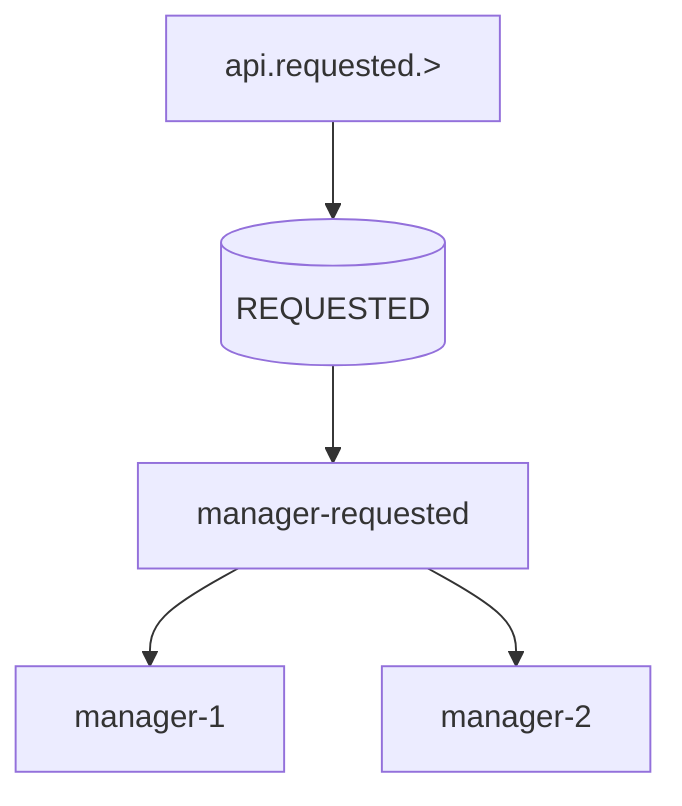
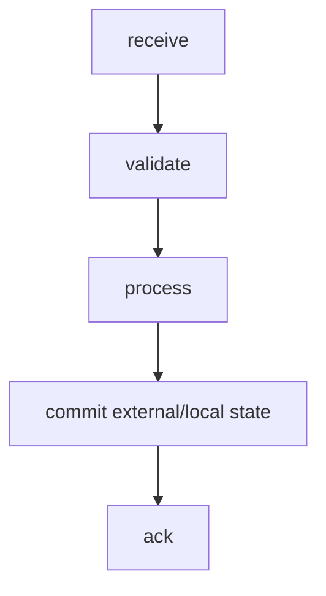
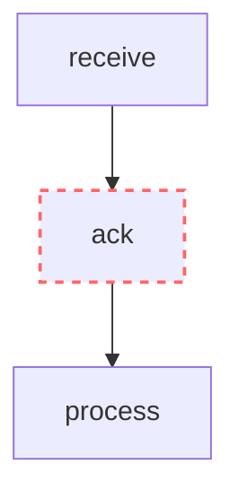
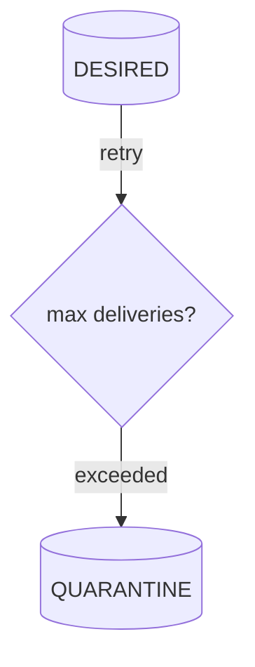
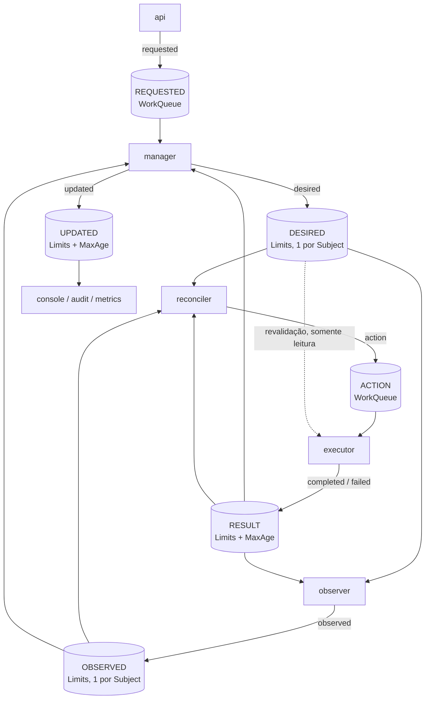
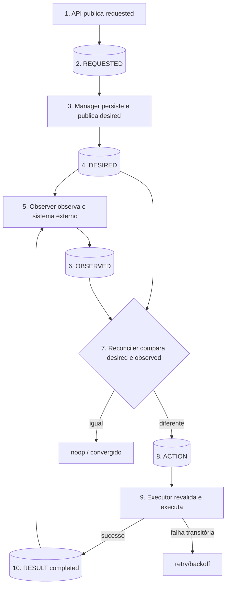

# NATS

# 1. Introdução

Este documento define a implementação de referência do modelo de mensageria em NATS e NATS JetStream. A semântica das mensagens é definida exclusivamente em `MESSAGING.md`.

NATS é uma tecnologia de transporte. Este documento descreve como o contrato semântico é materializado em Subjects, Streams, Consumers e demais recursos do NATS.

# 2. Objetivos

O objetivo é estabelecer uma implementação NATS consistente, previsível, segura e resiliente para os contratos definidos em `MESSAGING.md`, incluindo roteamento, persistência, consumo, distribuição, retry, quarentena, replay, segurança e observabilidade.

# 3. Princípios de implementação

## 3.1 Respeitar o modelo semântico

A implementação NATS deve preservar:

```text
emitter
messageType
module
resourceType
resourceId
operation
```

conforme definido em `MESSAGING.md`.

## 3.2 Subject como materialização do endereço lógico

No NATS, o endereço lógico é materializado em um Subject hierárquico.

Formato de referência:

```text
<emitter>.<messageType>.<module>.<resourceType>.<resourceId>.<operation>
```

Exemplos:

```text
api.requested.ipm.tenant.<id>.create
manager.desired.ipm.tenant.<id>.changed
observer.observed.ipm.tenant.<id>.changed
reconciler.action.ipm.tenant.<id>.create
executor.completed.ipm.tenant.<id>.create
manager.updated.ipm.tenant.<id>.changed
```

## 3.3 Emissor primeiro

O primeiro nível representa o emissor funcional:

```text
api
manager
observer
reconciler
executor
```

Emissores compostos de dois tokens, quando definidos em `MESSAGING.md` (por exemplo, `worker.platform`), exigem que filtros e autorizações considerem os dois tokens.

## 3.4 Destinatário não é codificado no Subject

Não utilizar:

```text
manager.executor.desired...
observer.manager.observed...
```

para representar destinatário.

O consumidor manifesta interesse por meio de subscription ou JetStream Consumer.

## 3.5 `resourceId` no Subject

Quando `resourceId` fizer parte do Subject, ele deve respeitar a sintaxe de Subject do NATS.

Em particular, `.` é separador de tokens e, portanto, não deve aparecer no `resourceId` usado no Subject. Caracteres que criem tokens extras ou wildcards (`*`, `>`) também não são permitidos.

O `resourceId` deve ser validado antes de compor o Subject, e um valor inválido deve ser rejeitado (ver `RESOURCE-CONTROL-SECURITY.md`).

A regra semântica de identidade de recurso continua pertencendo a `MESSAGING.md`; a restrição de caracteres é específica da implementação NATS.

## 3.6 Um Subject por recurso nas mensagens de estado

`desired` e `observed` são mensagens de estado (ver `MESSAGING.md`, classes de mensagem). Por isso, utilizam sempre a operação `changed`:

```text
manager.desired.ipm.tenant.<id>.changed
observer.observed.ipm.tenant.<id>.changed
```

Assim, cada recurso possui **um único Subject** por tipo de estado, e a retenção de uma mensagem por Subject (seção de retenção) guarda exatamente o último estado do recurso.

Se a operação fizesse parte da identidade do Subject (`...create`, `...update`, `...present`, `...absent`), o stream reteria uma mensagem por operação, e uma observação antiga poderia permanecer ao lado de uma recente.

# 4. Core NATS e JetStream

Core NATS entrega mensagens aos subscribers conectados e não fornece persistência para reprocessamento posterior. Quando mensagens precisam sobreviver a reinícios, aguardar consumidores ou ser reproduzidas, a implementação deve utilizar JetStream.

## 4.1 Uso recomendado

Para mensagens de negócio relacionadas a `desired` e `observed` que tenham requisito de durabilidade, replay, retry ou tolerância a indisponibilidade do consumidor, utilizar JetStream.

Core NATS pode ser utilizado para interações que explicitamente sejam efêmeras, como sinais operacionais ou request/reply de baixo risco, desde que isso não viole o contrato de `MESSAGING.md`.

# 5. Subjects

## 5.1 Subject canônico

```text
<emitter>.<messageType>.<module>.<resourceType>.<resourceId>.<operation>
```

## 5.2 Exemplos

```text
api.requested.ipm.tenant.<id>.create
manager.desired.ipm.tenant.<id>.changed
observer.observed.ipm.tenant.<id>.changed
reconciler.action.ipm.tenant.<id>.create
executor.completed.ipm.tenant.<id>.create
executor.failed.ipm.tenant.<id>.create
manager.updated.ipm.tenant.<id>.changed
```

## 5.3 Wildcards

Wildcards devem ser restritos ao escopo necessário.

Exemplos:

```text
manager.desired.>
manager.desired.ipm.>
manager.desired.ipm.tenant.>

observer.observed.ipm.tenant.>
reconciler.action.ipm.tenant.>
```

Evitar subscriptions genéricas como:

```text
>
*
```

em componentes de produção.

## 5.4 Identificadores

Quando `resourceId` estiver no Subject:

```text
observer.observed.ipm.tenant.tenant-01.changed
```

não utilizar:

```text
observer.observed.ipm.tenant.tenant.01.changed
```

porque o segundo exemplo cria dois tokens adicionais.

# 6. Streams JetStream

Streams são o mecanismo de persistência e replay do JetStream. O desenho do Stream deve seguir o modelo de entrega desejado, e não apenas a conveniência de agrupar Subjects. JetStream suporta políticas de retenção `limits`, `interest` e `workqueue`, além de consumidores, replay e replicação.

## 6.1 Um Stream por `messageType`

A regra é explícita: **cada `messageType` possui seu Stream**, com a retenção adequada à sua classe (ver `MESSAGING.md`, classes de mensagem). A única exceção é `completed` e `failed`, que compartilham o Stream `RESULT` por serem resultados da mesma operação, com os mesmos consumidores e a mesma retenção.

Motivos:

- **segurança:** a autorização de JetStream é por Stream. A permissão de subscribe por Subject não restringe o que um consumidor JetStream lê, e o controle por filtro de consumidor só existe para consumidor com um único filtro. Um Stream por tipo isola quem acessa `action` de quem acessa `requested`;
- **robustez:** limites e política de descarte são por Stream, de modo que um excesso de um tipo não bloqueia outro;
- **resiliência:** a falha ou a limpeza de um Stream afeta um único tipo;
- **simplicidade:** a regra "Stream = `messageType`" dispensa uma segunda taxonomia.

Esta regra não contradiz a recomendação de evitar fragmentação (seção própria): ela se aplica a recursos e componentes, e não a tipos semânticos.

## 6.2 Mapeamento

| Stream | Subjects | Retenção | Classe | Consumidores |
|---|---|---|---|---|
| `REQUESTED` | `api.requested.>` | `WorkQueuePolicy`, `DiscardNew` | Trabalho | Manager |
| `DESIRED` | `manager.desired.>` | `LimitsPolicy`, `MaxMsgsPerSubject=1` | Estado | Reconciler, Observer, Executor (leitura), outros |
| `OBSERVED` | `observer.observed.>` | `LimitsPolicy`, `MaxMsgsPerSubject=1`, `MaxAge` | Estado | Reconciler, Manager, outros |
| `ACTION` | `reconciler.action.>` | `WorkQueuePolicy`, `DiscardNew` | Trabalho | Executor |
| `RESULT` | `executor.completed.>`, `executor.failed.>` | `LimitsPolicy`, `MaxAge` | Fato | Manager, Observer, Reconciler, auditoria |
| `UPDATED` | `manager.updated.>` | `LimitsPolicy`, `MaxAge` | Fato | Console, auditoria, métricas |
| `AUDIT` | `audit.>` | `LimitsPolicy`, retenção longa | Histórico | Auditoria |
| `QUARANTINE` | definido pela política de quarentena | `LimitsPolicy` | Diagnóstico | Operação |

Os valores de limites (`MaxAge`, tamanho, réplicas) dependem do ambiente. Duas restrições:

- `RESULT` deve reter por mais tempo que o prazo de ação do domínio e que a janela de recuperação do Reconciler;
- `OBSERVED` deve possuir `MaxAge` maior que alguns períodos de observação (o Observer observa periodicamente). Um recurso que deixa de ser observado expira, e o Reconciler não decide sem observação (ver `RESOURCE-CONTROL-LOOP.md`).

## 6.3 `REQUESTED` e `ACTION`: trabalho

São mensagens de trabalho com **um único consumidor lógico**. A mensagem deve ser processada uma vez por um grupo de instâncias e deixar de existir após o ACK.

- `WorkQueuePolicy`: a mensagem é removida após o ACK;
- `DiscardNew`: com o Stream cheio, o publicador recebe erro, em vez de o Stream descartar trabalho antigo. O publicador deve tratar esse erro como contrapressão (a API rejeita o pedido de forma retentável; o Reconciler tenta novamente na próxima reconciliação);
- consumidores de um Stream `WorkQueue` não podem ter filtros de Subject sobrepostos. Cada Stream de trabalho possui um único consumidor durável por função;
- um segundo leitor (auditoria, métricas) **não** deve consumir o Stream de trabalho. Esses leitores usam `AUDIT` (ver seção de Source, Mirror e Republish).

`ACTION` publica com o cabeçalho `Nats-Msg-Id` igual ao `actionId`. O broker descarta duplicatas dentro da janela de deduplicação (por padrão, 2 minutos). Isso é uma otimização: a deduplicação do Executor por `actionId` continua obrigatória.

## 6.4 `DESIRED` e `OBSERVED`: estado

São mensagens de estado: a mais recente por recurso substitui as anteriores.

- `LimitsPolicy` com `MaxMsgsPerSubject=1`: o Stream retém o último estado de cada recurso, e **não** remove a mensagem após o ACK;
- vários consumidores independentes, cada um com seu progresso (Reconciler, Observer, Executor, Manager, outros);
- após restart, o consumidor do Reconciler parte da última mensagem de cada Subject (`DeliverLastPerSubject`) e reconstrói o estado;
- o histórico de gerações não fica nestes Streams. Quando necessário, vem de `AUDIT`.

## 6.5 `RESULT` e `UPDATED`: fatos

São fatos imutáveis, consumidos por vários consumidores independentes.

- `LimitsPolicy` com `MaxAge` (e limites de tamanho);
- cada consumidor mantém seu progresso;
- um consumidor lento não bloqueia os demais.

## 6.6 `AUDIT`

Auditoria é opcional e não faz parte da semântica básica da mensagem.

Quando necessário, pode existir um Stream dedicado para retenção histórica, replay controlado e investigações.

Exemplo:

```text
Stream: AUDIT
Subjects:
  audit.>
```

A forma de popular `AUDIT` deve ser escolhida explicitamente. Não assumir que `Source`, `Mirror` ou `RePublish` são semanticamente equivalentes. Em particular, a origem em Stream `WorkQueue` (`REQUESTED`, `ACTION`) deve ser validada antes de adotada, pois a restrição de consumidores sem sobreposição se aplica a quem lê o Stream.

## 6.7 Evitar streams excessivamente fragmentados

Não criar um Stream por recurso ou por componente sem necessidade operacional.

A divisão por `messageType` (6 Streams operacionais) é deliberada. Qualquer divisão adicional deve considerar:

- política de retenção;
- modelo de consumo;
- requisitos de durabilidade;
- recuperação;
- segurança;
- volume;
- ciclo de vida operacional.

# 7. Consumers

Consumers mantêm o estado de entrega por leitor e controlam como mensagens persistidas são disponibilizadas. JetStream suporta pull consumers, replay, ACK, redelivery e escalabilidade entre várias instâncias de um mesmo consumer.

## 7.1 Consumers por função

Cada função possui seu próprio consumer durável. O nome representa a função, e não uma instância.

| Stream | Consumer | Função | Observação |
|---|---|---|---|
| `REQUESTED` | `manager-requested` | Manager | Único consumidor do Stream de trabalho |
| `DESIRED` | `reconciler-desired` | Reconciler | `DeliverLastPerSubject` no cold start |
| `DESIRED` | `observer-desired` | Observer | Define quais recursos observar |
| `DESIRED` | `executor-desired` | Executor | Somente leitura, para revalidar a `action` |
| `OBSERVED` | `reconciler-observed` | Reconciler | `DeliverLastPerSubject` no cold start |
| `OBSERVED` | `manager-observed` | Manager | Atualiza `observed` e `conditions` no SSOT |
| `ACTION` | `executor-action` | Executor | Único consumidor do Stream de trabalho |
| `RESULT` | `manager-result`, `observer-result`, `reconciler-result` | Manager, Observer, Reconciler | O Reconciler rastreia `action` pendente |
| `UPDATED` | `console-updated`, `metrics-updated`, ... | Projeções | Um por consumidor |

Funções adicionais (billing, auditoria, monitoramento) criam seus próprios consumers, sem alterar o produtor.

## 7.2 Pull Consumer

Pull Consumer é o padrão para todos os consumers de processamento.

Motivos:

- backpressure controlado pelo consumidor;
- lote de mensagens controlado pelo consumidor;
- escala horizontal simples;
- comportamento operacional previsível.

## 7.3 Instâncias de uma função

Várias instâncias de uma mesma função **compartilham o mesmo consumer durável**. É isso que distribui o trabalho entre elas, e não a política de retenção do Stream.

Para `DESIRED` e `OBSERVED`, cada instância do Reconciler precisa do estado completo dos recursos que decide. Quando a carga exigir mais de uma instância, a divisão deve ser determinística por `resourceId`, de modo que um mesmo recurso seja decidido por uma única instância por vez.

## 7.4 Durable Consumers

Consumidores responsáveis por processamento de produção devem utilizar identidade durável e estável quando a continuidade do progresso for necessária.

O nome do consumer deve representar sua função, não uma instância efêmera.

# 8. Work Distribution

Aplica-se às mensagens de trabalho (`requested` e `action`):



As instâncias concorrem sobre o mesmo fluxo lógico de trabalho. A instância confirma a mensagem somente depois de executar o processamento definido pela aplicação.

Para `action`, apenas uma `action` deve estar em execução por vez para o mesmo `resourceId` (*single-flight*, ver `RESOURCE-CONTROL-LOOP.md`). Essa garantia deve ser implementada pela aplicação (verificação de `action` pendente ou divisão determinística por `resourceId`). Ela não decorre automaticamente da política `WorkQueue`.

A confirmação de transporte não substitui a publicação de `completed`, `failed` ou `observed`.

# 9. Fanout e estado

Aplica-se às mensagens de estado (`desired`, `observed`) e aos fatos (`completed`, `failed`, `updated`):

```text
observer.observed.>
          |
          v
      OBSERVED
      /   |   \
     /    |    \
reconciler manager audit
```

Cada consumidor mantém seu próprio estado de leitura.

Um consumidor lento não deve bloquear semanticamente os demais consumidores.

Nas mensagens de estado, o ACK registra o progresso do consumidor, mas **não remove** a mensagem: o último estado do recurso permanece disponível para novos consumidores e para restarts.

# 10. ACK e processamento

JetStream rastreia a entrega por consumer e considera a mensagem processada quando há ACK apropriado. Mensagens não confirmadas podem ser entregues novamente.

## 10.1 Regra de ACK

Para processamento de negócio:



Evitar:



quando a perda de uma falha após ACK puder causar inconsistência.

## 10.2 ACK não é convergência

```text
JetStream ACK
      !=
Desired converged
```

Convergência é determinada pelo ciclo de reconciliação e pelas observações persistidas.

# 11. Retry e Backoff

Falhas transitórias devem usar redelivery com backoff quando suportado pelo consumer.

Configurações como:

```text
ack_wait
backoff
max_deliver
```

devem ser escolhidas com base no tempo de processamento e na natureza da falha.

O retry não deve causar tempestade de mensagens.

## 11.1 Falha transitória

Exemplos:

- timeout do provedor;
- conexão temporariamente indisponível;
- lock transitório;
- indisponibilidade temporária do serviço externo.

Essas falhas normalmente devem retornar para retry.

## 11.2 Falha permanente

Exemplos:

- contrato inválido;
- recurso impossível de processar;
- credencial inválida sem mecanismo automático de recuperação;
- payload incompatível.

Essas falhas devem eventualmente ser direcionadas à quarentena, evitando loops infinitos.

# 12. Quarentena / DLQ

JetStream fornece mecanismos de redelivery e limite de entregas; uma política de DLQ/quarentena deve ser implementada de forma explícita conforme a necessidade da aplicação.

Fluxo de referência:



Uma mensagem deve ser movida para quarentena somente quando houver decisão explícita de que o processamento normal não deve continuar.

A mensagem original deve ser preservada com seus metadados de diagnóstico.

# 13. Retry não é DLQ

São mecanismos diferentes:

```text
retry      = tentar novamente
quarantine = retirar do fluxo normal
replay     = executar novamente de forma controlada
```

Não tratar uma fila de retry como auditoria.

Não tratar uma quarentena como armazenamento histórico permanente.

# 14. Replay

JetStream permite leitura e replay de mensagens persistidas.

Replay deve ser controlado para evitar efeitos duplicados.

Antes de realizar replay:

1. identificar consumer de destino;
2. definir janela ou ponto inicial;
3. avaliar idempotência;
4. avaliar efeito sobre sistemas externos;
5. registrar o motivo do replay;
6. monitorar a carga gerada.

Replay não deve ser utilizado como mecanismo cotidiano de retry.

# 15. Streams e retenção

## 15.1 `WorkQueuePolicy`

Adequado para `REQUESTED` e `ACTION`, quando a mensagem representa trabalho que deve ser processado por um único grupo de consumidores concorrentes.

A mensagem não deve desaparecer do fluxo antes que o processamento correspondente tenha sido reconhecido conforme a política do consumer. Os consumidores do Stream não podem ter filtros de Subject sobrepostos.

## 15.2 `LimitsPolicy`

Adequado para `DESIRED`, `OBSERVED`, `RESULT`, `UPDATED` e `AUDIT`, quando as mensagens devem permanecer disponíveis para consumidores independentes.

Os limites devem ser definidos por:

- tempo;
- tamanho;
- quantidade;
- impacto de armazenamento;
- necessidade de replay.

Em `DESIRED` e `OBSERVED`, o limite principal é a quantidade por Subject (`MaxMsgsPerSubject=1`).

## 15.3 `InterestPolicy`

Pode ser utilizada quando a retenção deve depender da existência de consumidores interessados.

Não utilizar automaticamente apenas porque está disponível. Validar primeiro a semântica desejada. Esta política não é adotada neste momento.

## 15.4 Remoção de recursos

Como `DESIRED` e `OBSERVED` retêm o último estado por recurso, o estado de um recurso removido precisa sair dos Streams:

- `DESIRED`: após a convergência da remoção (`desired` com `lifecycle=absent` e observação `presence=absent`), o Manager remove o recurso do SSOT e remove a mensagem do Subject do recurso (purge por Subject). Remover antes da convergência faria o Reconciler perder o estado desejado;
- `OBSERVED`: expira por `MaxAge`, pois o Observer reobserva periodicamente os recursos que existem em `DESIRED`.

O purge deve ser autorizado de forma restrita (somente o Stream `DESIRED` e somente o Manager).

# 16. Replicação e durabilidade

Streams críticos devem utilizar armazenamento persistente e número de réplicas compatível com o nível de disponibilidade definido para o ambiente.

A escolha de réplica deve considerar:

- quorum;
- capacidade de armazenamento;
- latência;
- domínio de falha;
- recuperação;
- custo.

Não assumir que replicação do Stream elimina a necessidade de backup.

# 17. Source, Mirror e Republish

NATS possui mecanismos diferentes para copiar ou transformar fluxos, incluindo sources, mirrors e republish. A escolha depende do objetivo operacional e da política do Stream.

## 17.1 Regra arquitetural

Não utilizar `Source`, `Mirror` ou `RePublish` apenas para criar uma segunda cópia sem definir:

- finalidade;
- retenção;
- independência operacional;
- impacto sobre ACK;
- recuperação;
- autorização.

## 17.2 Auditoria

Para auditoria de longa duração, preferir um fluxo explicitamente desenhado para auditoria, em vez de depender de comportamento implícito de um Stream operacional.

# 18. Segurança

## 18.1 TLS

Em ambientes não locais, conexões NATS devem utilizar TLS.

O certificado do servidor deve ser validado pelo cliente usando CA confiável.

## 18.2 mTLS

Para comunicação serviço-a-serviço, mTLS é a configuração recomendada quando a identidade criptográfica do cliente for necessária.

## 18.3 Autorização

Publicação e assinatura devem ser autorizadas separadamente.

A matriz de permissões por componente é definida em `RESOURCE-CONTROL-SECURITY.md`. Este documento descreve como ela é materializada em NATS.

NATS suporta ACLs de publicação e assinatura por Subject. Uma allow-list explícita restringe o acesso às subjects não autorizadas.

Em JetStream há uma particularidade: a permissão de subscribe por Subject não restringe o que um consumidor JetStream lê do Stream. O acesso à API de consumers é autorizado por Stream (`$JS.API.CONSUMER.*.<stream>...`) e, para um consumer com um único filtro, por filtro. Por isso:

- cada `messageType` possui seu Stream (seção de Streams);
- consumers são criados pela infraestrutura (seção de administração), e identidades de runtime recebem apenas o acesso ao **seu** consumer (`$JS.API.CONSUMER.MSG.NEXT.<stream>.<consumer>` e os Subjects de ACK correspondentes);
- identidades de runtime não recebem permissão para criar, alterar ou listar consumers de outros componentes.

## 18.4 Princípio do menor privilégio

Cada identidade deve possuir somente os Subjects necessários.

Evitar permissões amplas como:

```text
publish: ">
subscribe: ">"
```

para componentes de aplicação.

## 18.5 Segredos

Credenciais de NATS, chaves privadas e tokens não devem ser versionados no repositório.

Devem ser fornecidos por mecanismo seguro de secrets management.

# 19. TLS do cluster e clientes

A configuração de TLS deve distinguir claramente:

```text
client -> server
server -> server
```

O material criptográfico utilizado para comunicação cliente-servidor não deve ser automaticamente reutilizado para comunicação de cluster.

No mínimo, devem existir identidades adequadas aos diferentes trust domains quando a topologia exigir essa separação.

# 20. Configuração por ambiente

A política semântica não depende do ambiente.

A infraestrutura pode variar:

```text
dev  -> NATS local
stg  -> cluster NATS interno
prd  -> cluster NATS resiliente
```

mas os Subjects e contratos semânticos devem permanecer compatíveis.

Parâmetros de deployment pertencem à infraestrutura, não a este contrato.

# 21. Versionamento do NATS

A versão do NATS Server deve ser explicitamente pinada no ambiente de execução.

Evitar tags flutuantes como:

```text
latest
2.12
```

em ambientes de integração, homologação e produção.

Uma atualização de versão deve incluir:

- validação de compatibilidade dos clientes;
- validação de Streams e Consumers;
- testes de integração;
- revisão de release notes;
- verificação de comportamento de recursos JetStream utilizados pelo projeto;
- registro da alteração no changelog da plataforma.

Este documento não fixa uma versão específica do servidor. O número efetivamente suportado deve ser definido pelo ambiente e pelos testes do projeto.

# 22. Observabilidade

A plataforma deve monitorar pelo menos:

```text
publish rate
consume rate
consumer lag
pending messages
redelivery count
ack latency
processing latency
stream size
stream age
storage usage
quorum status
consumer state
```

Os sinais devem ser coletados do NATS e das aplicações consumidoras.

Observabilidade do broker não substitui observabilidade do processamento de negócio.

# 23. Métricas de aplicação

Para cada consumidor, observar:

```text
messages_received_total
messages_processed_total
messages_failed_total
messages_retried_total
messages_quarantined_total
message_processing_duration
```

Correlacionar os dados com:

```text
messageId
correlationId
causationId
resourceId
resourceType
messageType
```

# 24. Requisitos de resiliência do cliente

Clientes devem tratar desconexões e reconexões como comportamento normal.

Devem possuir:

- timeout explícito;
- reconnect controlado;
- backoff;
- tratamento de falha de autenticação;
- observabilidade das reconexões;
- shutdown ordenado;
- recuperação do consumer durável quando aplicável.

Falha de autenticação não deve ser mascarada como simples indisponibilidade de rede. Clientes NATS possuem comportamentos específicos para reconexão e falhas de autenticação que devem ser considerados na operação.

# 25. JetStream API e administração

A criação e alteração de Streams e Consumers deve ser controlada.

Preferir configuração declarativa e versionada por infraestrutura como código ou mecanismo equivalente.

Não permitir que aplicações de runtime tenham privilégios administrativos amplos sobre:

```text
$JS.API.>
```

sem necessidade explícita.

# 26. Exemplos de autorização

Exemplos conceituais por componente. A matriz oficial está em `RESOURCE-CONTROL-SECURITY.md`; os valores concretos de configuração do servidor pertencem à infraestrutura e devem ser validados no ambiente.

## 26.1 Manager

```text
publish:
  manager.desired.>
  manager.updated.>

consumo (consumers próprios):
  REQUESTED  → manager-requested
  OBSERVED   → manager-observed
  RESULT     → manager-result

administração restrita:
  purge do Stream DESIRED
```

## 26.2 Observer

```text
publish:
  observer.observed.>

consumo (consumers próprios):
  DESIRED → observer-desired
  RESULT  → observer-result
```

## 26.3 Reconciler

```text
publish:
  reconciler.action.>

consumo (consumers próprios):
  DESIRED  → reconciler-desired
  OBSERVED → reconciler-observed
  RESULT   → reconciler-result
```

## 26.4 Executor

```text
publish:
  executor.completed.>
  executor.failed.>

consumo (consumers próprios):
  ACTION  → executor-action
  DESIRED → executor-desired   (somente leitura, revalidação)
```

O Executor é a única identidade com acesso de consumo ao Stream `ACTION`.

## 26.5 Billing

```text
consumo (consumer próprio):
  OBSERVED → billing-observed
```

Billing não recebe permissões de publicação para Subjects de outros componentes apenas para consumir observações.

# 27. Exemplo de arquitetura



# 28. Fluxo de reconciliação



O ciclo continua até que a observação demonstre convergência. `completed` não encerra o ciclo (ver `RESOURCE-CONTROL-LOOP.md`).

# 29. Anti-padrões

## 29.1 Proibido: destinatário como prefixo do Subject

Não utilizar:

```text
manager.executor.desired...
```

para codificar uma rota ponto-a-ponto.

## 29.2 Proibido: `task` e `reality` como tipos oficiais

A semântica oficial é:

```text
desired
observed
```

## 29.3 Proibido: operação imperativa ou resultado no Subject de `desired` e `observed`

Evitar:

```text
manager.desired.ipm.tenant.<id>.create
observer.observed.ipm.tenant.<id>.absent
```

Preferir:

```text
manager.desired.ipm.tenant.<id>.changed
observer.observed.ipm.tenant.<id>.changed
```

O tipo de mudança pertence ao contrato do recurso e à evolução de `desiredGeneration`. O resultado da observação (`present`, `absent`, `unknown`) pertence ao campo `presence` do envelope.

## 29.4 Proibido: subscription `>` sem justificativa

## 29.5 Proibido: secrets dentro do payload

## 29.6 Proibido: ACK antecipado

## 29.7 Proibido: depender de exactly-once para correção

## 29.8 Proibido: criar um Stream por recurso sem necessidade

## 29.9 Proibido: misturar classes de retenção no mesmo Stream

Não reunir mensagens de trabalho, de estado e de fato em um mesmo Stream, nem conceder acesso a um Stream de trabalho (`REQUESTED`, `ACTION`) a quem não é seu consumidor.

## 29.10 Proibido: mais de um consumidor sobreposto em Stream `WorkQueue`

# 30. Nomenclatura recomendada

## 30.1 Streams

```text
REQUESTED
DESIRED
OBSERVED
ACTION
RESULT
UPDATED
AUDIT
QUARANTINE
```

## 30.2 Consumers

Nomes devem ser funcionais e estáveis, no formato `<função>-<stream>`, por exemplo:

```text
manager-requested
reconciler-desired
reconciler-observed
executor-action
billing-observed
audit-observed
```

## 30.3 Subjects

```text
manager.desired.ipm.tenant.<id>.changed
observer.observed.ipm.tenant.<id>.changed
executor.completed.ipm.tenant.<id>.create
```

# 31. Checklist operacional

Antes de colocar um fluxo em produção, verificar:

- [ ] Subject segue o formato definido em `MESSAGING.md`;
- [ ] emissor é funcional e estável;
- [ ] consumidor não está embutido no Subject;
- [ ] `desired` e `observed` estão corretamente utilizados;
- [ ] Stream pertence ao `messageType` da mensagem e possui a retenção da sua classe;
- [ ] `desired` e `observed` usam a operação `changed` (um Subject por recurso);
- [ ] Stream `WorkQueue` possui consumidores sem filtros sobrepostos e `DiscardNew`;
- [ ] consumidor de estado reconstrói o último estado por Subject após restart;
- [ ] consumer é durável quando necessário;
- [ ] Pull Consumer é utilizado para work distribution;
- [ ] ACK ocorre somente após processamento seguro;
- [ ] retry possui backoff;
- [ ] mensagens poison possuem quarentena;
- [ ] replay foi considerado;
- [ ] idempotência foi implementada;
- [ ] ordering necessário possui chave explícita;
- [ ] TLS está habilitado fora do ambiente local;
- [ ] autorização utiliza menor privilégio;
- [ ] secrets não estão no repositório;
- [ ] métricas e traces estão disponíveis;
- [ ] Streams e Consumers são gerenciados de forma controlada;
- [ ] versão do NATS está pinada no ambiente.

# 32. Fontes técnicas

A implementação deste documento utiliza como referência a documentação oficial do NATS:

- NATS Core e comportamento de subscribers: https://docs.nats.io/learn/core-nats/
- JetStream Deep Dive: https://docs.nats.io/learn/jetstream/
- JetStream Reference: https://docs.nats.io/reference/2.12/jetstream
- Authorization: https://docs.nats.io/learn/security/authorization
- TLS/Auth e clientes resilientes: https://docs.nats.io/learn/resilient-clients/tls-and-auth
- Encryption at rest: https://docs.nats.io/learn/security/encryption
- Retention policies: https://docs.nats.io/learn/jetstream/retention-policies
- Consumers: https://docs.nats.io/nats-concepts/jetstream/consumers

# 33. Fonte de verdade

`MESSAGING.md` é a fonte de verdade para a semântica de mensageria.

`NATS.md` é a fonte de verdade para a implementação dessa semântica em NATS.

A hierarquia é:

```text
MESSAGING.md
      |
      v
   NATS.md
```

Uma limitação específica do NATS não deve alterar o modelo semântico. Quando a implementação exigir adaptação, a adaptação deve permanecer confinada a `NATS.md` e à infraestrutura.
