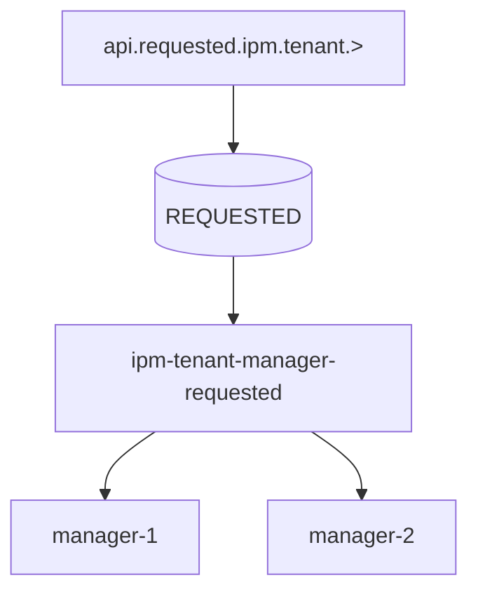
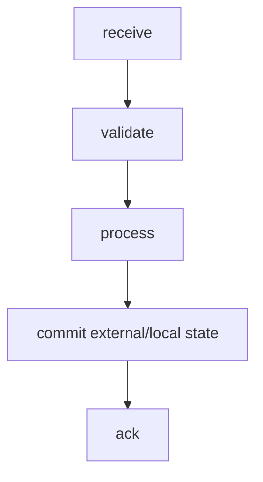
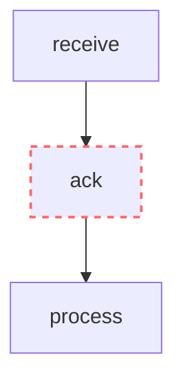
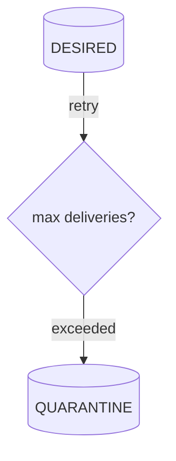
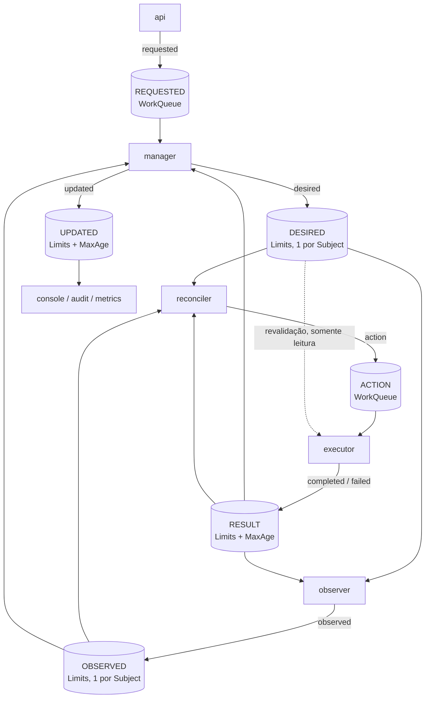
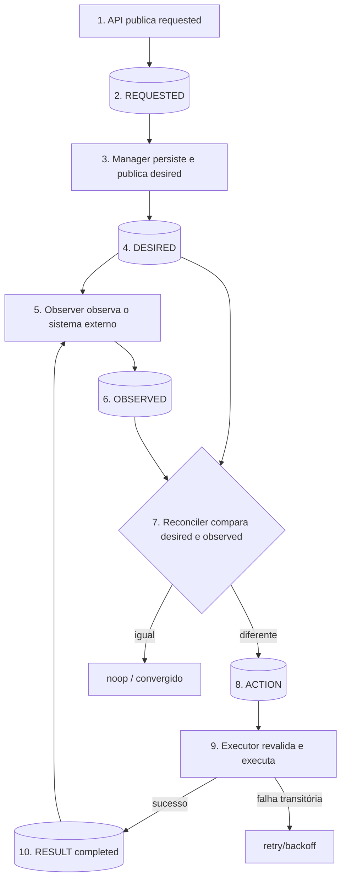

# NATS

# 1. Introdução

Este documento define a implementação de referência do modelo de mensageria em NATS e NATS JetStream. A semântica das mensagens é definida exclusivamente em `MESSAGING.md`.

NATS é uma tecnologia de transporte. Este documento descreve como o contrato semântico é materializado em Subjects, Streams, Consumers e demais recursos do NATS.

# 2. Objetivos

O objetivo é estabelecer uma implementação NATS consistente, previsível, segura e resiliente para os contratos definidos em `MESSAGING.md`, incluindo roteamento, persistência, consumo, distribuição, retry, quarentena, replay, segurança e observabilidade.

# 3. Princípios de implementação

## 3.1 Respeitar o modelo semântico

A implementação NATS deve preservar:

```text
emitter
messageType
module
resourceType
resourceId
operation
```

conforme definido em `MESSAGING.md`.

## 3.2 Subject como materialização do endereço lógico

No NATS, o endereço lógico é materializado em um Subject hierárquico.

Formato de referência:

```text
<emitter>.<messageType>.<module>.<resourceType>.<resourceId>.<operation>
```

Exemplos:

```text
api.requested.ipm.tenant.<id>.create
manager.desired.ipm.tenant.<id>.changed
observer.observed.ipm.tenant.<id>.changed
reconciler.action.ipm.tenant.<id>.create
executor.completed.ipm.tenant.<id>.create
manager.updated.ipm.tenant.<id>.changed
```

## 3.3 Emissor primeiro

O primeiro nível representa o emissor funcional:

```text
api
manager
observer
reconciler
executor
```

Emissores compostos de dois tokens, quando definidos em `MESSAGING.md` (por exemplo, `worker.platform`), exigem que filtros e autorizações considerem os dois tokens.

## 3.4 Destinatário não é codificado no Subject

Não utilizar:

```text
manager.executor.desired...
observer.manager.observed...
```

para representar destinatário.

O consumidor manifesta interesse por meio de subscription ou JetStream Consumer.

## 3.5 `resourceId` no Subject

Quando `resourceId` fizer parte do Subject, ele deve respeitar a sintaxe de Subject do NATS.

Em particular, `.` é separador de tokens e, portanto, não deve aparecer no `resourceId` usado no Subject. Caracteres que criem tokens extras ou wildcards (`*`, `>`) também não são permitidos.

O `resourceId` deve ser validado antes de compor o Subject, e um valor inválido deve ser rejeitado (ver `RESOURCE-CONTROL-SECURITY.md`).

A regra semântica de identidade de recurso continua pertencendo a `MESSAGING.md`; a restrição de caracteres é específica da implementação NATS.

## 3.6 Um Subject por recurso nas mensagens de estado

`desired` e `observed` são mensagens de estado (ver `MESSAGING.md`, classes de mensagem). Por isso, utilizam sempre a operação `changed`:

```text
manager.desired.ipm.tenant.<id>.changed
observer.observed.ipm.tenant.<id>.changed
```

Assim, cada recurso possui **um único Subject** por tipo de estado, e a retenção de uma mensagem por Subject (seção de retenção) guarda exatamente o último estado do recurso.

Se a operação fizesse parte da identidade do Subject (`...create`, `...update`, `...present`, `...absent`), o stream reteria uma mensagem por operação, e uma observação antiga poderia permanecer ao lado de uma recente.

# 4. Core NATS e JetStream

Core NATS entrega mensagens aos subscribers conectados e não fornece persistência para reprocessamento posterior. Quando mensagens precisam sobreviver a reinícios, aguardar consumidores ou ser reproduzidas, a implementação deve utilizar JetStream.

## 4.1 Uso recomendado

Para mensagens de negócio relacionadas a `desired` e `observed` que tenham requisito de durabilidade, replay, retry ou tolerância a indisponibilidade do consumidor, utilizar JetStream.

Core NATS pode ser utilizado para interações que explicitamente sejam efêmeras, como sinais operacionais ou request/reply de baixo risco, desde que isso não viole o contrato de `MESSAGING.md`.

# 5. Subjects

## 5.1 Subject canônico

```text
<emitter>.<messageType>.<module>.<resourceType>.<resourceId>.<operation>
```

## 5.2 Exemplos

```text
api.requested.ipm.tenant.<id>.create
manager.desired.ipm.tenant.<id>.changed
observer.observed.ipm.tenant.<id>.changed
reconciler.action.ipm.tenant.<id>.create
executor.completed.ipm.tenant.<id>.create
executor.failed.ipm.tenant.<id>.create
manager.updated.ipm.tenant.<id>.changed
```

## 5.3 Wildcards

Wildcards devem ser restritos ao escopo necessário.

Exemplos:

```text
manager.desired.>
manager.desired.ipm.>
manager.desired.ipm.tenant.>

observer.observed.ipm.tenant.>
reconciler.action.ipm.tenant.>
```

Evitar subscriptions genéricas como:

```text
>
*
```

em componentes de produção.

## 5.4 Identificadores

Quando `resourceId` estiver no Subject:

```text
observer.observed.ipm.tenant.tenant-01.changed
```

não utilizar:

```text
observer.observed.ipm.tenant.tenant.01.changed
```

porque o segundo exemplo cria dois tokens adicionais.

# 6. Streams JetStream

Streams são o mecanismo de persistência e replay do JetStream. O desenho do Stream deve seguir o modelo de entrega desejado, e não apenas a conveniência de agrupar Subjects. JetStream suporta políticas de retenção `limits`, `interest` e `workqueue`, além de consumidores, replay e replicação.

## 6.1 Um Stream por `messageType`

A regra é explícita: **cada `messageType` possui seu Stream**, com a retenção adequada à sua classe (ver `MESSAGING.md`, classes de mensagem). A única exceção é `completed` e `failed`, que compartilham o Stream `RESULT` por serem resultados da mesma operação, com os mesmos consumidores e a mesma retenção.

Motivos:

- **segurança:** a autorização de JetStream é por Stream. A permissão de subscribe por Subject não restringe o que um consumidor JetStream lê, e o controle por filtro de consumidor só existe para consumidor com um único filtro. Um Stream por tipo isola quem acessa `action` de quem acessa `requested`;
- **robustez:** limites e política de descarte são por Stream, de modo que um excesso de um tipo não bloqueia outro;
- **resiliência:** a falha ou a limpeza de um Stream afeta um único tipo;
- **simplicidade:** a regra "Stream = `messageType`" dispensa uma segunda taxonomia.

Esta regra não contradiz a recomendação de evitar fragmentação (seção própria): ela se aplica a recursos e componentes, e não a tipos semânticos.

## 6.2 Mapeamento

| Stream | Subjects | Retenção | Classe | Consumidores |
|---|---|---|---|---|
| `REQUESTED` | `api.requested.>` | `WorkQueuePolicy`, `DiscardNew` | Trabalho | Manager |
| `DESIRED` | `manager.desired.>` | `LimitsPolicy`, `MaxMsgsPerSubject=1`, `allow_direct` | Estado | Reconciler, Observer, Executor (leitura direta do último valor), outros |
| `OBSERVED` | `observer.observed.>` | `LimitsPolicy`, `MaxMsgsPerSubject=1`, `MaxAge` | Estado | Reconciler, Manager, outros |
| `ACTION` | `reconciler.action.>` | `WorkQueuePolicy`, `DiscardNew` | Trabalho | Executor |
| `RESULT` | `executor.completed.>`, `executor.failed.>` | `LimitsPolicy`, `MaxAge`, `allow_direct` | Fato | Manager, Observer, Reconciler, auditoria |
| `UPDATED` | `manager.updated.>` | `LimitsPolicy`, `MaxAge` | Fato | Console, auditoria, métricas |
| `AUDIT` | `audit.>` | `LimitsPolicy`, retenção longa | Histórico | Auditoria |
| `QUARANTINE` | definido pela política de quarentena | `LimitsPolicy` | Diagnóstico | Operação |

Os valores de limites (`MaxAge`, tamanho, réplicas) dependem do ambiente. Duas restrições:

- `RESULT` deve reter por mais tempo que o prazo de ação do domínio, que a janela de recuperação do Reconciler e que o prazo máximo de reentrega ou reemissão de uma `action`. O Executor consulta o `RESULT` para saber o desfecho de um `actionId` (seção de Consumers);
- `OBSERVED` deve possuir `MaxAge` maior que alguns períodos de observação (o Observer observa periodicamente). Um recurso que deixa de ser observado expira, e o Reconciler não decide sem observação (ver `RESOURCE-CONTROL-LOOP.md`).

## 6.3 `REQUESTED` e `ACTION`: trabalho

São mensagens de trabalho com **um único consumidor lógico**. A mensagem deve ser processada uma vez por um grupo de instâncias e deixar de existir após o ACK.

- `WorkQueuePolicy`: a mensagem é removida após o ACK;
- `DiscardNew`: com o Stream cheio, o publicador recebe erro, em vez de o Stream descartar trabalho antigo. O publicador deve tratar esse erro como contrapressão (a API rejeita o pedido de forma retentável; o Reconciler tenta novamente na próxima reconciliação);
- consumidores de um Stream `WorkQueue` não podem ter filtros de Subject sobrepostos. Cada Stream de trabalho possui um único consumidor durável por função;
- um segundo leitor (auditoria, métricas) **não** deve consumir o Stream de trabalho. Esses leitores usam `AUDIT` (ver seção de Source, Mirror e Republish).

`ACTION` publica com o cabeçalho `Nats-Msg-Id` igual ao `actionId`. O broker descarta duplicatas dentro da janela de deduplicação (por padrão, 2 minutos). Isso é uma otimização: a deduplicação do Executor por `actionId` continua obrigatória.

## 6.4 `DESIRED` e `OBSERVED`: estado

São mensagens de estado: a mais recente por recurso substitui as anteriores.

- `LimitsPolicy` com `MaxMsgsPerSubject=1`: o Stream retém o último estado de cada recurso, e **não** remove a mensagem após o ACK;
- vários consumidores independentes, cada um com seu progresso (Reconciler, Observer, Executor, Manager, outros);
- cada instância que mantém estado em memória cria o seu próprio consumer a partir da última mensagem de cada Subject (`DeliverLastPerSubject`) e reconstrói o estado (ver seção de Consumers);
- o histórico de gerações não fica nestes Streams. Quando necessário, vem de `AUDIT`.

## 6.5 `RESULT` e `UPDATED`: fatos

São fatos imutáveis, consumidos por vários consumidores independentes.

- `LimitsPolicy` com `MaxAge` (e limites de tamanho);
- cada consumidor mantém seu progresso;
- um consumidor lento não bloqueia os demais.

## 6.6 `AUDIT`

Auditoria é opcional e não faz parte da semântica básica da mensagem.

Quando necessário, pode existir um Stream dedicado para retenção histórica, replay controlado e investigações.

Exemplo:

```text
Stream: AUDIT
Subjects:
  audit.>
```

A forma de popular `AUDIT` deve ser escolhida explicitamente. Não assumir que `Source`, `Mirror` ou `RePublish` são semanticamente equivalentes. Em particular, a origem em Stream `WorkQueue` (`REQUESTED`, `ACTION`) deve ser validada antes de adotada, pois a restrição de consumidores sem sobreposição se aplica a quem lê o Stream.

## 6.7 Evitar streams excessivamente fragmentados

Não criar um Stream por recurso ou por componente sem necessidade operacional.

A divisão por `messageType` (6 Streams operacionais) é deliberada. Qualquer divisão adicional deve considerar:

- política de retenção;
- modelo de consumo;
- requisitos de durabilidade;
- recuperação;
- segurança;
- volume;
- ciclo de vida operacional.

# 7. Consumers

Consumers mantêm o estado de entrega por leitor e controlam como mensagens persistidas são disponibilizadas. JetStream suporta pull consumers, replay, ACK, redelivery e escalabilidade entre várias instâncias de um mesmo consumer.

## 7.1 Serviço e consumer

A plataforma é composta por muitos serviços pequenos. Para cada módulo e tipo de recurso existe o mesmo conjunto de serviços:

```text
api-<módulo>-<tipo>
srv-<módulo>-<tipo>-manager
srv-<módulo>-<tipo>-observer
srv-<módulo>-<tipo>-reconciler
srv-<módulo>-<tipo>-executor
```

Um consumer pertence a **um único Stream**. Portanto, um serviço possui um consumer **por Stream que lê**. Cada consumer possui um **filtro único** no nível `<módulo>.<tipo>`, por exemplo `manager.desired.ipm.tenant.>`.

Os Streams são fixos (um por `messageType`); a criação de um novo módulo ou tipo de recurso acrescenta apenas consumers, e não Streams.

## 7.2 Classes de consumer

| Classe | Quando | Modelo | Serviços |
|---|---|---|---|
| Trabalho | `requested` e `action`: cada mensagem é processada uma vez | Durável pull, compartilhado pelas instâncias | Manager (`requested`), Executor (`action`) |
| Persistência | `observed` e `result` consumidos para gravar no SSOT | Durável pull, compartilhado pelas instâncias | Manager (`observed`, `result`) |
| Estado em memória | `desired`, `observed` e `result` consumidos para manter um cache | Um consumer **por instância** | Reconciler, Observer |

## 7.3 Trabalho e persistência: durável compartilhado

Todas as instâncias do serviço se ligam ao **mesmo consumer durável**. O servidor entrega cada mensagem a uma única instância, e a mensagem não confirmada dentro de `ack_wait` é entregue novamente.

Equivalências:

| Mecanismo | Persistência | Redelivery | Observação |
|---|---|---|---|
| Queue group do Core NATS | Não | Não ("a message sent to a worker that crashes mid-processing is lost") | Não utilizar para mensagens de negócio |
| Push consumer com `deliver_group` | Sim | Sim, com `AckExplicit` | Mesma semântica: uma mensagem, um membro |
| Pull consumer compartilhado | Sim | Sim, com `AckExplicit` | **Adotado**: não exige configuração de grupo e deixa o backpressure e o lote sob controle do consumidor |

Regras:

- política de ACK explícita (`AckExplicit`), com `ack_wait`, `backoff` e `max_deliver` conforme a seção de Retry;
- `max_ack_pending` é um limite **único**, dividido por todas as instâncias do pool;
- ao reduzir o número de instâncias, drenar a subscription (*drain*) antes de encerrar;
- o consumer de persistência exige que o SSOT seja idempotente: ele descarta estado mais antigo que o já gravado (`observedAt`, geração) e usa `resourceVersion` para atualizações concorrentes (`MESSAGING.md`).

## 7.4 Estado em memória: um consumer por instância

O Reconciler e o Observer mantêm em memória o último `desired`, `observed` e `result` de cada recurso. Um consumer compartilhado **não serve** a esse caso, por dois motivos:

1. **Fração do estado.** Em um consumer compartilhado, cada mensagem vai para uma única instância. Nenhuma instância teria o estado completo, e o Reconciler precisa do `desired`, do `observed` e do `result` do mesmo recurso na mesma instância.
2. **Posição durável.** Um consumer durável retoma da última mensagem confirmada. A política de entrega (`DeliverLastPerSubject`) vale apenas na criação do consumer. Após um restart, o processo perde o cache e o durável **não** reentrega o último estado de cada recurso.

Por isso, cada **instância** cria o seu consumer ao iniciar:

- nome `<módulo>-<tipo>-<papel>-<stream>-<instância>`, em que `<instância>` é único **por execução do processo** (por exemplo, um identificador gerado na partida), e não apenas por réplica. Se o nome se repetisse, o servidor reutilizaria o consumer existente com a posição antiga, e o estado não seria reconstruído;
- filtro único no nível `<módulo>.<tipo>`;
- `DeliverLastPerSubject`, que entrega a última mensagem de cada Subject e, em seguida, as alterações;
- `AckExplicit`;
- `inactive_threshold`, para que o servidor remova o consumer de uma instância que não retornou.

Efeitos:

- todas as instâncias possuem o estado completo, e o failover é imediato;
- as instâncias podem tomar a mesma decisão. Isso é inofensivo: a `action` possui `actionId` determinístico, o publicador usa `Nats-Msg-Id` igual ao `actionId` e o Executor deduplica por `actionId` (`RESOURCE-CONTROL-LOOP.md`);
- o custo é a duplicação do cache e da avaliação por instância. Para o Reconciler, o particionamento por `resourceId` fica reservado para quando houver carga medida que o justifique;
- **o Observer é a exceção**: se todas as instâncias observassem todos os recursos, o provider receberia N vezes as leituras. A observação periódica é particionada por `resourceId`, e cada instância observa apenas a sua partição, usando o índice estável da réplica (`RESOURCE-CONTROL-LOOP.md`, *Coordenação da observação*). O consumer de estado continua por instância, para que o cache permaneça completo.

## 7.5 Executor

- **`action`:** consumer durável com `priority_policy=pinned_client` (instância ativa e instâncias em standby, com failover automático) e `max_ack_pending=1`. Em operação normal, apenas uma `action` é executada por vez no serviço, o que garante o *single-flight* por recurso. A vazão fica limitada; o particionamento por `resourceId` só deve ser considerado com carga medida. Pinned consumers exigem `AckExplicit`.
- **Revalidação do `desired`:** *Direct Get* do último valor do Subject do recurso (`last_by_subj`), sem consumer e sem cache. Requer `allow_direct` em `DESIRED`.
- **Desfecho do `actionId`:** antes de executar, *Direct Get* do último `completed` e do último `failed` publicados por ele para o recurso e a operação (Subjects `executor.completed.<módulo>.<tipo>.<resourceId>.<operação>` e `executor.failed...`), em `RESULT`. Se o desfecho do mesmo `actionId` já existe, o Executor não executa de novo e republica o resultado. Requer `allow_direct` em `RESULT`.

Limitações a considerar:

- sob falha, o servidor pode entregar a `action` a outra instância enquanto a anterior ainda executa a chamada ao provider. A garantia de *single-flight* não elimina a necessidade de idempotência do Executor (`actionId` e chave de correlação com o recurso externo);
- o Direct Get pode ser atendido por uma réplica e refletir, por instantes, um estado anterior ao mais recente. A revalidação é um controle adicional; ela se soma, e não substitui, à conferência da geração (`desiredGeneration`) e à nova reconciliação periódica.

A configuração exata de `pinned_client` (inclusive a versão mínima do servidor) e de Direct Get deve ser validada no ambiente.

## 7.6 Consumers por serviço (exemplo `ipm.tenant`)

| Serviço | Consumer | Stream | Filtro | Classe |
|---|---|---|---|---|
| `api-ipm-tenant` | — | — | — | Somente publica |
| `srv-ipm-tenant-manager` | `ipm-tenant-manager-requested` | `REQUESTED` | `api.requested.ipm.tenant.>` | Trabalho |
| | `ipm-tenant-manager-observed` | `OBSERVED` | `observer.observed.ipm.tenant.>` | Persistência |
| | `ipm-tenant-manager-result` | `RESULT` | `executor.*.ipm.tenant.>` | Persistência |
| `srv-ipm-tenant-observer` | `ipm-tenant-observer-desired-<instância>` | `DESIRED` | `manager.desired.ipm.tenant.>` | Estado |
| | `ipm-tenant-observer-result-<instância>` | `RESULT` | `executor.*.ipm.tenant.>` | Estado |
| `srv-ipm-tenant-reconciler` | `ipm-tenant-reconciler-desired-<instância>` | `DESIRED` | `manager.desired.ipm.tenant.>` | Estado |
| | `ipm-tenant-reconciler-observed-<instância>` | `OBSERVED` | `observer.observed.ipm.tenant.>` | Estado |
| | `ipm-tenant-reconciler-result-<instância>` | `RESULT` | `executor.*.ipm.tenant.>` | Estado |
| `srv-ipm-tenant-executor` | `ipm-tenant-executor-action` | `ACTION` | `reconciler.action.ipm.tenant.>` | Trabalho (`pinned_client`, `max_ack_pending=1`) |

O filtro `executor.*.ipm.tenant.>` usa um curinga no token de `messageType` para cobrir `completed` e `failed` com **um único filtro**, o que preserva a autorização por filtro.

Funções adicionais (billing, auditoria, monitoramento) criam seus próprios consumers, sem alterar o produtor.

## 7.7 Regras de filtro

- cada consumer possui **um único filtro** no nível `<módulo>.<tipo>`;
- em Streams `WorkQueue` (`REQUESTED`, `ACTION`), nenhum consumer pode possuir filtro mais largo que `<módulo>.<tipo>` (por exemplo, `api.requested.ipm.>`): ele se sobreporia aos consumers dos demais tipos, e o servidor rejeitaria a criação;
- um segundo leitor de Stream de trabalho (auditoria, métricas) não é permitido; esses leitores usam `AUDIT`.

## 7.8 Pull Consumer

Pull Consumer é o padrão para os consumers de trabalho e persistência.

Motivos:

- backpressure controlado pelo consumidor;
- lote de mensagens controlado pelo consumidor;
- escala horizontal simples;
- comportamento operacional previsível.

## 7.9 Durable Consumers

Consumidores responsáveis por processamento de produção devem utilizar identidade durável e estável quando a continuidade do progresso for necessária. Isso se aplica às classes de trabalho e de persistência.

O nome do consumer deve representar sua função. Os consumers de estado em memória são a exceção: seu nome inclui a instância (seção de estado em memória).

# 8. Work Distribution

Aplica-se às mensagens de trabalho (`requested` e `action`) e aos consumers de persistência:



As instâncias concorrem sobre o mesmo fluxo lógico de trabalho. A instância confirma a mensagem somente depois de executar o processamento definido pela aplicação.

Para `action`, apenas uma `action` deve estar em execução por vez para o mesmo `resourceId` (*single-flight*, ver `RESOURCE-CONTROL-LOOP.md`). Isso é obtido pelo consumer do Executor com `pinned_client` e `max_ack_pending=1` (seção de Consumers), e **não** decorre da política `WorkQueue`. Como o servidor pode redistribuir uma `action` sob falha, a idempotência do Executor continua obrigatória.

A confirmação de transporte não substitui a publicação de `completed`, `failed` ou `observed`.

# 9. Fanout e estado

Aplica-se às mensagens de estado (`desired`, `observed`) e aos fatos (`completed`, `failed`, `updated`):

```text
observer.observed.>
          |
          v
      OBSERVED
      /   |   \
     /    |    \
reconciler manager audit
```

Cada consumidor mantém seu próprio estado de leitura.

Um consumidor lento não deve bloquear semanticamente os demais consumidores.

Nas mensagens de estado, o ACK registra o progresso do consumidor, mas **não remove** a mensagem: o último estado do recurso permanece disponível para novos consumers.

Os consumers que mantêm estado em memória não são compartilhados: cada instância possui o seu (seção de Consumers).

# 10. ACK e processamento

JetStream rastreia a entrega por consumer e considera a mensagem processada quando há ACK apropriado. Mensagens não confirmadas podem ser entregues novamente.

## 10.1 Regra de ACK

Para processamento de negócio:



Evitar:



quando a perda de uma falha após ACK puder causar inconsistência.

## 10.2 ACK não é convergência

```text
JetStream ACK
      !=
Desired converged
```

Convergência é determinada pelo ciclo de reconciliação e pelas observações persistidas.

# 11. Retry e Backoff

Falhas transitórias devem usar redelivery com backoff quando suportado pelo consumer.

Configurações como:

```text
ack_wait
backoff
max_deliver
```

devem ser escolhidas com base no tempo de processamento e na natureza da falha.

O retry não deve causar tempestade de mensagens.

## 11.1 Falha transitória

Exemplos:

- timeout do provedor;
- conexão temporariamente indisponível;
- lock transitório;
- indisponibilidade temporária do serviço externo.

Essas falhas normalmente devem retornar para retry.

## 11.2 Falha permanente

Exemplos:

- contrato inválido;
- recurso impossível de processar;
- credencial inválida sem mecanismo automático de recuperação;
- payload incompatível.

Essas falhas devem eventualmente ser direcionadas à quarentena, evitando loops infinitos.

# 12. Quarentena / DLQ

JetStream fornece mecanismos de redelivery e limite de entregas; uma política de DLQ/quarentena deve ser implementada de forma explícita conforme a necessidade da aplicação.

Fluxo de referência:



Uma mensagem deve ser movida para quarentena somente quando houver decisão explícita de que o processamento normal não deve continuar.

A mensagem original deve ser preservada com seus metadados de diagnóstico.

# 13. Retry não é DLQ

São mecanismos diferentes:

```text
retry      = tentar novamente
quarantine = retirar do fluxo normal
replay     = executar novamente de forma controlada
```

Não tratar uma fila de retry como auditoria.

Não tratar uma quarentena como armazenamento histórico permanente.

# 14. Replay

JetStream permite leitura e replay de mensagens persistidas.

Replay deve ser controlado para evitar efeitos duplicados.

Antes de realizar replay:

1. identificar consumer de destino;
2. definir janela ou ponto inicial;
3. avaliar idempotência;
4. avaliar efeito sobre sistemas externos;
5. registrar o motivo do replay;
6. monitorar a carga gerada.

Replay não deve ser utilizado como mecanismo cotidiano de retry.

# 15. Streams e retenção

## 15.1 `WorkQueuePolicy`

Adequado para `REQUESTED` e `ACTION`, quando a mensagem representa trabalho que deve ser processado por um único grupo de consumidores concorrentes.

A mensagem não deve desaparecer do fluxo antes que o processamento correspondente tenha sido reconhecido conforme a política do consumer. Os consumidores do Stream não podem ter filtros de Subject sobrepostos.

## 15.2 `LimitsPolicy`

Adequado para `DESIRED`, `OBSERVED`, `RESULT`, `UPDATED` e `AUDIT`, quando as mensagens devem permanecer disponíveis para consumidores independentes.

Os limites devem ser definidos por:

- tempo;
- tamanho;
- quantidade;
- impacto de armazenamento;
- necessidade de replay.

Em `DESIRED` e `OBSERVED`, o limite principal é a quantidade por Subject (`MaxMsgsPerSubject=1`).

## 15.3 `InterestPolicy`

Pode ser utilizada quando a retenção deve depender da existência de consumidores interessados.

Não utilizar automaticamente apenas porque está disponível. Validar primeiro a semântica desejada. Esta política não é adotada neste momento.

## 15.4 Remoção de recursos

Como `DESIRED` e `OBSERVED` retêm o último estado por recurso, o estado de um recurso removido permanece nos Streams até ser limpo.

**Nenhum serviço de runtime recebe permissão de purge.** A API de purge de Stream recebe o filtro de Subject no corpo da requisição, e uma permissão por Subject não consegue restringi-lo. Conceder purge ao Manager de um tipo permitiria apagar o estado de **todos** os tipos em `DESIRED`.

O procedimento é:

1. o Manager publica o `desired` final (`lifecycle=absent`, com a geração final);
2. após a convergência (observação `presence=absent`), o Manager remove o recurso do SSOT;
3. a última mensagem do recurso permanece em `DESIRED` como **tombstone**. O Reconciler e o Observer ignoram recurso com `lifecycle=absent` já convergido;
4. um job de infraestrutura, com **identidade administrativa própria** (não é um serviço de runtime), remove periodicamente os tombstones antigos;
5. `OBSERVED` expira por `MaxAge`, pois o Observer reobserva periodicamente os recursos que existem em `DESIRED`.

Custo: uma mensagem pequena por recurso removido até a próxima limpeza.

# 16. Replicação e durabilidade

Streams críticos devem utilizar armazenamento persistente e número de réplicas compatível com o nível de disponibilidade definido para o ambiente.

A escolha de réplica deve considerar:

- quorum;
- capacidade de armazenamento;
- latência;
- domínio de falha;
- recuperação;
- custo.

Não assumir que replicação do Stream elimina a necessidade de backup.

## 16.1 Custo de Streams e Consumers

- cada Stream consome cerca de dois descritores de arquivo;
- Stream e consumer durável replicados (R3) possuem um grupo Raft cada, com tráfego de heartbeat em regime estacionário; consumers efêmeros não são baseados em Raft;
- o armazenamento é por dado: um Stream R3 de 10 GiB conta 30 GiB. As mesmas mensagens ocupam o mesmo espaço em um Stream ou em seis;
- os limites práticos aparecem na ordem de centenas de milhares de Streams e consumers somados. Não há valor oficial por consumer em bytes.

Neste desenho, os Streams são fixos. Por tipo de recurso, o número de consumers é de aproximadamente 4 duráveis (Manager 3, Executor 1) mais 5 consumers de estado por instância (Reconciler 3, Observer 2). Com 20 tipos e 2 instâncias, são cerca de 80 duráveis e 200 consumers de estado, bem abaixo do limite prático.

O risco real é criar Streams por recurso ou por tipo, o que multiplicaria os grupos Raft e os descritores a cada novo serviço.

Os consumers duráveis devem ser gerados a partir de um manifesto por tipo de recurso, e deve existir um limite de consumers por conta como controle de abuso.

## 16.2 Janela de recuperação

A **janela de recuperação** é o maior intervalo de indisponibilidade de um consumidor (ou do próprio broker) que o sistema deve tolerar sem perder as mensagens de que ele precisa para voltar a convergir.

Regra: a retenção de cada Stream deve ser **maior ou igual** à janela de recuperação dos seus consumidores. O valor é definido por ambiente e por domínio, e não é fixado neste documento.

Aplica-se, em particular, a `RESULT` e `UPDATED` (retenção por tempo). Em `DESIRED` e `OBSERVED`, que guardam o último estado por recurso, a janela se traduz em `MaxAge` de `OBSERVED` maior que alguns períodos de observação (ver seção de Streams).

# 17. Source, Mirror e Republish

NATS possui mecanismos diferentes para copiar ou transformar fluxos, incluindo sources, mirrors e republish. A escolha depende do objetivo operacional e da política do Stream.

## 17.1 Regra arquitetural

Não utilizar `Source`, `Mirror` ou `RePublish` apenas para criar uma segunda cópia sem definir:

- finalidade;
- retenção;
- independência operacional;
- impacto sobre ACK;
- recuperação;
- autorização.

## 17.2 Auditoria

Para auditoria de longa duração, preferir um fluxo explicitamente desenhado para auditoria, em vez de depender de comportamento implícito de um Stream operacional.

# 18. Segurança

## 18.1 TLS

Em ambientes não locais, conexões NATS devem utilizar TLS.

O certificado do servidor deve ser validado pelo cliente usando CA confiável.

## 18.2 mTLS

Para comunicação serviço-a-serviço, mTLS é a configuração recomendada quando a identidade criptográfica do cliente for necessária.

## 18.3 Autorização

Publicação e assinatura devem ser autorizadas separadamente.

A matriz de permissões por componente é definida em `RESOURCE-CONTROL-SECURITY.md`. Este documento descreve como ela é materializada em NATS.

NATS suporta ACLs de publicação e assinatura por Subject. Uma allow-list explícita restringe o acesso às subjects não autorizadas.

Em JetStream há uma particularidade: a permissão de subscribe por Subject não restringe o que um consumidor JetStream lê do Stream. O acesso à API de consumers é autorizado por Stream (`$JS.API.CONSUMER.*.<stream>...`) e, para um consumer com um único filtro, por filtro. Por isso:

- cada `messageType` possui seu Stream (seção de Streams);
- a identidade de um serviço é `<módulo>-<tipo>-<papel>`, e suas permissões são sempre escopadas por `<módulo>.<tipo>` (por exemplo, `manager.desired.ipm.tenant.>`), nunca por `manager.desired.>`;
- consumers de trabalho e persistência são criados pela infraestrutura (seção de administração), e a identidade de runtime recebe apenas o acesso ao **seu** consumer (`$JS.API.CONSUMER.MSG.NEXT.<stream>.<consumer>` e os Subjects de ACK correspondentes);
- consumers de estado em memória são criados pelo próprio serviço. Sua identidade pode criar **somente** consumers que casem com o seu padrão de nome e com o seu filtro único (`$JS.API.CONSUMER.CREATE.<stream>.<consumer>.<filtro>`), e não pode listar, alterar nem remover consumers de outros serviços;
- o Executor lê o `desired` e o desfecho em `RESULT` por Direct Get, com permissões restritas ao Subject do seu tipo (`$JS.API.DIRECT.GET.DESIRED.manager.desired.<módulo>.<tipo>.>` e `$JS.API.DIRECT.GET.RESULT.executor.*.<módulo>.<tipo>.>`);
- nenhum serviço de runtime recebe permissão sobre `$JS.API.STREAM.*`, inclusive purge;
- criação de Streams e de consumers duráveis e a limpeza de tombstones usam uma identidade administrativa separada.

Os Subjects exatos de autorização (criação de consumer com filtro, `MSG.NEXT`, ACK e Direct Get) devem ser validados no servidor utilizado, pois a documentação consultada não os detalha por completo.

## 18.4 Princípio do menor privilégio

Cada identidade deve possuir somente os Subjects necessários.

Evitar permissões amplas como:

```text
publish: ">
subscribe: ">"
```

para componentes de aplicação.

## 18.5 Segredos

Credenciais de NATS, chaves privadas e tokens não devem ser versionados no repositório.

Devem ser fornecidos por mecanismo seguro de secrets management.

# 19. TLS do cluster e clientes

A configuração de TLS deve distinguir claramente:

```text
client -> server
server -> server
```

O material criptográfico utilizado para comunicação cliente-servidor não deve ser automaticamente reutilizado para comunicação de cluster.

No mínimo, devem existir identidades adequadas aos diferentes trust domains quando a topologia exigir essa separação.

# 20. Configuração por ambiente

A política semântica não depende do ambiente.

A infraestrutura pode variar:

```text
dev  -> NATS local
stg  -> cluster NATS interno
prd  -> cluster NATS resiliente
```

mas os Subjects e contratos semânticos devem permanecer compatíveis.

Parâmetros de deployment pertencem à infraestrutura, não a este contrato.

# 21. Versionamento do NATS

A versão do NATS Server deve ser explicitamente pinada no ambiente de execução.

Evitar tags flutuantes como:

```text
latest
2.12
```

em ambientes de integração, homologação e produção.

Uma atualização de versão deve incluir:

- validação de compatibilidade dos clientes;
- validação de Streams e Consumers;
- testes de integração;
- revisão de release notes;
- verificação de comportamento de recursos JetStream utilizados pelo projeto;
- registro da alteração no changelog da plataforma.

Este documento não fixa uma versão específica do servidor. O número efetivamente suportado deve ser definido pelo ambiente e pelos testes do projeto.

# 22. Observabilidade

A plataforma deve monitorar pelo menos:

```text
publish rate
consume rate
consumer lag
pending messages
redelivery count
ack latency
processing latency
stream size
stream age
storage usage
quorum status
consumer state
quantidade de consumers por Stream
mensagens pendentes e sem ACK por consumer
instância fixada (`pinned`) por consumer do Executor
idade do último estado (`observedAt`) por tipo de recurso
```

Os sinais devem ser coletados do NATS e das aplicações consumidoras.

Observabilidade do broker não substitui observabilidade do processamento de negócio.

# 23. Métricas de aplicação

Para cada consumidor, observar:

```text
messages_received_total
messages_processed_total
messages_failed_total
messages_retried_total
messages_quarantined_total
message_processing_duration
```

Correlacionar os dados com:

```text
messageId
correlationId
causationId
resourceId
resourceType
messageType
```

# 24. Requisitos de resiliência do cliente

Clientes devem tratar desconexões e reconexões como comportamento normal.

Devem possuir:

- timeout explícito;
- reconnect controlado;
- backoff;
- tratamento de falha de autenticação;
- observabilidade das reconexões;
- shutdown ordenado;
- recuperação do consumer durável quando aplicável.

Falha de autenticação não deve ser mascarada como simples indisponibilidade de rede. Clientes NATS possuem comportamentos específicos para reconexão e falhas de autenticação que devem ser considerados na operação.

# 25. JetStream API e administração

A criação e alteração de Streams e Consumers deve ser controlada.

Preferir configuração declarativa e versionada por infraestrutura como código ou mecanismo equivalente.

A infraestrutura cria os Streams e os consumers duráveis a partir de um manifesto por tipo de recurso. A limpeza de tombstones é um job de infraestrutura com identidade administrativa própria. Aplicações de runtime criam apenas os consumers de estado em memória, com a permissão escopada descrita na seção de Segurança.

Não permitir que aplicações de runtime tenham privilégios administrativos amplos sobre:

```text
$JS.API.>
```

sem necessidade explícita.

# 26. Exemplos de autorização

Exemplos conceituais por serviço, para o tipo `ipm.tenant`. A matriz oficial está em `RESOURCE-CONTROL-SECURITY.md`; os valores concretos de configuração do servidor pertencem à infraestrutura e devem ser validados no ambiente.

## 26.1 `srv-ipm-tenant-manager`

```text
publish:
  manager.desired.ipm.tenant.>
  manager.updated.ipm.tenant.>

consumo (consumers criados pela infraestrutura):
  REQUESTED → ipm-tenant-manager-requested
  OBSERVED  → ipm-tenant-manager-observed
  RESULT    → ipm-tenant-manager-result
```

O Manager não recebe permissão de purge nem de administração de Streams.

## 26.2 `srv-ipm-tenant-observer`

```text
publish:
  observer.observed.ipm.tenant.>

consumers de estado (criados pelo serviço, somente com este padrão):
  DESIRED → ipm-tenant-observer-desired-*   filtro manager.desired.ipm.tenant.>
  RESULT  → ipm-tenant-observer-result-*    filtro executor.*.ipm.tenant.>
```

## 26.3 `srv-ipm-tenant-reconciler`

```text
publish:
  reconciler.action.ipm.tenant.>

consumers de estado (criados pelo serviço, somente com este padrão):
  DESIRED  → ipm-tenant-reconciler-desired-*
  OBSERVED → ipm-tenant-reconciler-observed-*
  RESULT   → ipm-tenant-reconciler-result-*
```

## 26.4 `srv-ipm-tenant-executor`

```text
publish:
  executor.completed.ipm.tenant.>
  executor.failed.ipm.tenant.>

consumo (consumer criado pela infraestrutura):
  ACTION → ipm-tenant-executor-action

leitura direta:
  DESIRED → último valor de manager.desired.ipm.tenant.>
  RESULT  → último valor de executor.*.ipm.tenant.>   (desfecho do actionId)
```

O Executor do tipo é a única identidade com acesso de consumo ao consumer de `ACTION` desse tipo.

## 26.5 Identidade administrativa

```text
administração:
  criar Streams e consumers duráveis
  remover tombstones de DESIRED (job periódico)
```

Esta identidade não é utilizada por nenhum serviço de runtime.

## 26.6 Billing

```text
consumo (consumer próprio):
  OBSERVED → billing-observed
```

Billing não recebe permissões de publicação para Subjects de outros componentes apenas para consumir observações.

# 27. Exemplo de arquitetura



# 28. Fluxo de reconciliação



O ciclo continua até que a observação demonstre convergência. `completed` não encerra o ciclo (ver `RESOURCE-CONTROL-LOOP.md`).

# 29. Anti-padrões

## 29.1 Proibido: destinatário como prefixo do Subject

Não utilizar:

```text
manager.executor.desired...
```

para codificar uma rota ponto-a-ponto.

## 29.2 Proibido: `task` e `reality` como tipos oficiais

A semântica oficial é:

```text
desired
observed
```

## 29.3 Proibido: operação imperativa ou resultado no Subject de `desired` e `observed`

Evitar:

```text
manager.desired.ipm.tenant.<id>.create
observer.observed.ipm.tenant.<id>.absent
```

Preferir:

```text
manager.desired.ipm.tenant.<id>.changed
observer.observed.ipm.tenant.<id>.changed
```

O tipo de mudança pertence ao contrato do recurso e à evolução de `desiredGeneration`. O resultado da observação (`present`, `absent`, `unknown`) pertence ao campo `presence` do envelope.

## 29.4 Proibido: subscription `>` sem justificativa

## 29.5 Proibido: secrets dentro do payload

## 29.6 Proibido: ACK antecipado

## 29.7 Proibido: depender de exactly-once para correção

## 29.8 Proibido: criar um Stream por recurso sem necessidade

## 29.9 Proibido: misturar classes de retenção no mesmo Stream

Não reunir mensagens de trabalho, de estado e de fato em um mesmo Stream, nem conceder acesso a um Stream de trabalho (`REQUESTED`, `ACTION`) a quem não é seu consumidor.

## 29.10 Proibido: mais de um consumidor sobreposto em Stream `WorkQueue`

## 29.11 Proibido: consumer compartilhado para estado em memória

Um consumer durável compartilhado entrega a cada instância apenas uma fração das mensagens e não reentrega o último estado após um restart. Cache de estado exige um consumer por instância.

## 29.12 Proibido: conceder purge ou administração de Stream a serviço de runtime

A permissão de purge não pode ser restringida por Subject. Remoção de tombstones é um job administrativo.

## 29.13 Proibido: filtro de consumer mais largo que `<módulo>.<tipo>`

Em Stream `WorkQueue`, sobrepõe consumers de outros tipos e é rejeitado pelo servidor. Em qualquer Stream, impede a autorização por filtro.

# 30. Nomenclatura recomendada

## 30.1 Streams

```text
REQUESTED
DESIRED
OBSERVED
ACTION
RESULT
UPDATED
AUDIT
QUARANTINE
```

## 30.2 Consumers

Nomes devem ser funcionais e usar apenas letras minúsculas, dígitos e hífen (sem `.`, `*`, `>` nem espaços).

Formato:

```text
<módulo>-<tipo>-<papel>-<stream>[-<instância>]
```

Exemplos:

```text
ipm-tenant-manager-requested
ipm-tenant-executor-action
ipm-tenant-reconciler-desired-<instância>
billing-observed
audit-observed
```

O sufixo `<instância>` existe apenas nos consumers de estado em memória e é único por execução do processo.

## 30.3 Subjects

```text
manager.desired.ipm.tenant.<id>.changed
observer.observed.ipm.tenant.<id>.changed
executor.completed.ipm.tenant.<id>.create
```

# 31. Checklist operacional

Antes de colocar um fluxo em produção, verificar:

- [ ] Subject segue o formato definido em `MESSAGING.md`;
- [ ] emissor é funcional e estável;
- [ ] consumidor não está embutido no Subject;
- [ ] `desired` e `observed` estão corretamente utilizados;
- [ ] Stream pertence ao `messageType` da mensagem e possui a retenção da sua classe;
- [ ] `desired` e `observed` usam a operação `changed` (um Subject por recurso);
- [ ] Stream `WorkQueue` possui consumidores sem filtros sobrepostos e `DiscardNew`;
- [ ] consumer de estado em memória é por instância, com `DeliverLastPerSubject`, nome único por execução e `inactive_threshold`;
- [ ] consumer de trabalho ou persistência é durável e compartilhado pelas instâncias;
- [ ] cada consumer possui um único filtro, no nível `<módulo>.<tipo>`;
- [ ] o Executor usa `pinned_client` e `max_ack_pending=1` em `ACTION`, e lê o `desired` por Direct Get;
- [ ] nenhum serviço de runtime possui permissão de purge ou de administração de Stream;
- [ ] Pull Consumer é utilizado para work distribution;
- [ ] ACK ocorre somente após processamento seguro;
- [ ] retry possui backoff;
- [ ] mensagens poison possuem quarentena;
- [ ] replay foi considerado;
- [ ] idempotência foi implementada;
- [ ] ordering necessário possui chave explícita;
- [ ] TLS está habilitado fora do ambiente local;
- [ ] autorização utiliza menor privilégio;
- [ ] secrets não estão no repositório;
- [ ] métricas e traces estão disponíveis;
- [ ] Streams e Consumers são gerenciados de forma controlada;
- [ ] versão do NATS está pinada no ambiente.

# 32. Fontes técnicas

A implementação deste documento utiliza como referência a documentação oficial do NATS:

- NATS Core e comportamento de subscribers: https://docs.nats.io/learn/core-nats/
- JetStream Deep Dive: https://docs.nats.io/learn/jetstream/
- JetStream Reference: https://docs.nats.io/reference/2.12/jetstream
- Authorization: https://docs.nats.io/learn/security/authorization
- TLS/Auth e clientes resilientes: https://docs.nats.io/learn/resilient-clients/tls-and-auth
- Encryption at rest: https://docs.nats.io/learn/security/encryption
- Retention policies: https://docs.nats.io/learn/jetstream/retention-policies
- Consumers: https://docs.nats.io/nats-concepts/jetstream/consumers
- Priority groups: https://docs.nats.io/learn/jetstream/priority-groups
- Queue groups (Core NATS): https://docs.nats.io/concepts/queue-groups
- Leitura direta (Direct Get): https://docs.nats.io/learn/jetstream/get-direct
- Sizing e recursos: https://docs.nats.io/learn/deployment/sizing-and-resources

# 33. Fonte de verdade

`MESSAGING.md` é a fonte de verdade para a semântica de mensageria.

`NATS.md` é a fonte de verdade para a implementação dessa semântica em NATS.

A hierarquia é:

```text
MESSAGING.md
      |
      v
   NATS.md
```

Uma limitação específica do NATS não deve alterar o modelo semântico. Quando a implementação exigir adaptação, a adaptação deve permanecer confinada a `NATS.md` e à infraestrutura.
