# Resource Control Loop

# 1. Introdução

O **Resource Control Loop** é o padrão arquitetural utilizado pela plataforma para gerenciar recursos de forma declarativa, assíncrona, idempotente e orientada à convergência.

O padrão define como a plataforma:

- recebe uma intenção;
- estabelece o estado desejado;
- observa a realidade;
- compara `desired` e `observed`;
- determina uma ação;
- executa a ação;
- observa novamente;
- atualiza o estado consolidado;
- converge continuamente para o estado desejado.

O padrão é independente da tecnologia utilizada para implementar a mensageria, persistência ou integração com sistemas externos.

Na implementação atual, NATS JetStream é utilizado como mecanismo de mensageria e PostgreSQL como SSOT, mas esses componentes são detalhes de implementação.

O Resource Control Loop é baseado no princípio:

```text
Desired → Observe → Reconcile → Act → Observe → Converge
```

# 2. Objetivo

Este documento define o padrão arquitetural oficial para componentes que gerenciam recursos da plataforma.

O objetivo é estabelecer uma estrutura consistente para recursos como:

```text
Tenant
Agent
Runner
Tool
Identity
Vault
Project
Node
Volume
VM
...
```

O padrão deve permitir que diferentes recursos utilizem a mesma arquitetura conceitual sem que cada domínio crie um modelo próprio de controle.

# 3. Princípios

## 3.1 Declarativo sobre imperativo

O sistema deve representar **o estado que deseja alcançar**, e não uma sequência de comandos necessária para alcançá-lo.

```text
Desired
   │
   ▼
Reconciliation
   │
   ▼
Action
```

O `desired` não diz:

```text
"execute create now"
```

Ele diz:

```text
"este recurso deve existir"
```

O Reconciler determina como transformar a realidade atual na realidade desejada.

## 3.2 Desired e Observed são conceitos centrais

O controle é baseado em dois estados:

```text
Desired = o que queremos

Observed = o que existe
```

A decisão é:

```text
Desired
   vs
Observed
   ↓
Reconciliation
```

## 3.3 O Reconciler não executa

O Reconciler decide.

O Executor executa.

```text
Reconciler
    │
    │ Action
    ▼
Executor
```

O Reconciler não deve possuir credenciais ou lógica específica para alterar o sistema externo quando essa responsabilidade pertence ao Executor.

## 3.4 O Observer não corrige

O Observer observa.

Ele não deve alterar o sistema externo.

```text
Observer
   │
   │ read
   ▼
External System
```

A correção pertence ao Executor.

## 3.5 O Manager é a autoridade do recurso

O Manager é responsável pelo recurso no SSOT.

Responsabilidades principais:

- persistência;
- lifecycle;
- desired;
- generations;
- conditions;
- processamento das mensagens relevantes;
- publicação de eventos consolidados.

O Manager não deve assumir a responsabilidade de executar operações diretamente no sistema externo quando existe um Executor para essa finalidade.

## 3.6 Comunicação assíncrona

Os componentes não devem depender de chamadas síncronas entre si para executar o control loop.

Preferir:

```text
Component
    │
    ▼
 Messaging
    │
    ▼
Component
```

em vez de:

```text
Component A
    │ HTTP
    ▼
Component B
    │ HTTP
    ▼
Component C
```

## 3.7 Responsabilidade antes de processo

O padrão define **responsabilidades arquiteturais**, não uma quantidade obrigatória de processos.

Por exemplo:

```text
Manager
Observer
Reconciler
Executor
```

podem ser:

```text
4 processos
```

ou:

```text
2 processos
```

desde que as responsabilidades permaneçam claramente separadas.

A separação em processos independentes é preferível quando:

- possuem ciclos de escala diferentes;
- possuem permissões diferentes;
- possuem dependências diferentes;
- precisam de isolamento;
- possuem falhas independentes;
- possuem requisitos operacionais diferentes.

# 4. Modelo geral

O Resource Control Loop pode ser representado como:

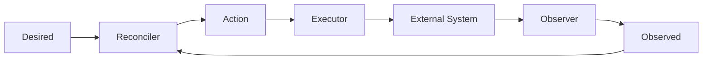

O ponto fundamental é que:

```text
Desired
```

e:

```text
Observed
```

são **entradas independentes do Reconciler**.

Não existe uma cadeia obrigatória:

```text
Desired → Observer → Observed → Reconciler
```

Existe:

```text
             Desired
                │
                ▼
           ┌──────────┐
           │Reconciler│
           └─────┬────┘
                ▲
                │
             Observed
```

# 5. Arquitetura de referência

A arquitetura completa é:

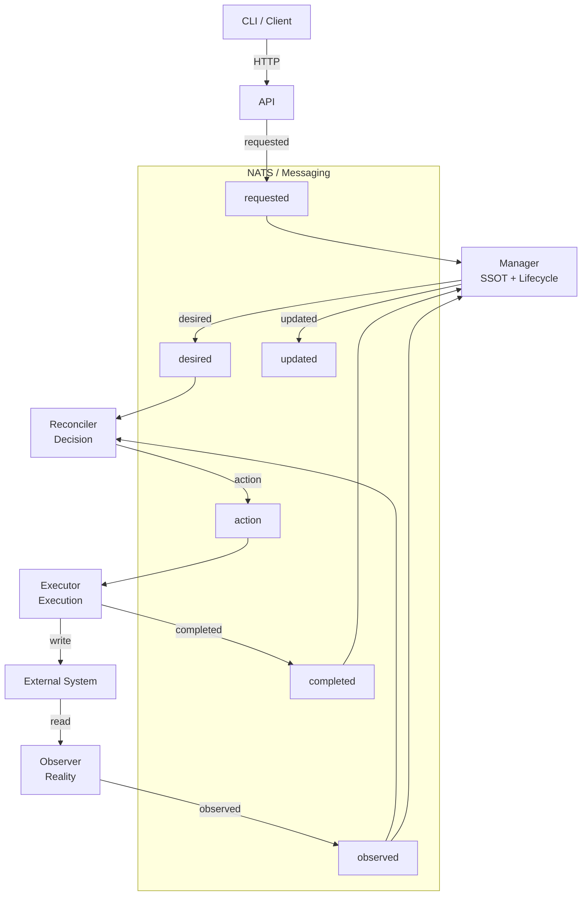

# 6. Componentes

# 6.1 API

A API é a porta de entrada do sistema.

Responsabilidades:

- autenticação;
- autorização;
- validação estrutural;
- geração de identificadores;
- criação de contexto de correlação;
- publicação de `requested`;
- consulta do SSOT;
- exposição do estado atual.

A API não deve:

- possuir o SSOT;
- executar reconciliação;
- chamar diretamente o sistema externo;
- implementar lógica de integração com o provider.

Fluxo:

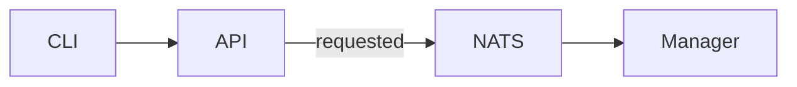

# 6.2 Manager

O Manager é o **owner do recurso no SSOT**.

Responsabilidades:

```text
Resource
Desired
Observed
Lifecycle
Conditions
Generation
Operation
```

Fluxo:

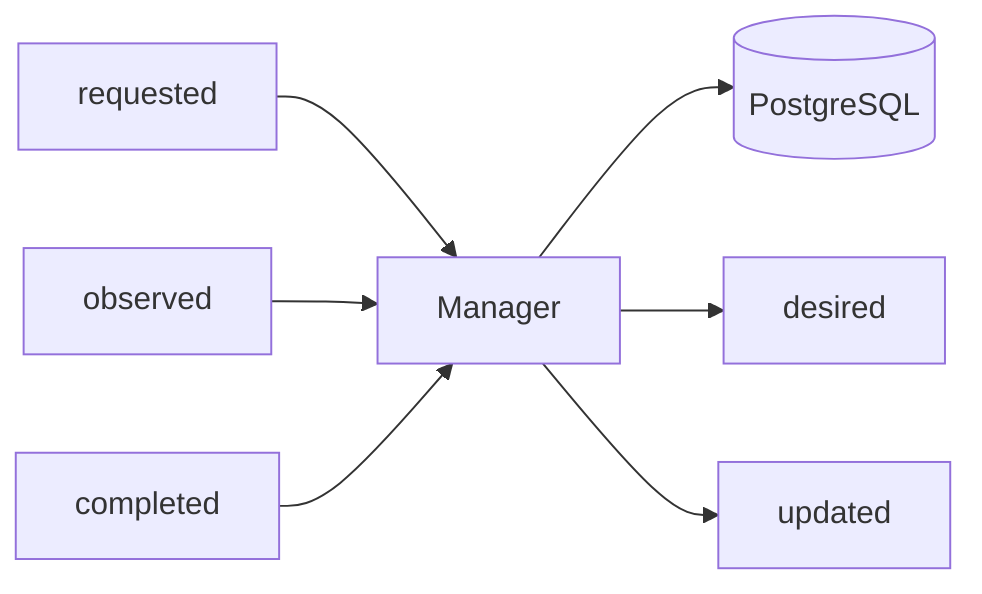

O Manager não precisa conhecer detalhes do provider.

Por exemplo, no caso de Tenant, ele não precisa implementar chamadas para Zitadel.

# 6.3 Observer

O Observer transforma realidade externa em `observed`.

Responsabilidades:

- consultar sistemas externos;
- verificar existência;
- consultar configuração;
- coletar estado;
- produzir observações;
- detectar drift.

Fluxo:

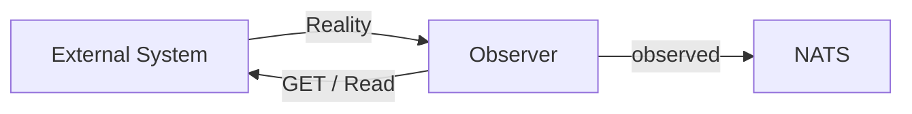

O Observer não deve:

```text
create
update
delete
```

diretamente no sistema externo.

# 6.4 Reconciler

O Reconciler é responsável exclusivamente pela **decisão de reconciliação**.

Ele consome:

```text
Desired
Observed
```

e produz:

```text
Action
```

Fluxo:

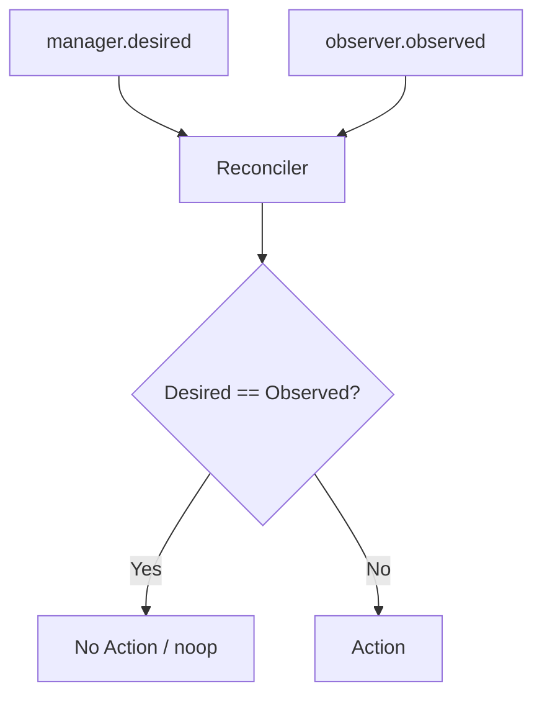

O Reconciler não deve:

- persistir o recurso como SSOT;
- chamar diretamente o provider;
- possuir lógica de API;
- executar a ação.

# 6.5 Executor

O Executor transforma `Action` em uma operação no sistema externo.

Fluxo:

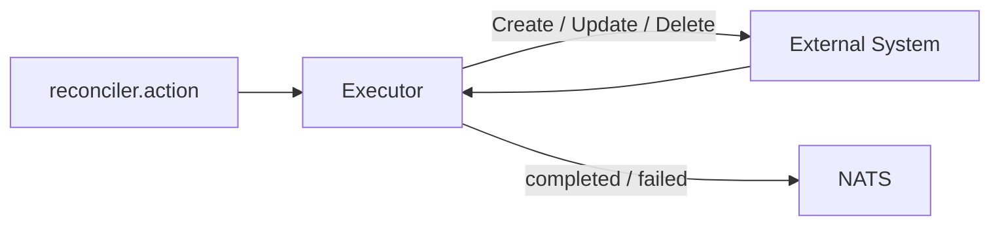

O Executor é o componente que possui as credenciais necessárias para alterar o sistema externo.

Isso permite aplicar menor privilégio:

```text
Observer
    → read-only

Executor
    → write
```

# 7. O fluxo completo

O fluxo completo pode ser dividido em quatro fases:

```text
1. Request
2. Reconciliation
3. Execution
4. Observation
```

Visualmente:

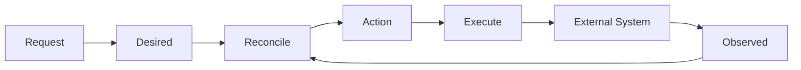

# 8. Fase 1 — Request

O cliente solicita uma alteração.

Exemplo:

```text
sk ipm tenant create --name acme
```

Fluxo:

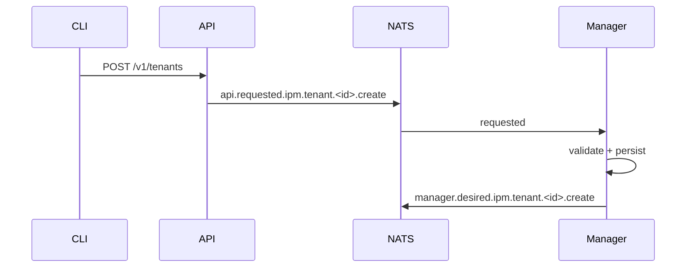

A API retorna rapidamente:

```text
202 Accepted
```

O processamento continua de forma assíncrona.

# 9. Fase 2 — Desired

O Manager estabelece o estado desejado no SSOT.

Exemplo:

```json
{
  "resourceId": "tenant-01",
  "desiredGeneration": 1,
  "desired": {
    "lifecycle": "present",
    "resourceName": "acme"
  }
}
```

Publicação:

```text
manager.desired.ipm.tenant.tenant-01.create
```

O Desired é uma declaração.

Não significa que o Tenant já existe.

```text
Desired = intenção
```

# 10. Fase 3 — Observation

O Observer consulta o sistema externo.

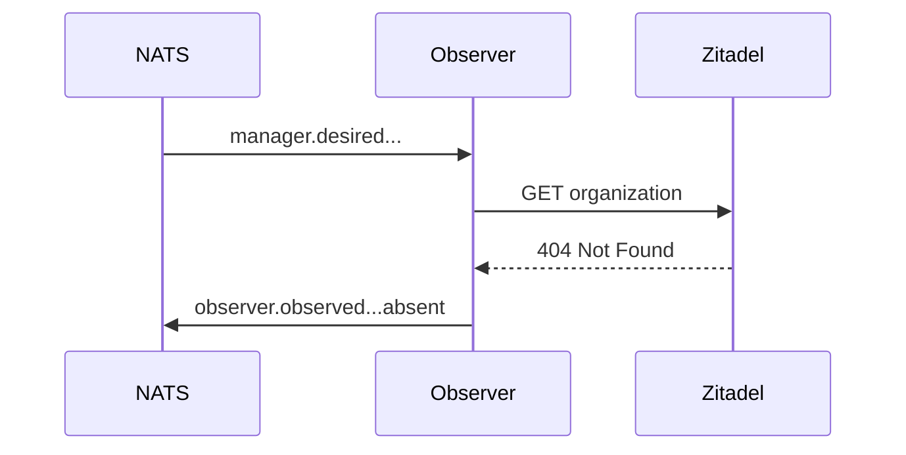

O resultado é:

```text
Observed = absent
```

# 11. Fase 4 — Reconciliation

O Reconciler recebe os dois estados.

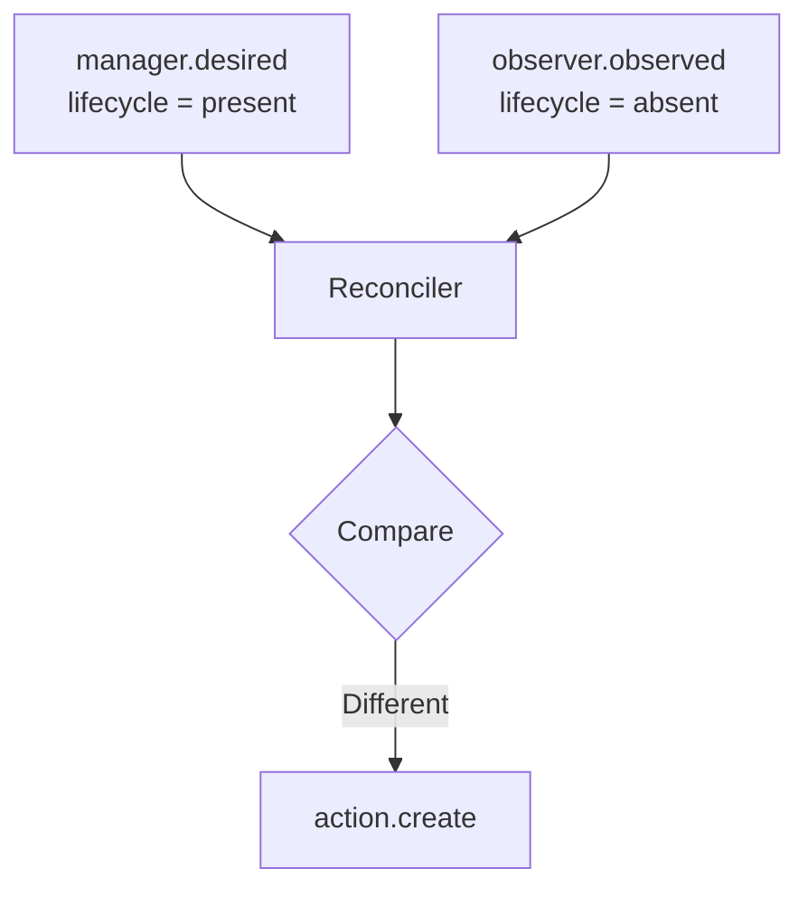

A decisão:

```text
Desired = present
Observed = absent

→ create
```

Publicação:

```text
reconciler.action.ipm.tenant.<id>.create
```

# 12. O Reconciler possui duas entradas independentes

Esta é uma propriedade fundamental do padrão.

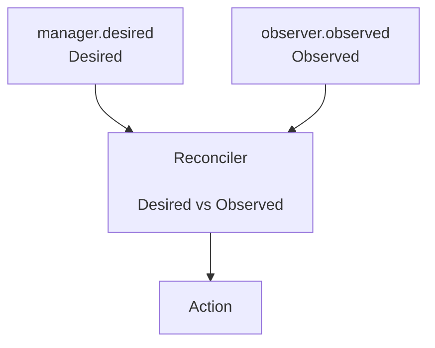

O Reconciler pode ser acionado por:

```text
Desired mudou
```

ou:

```text
Observed mudou
```

ou:

```text
reconciliation periódica
```

ou:

```text
retry / recovery
```

# 13. Reconcile provocado por mudança em Desired

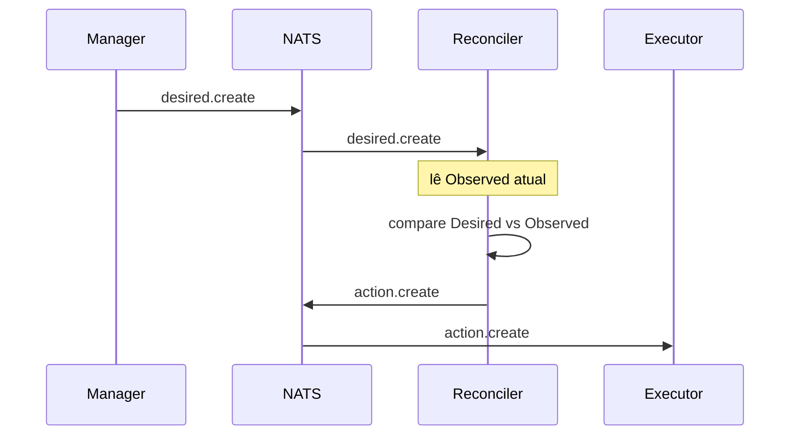

O Reconciler não precisa esperar uma nova mensagem `observed`.

Ele pode utilizar a última observação persistida/conhecida.

# 14. Reconcile provocado por mudança em Observed

Este caso é igualmente importante.

Imagine que um administrador altere diretamente o sistema externo.

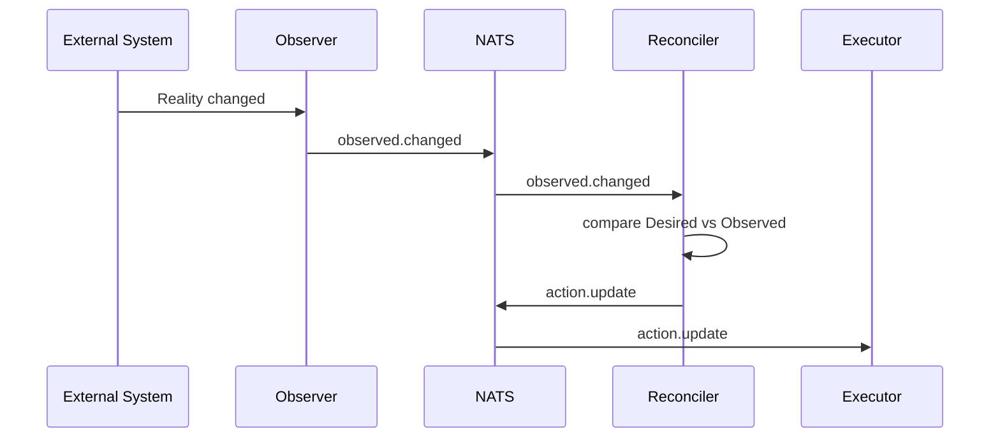

Esse mecanismo permite detectar e corrigir **drift**.

# 15. Drift

Drift ocorre quando:

```text
Desired != Observed
```

Exemplo:

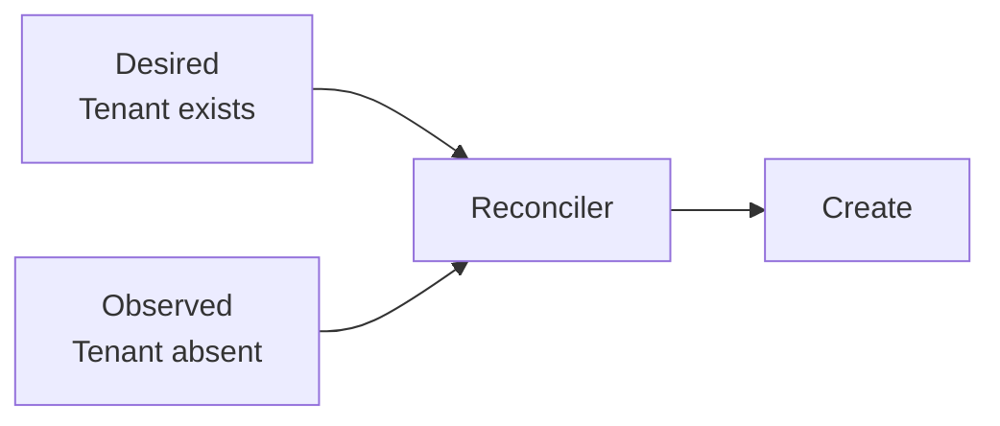

Outro exemplo:

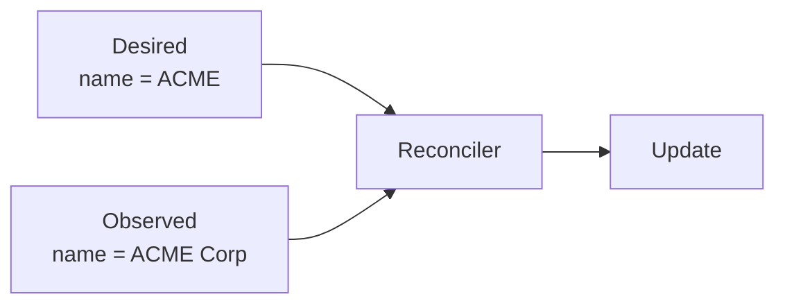

O Reconciler não precisa saber quem causou o drift.

Ele apenas responde:

```text
Desired != Observed
```

# 16. Fase 5 — Action

A Action representa uma decisão.

Exemplo:

```text
reconciler.action.ipm.tenant.<id>.create
```

Payload:

```json
{
  "messageType": "action",
  "operation": "create",
  "resourceId": "tenant-01",
  "desiredGeneration": 1,
  "data": {
    "reason": "resourceNotFound"
  }
}
```

A Action não é o Desired.

```text
Desired
   ↓
"o que deve existir"

Action
   ↓
"o que precisa ser feito agora"
```

# 17. Fase 6 — Execution

O Executor consome a Action.

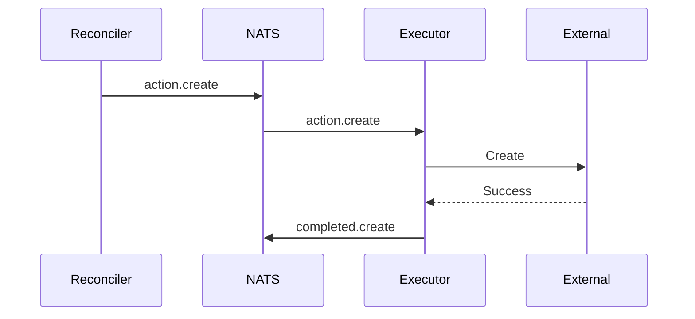

O Executor não decide se a ação é necessária.

Essa decisão pertence ao Reconciler.

# 18. Completed não significa convergência

Este princípio é obrigatório.

```text
executor.completed
        ≠
resource converged
```

`completed` significa:

> A operação solicitada foi executada com sucesso.

A convergência somente pode ser confirmada pela observação compatível.

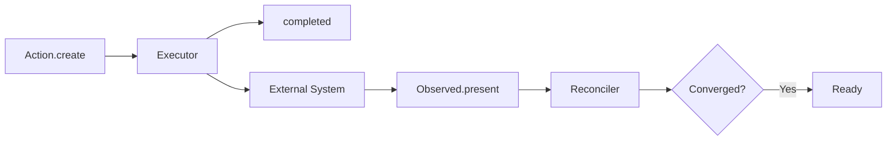

# 19. Nova observação

Após a execução, o Observer verifica novamente.

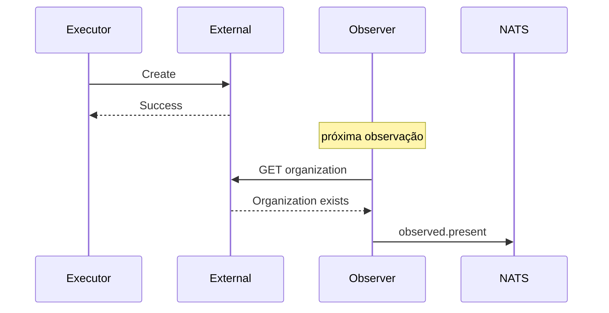

Agora:

```text
Desired = present
Observed = present
```

# 20. Convergência

O Reconciler compara novamente:

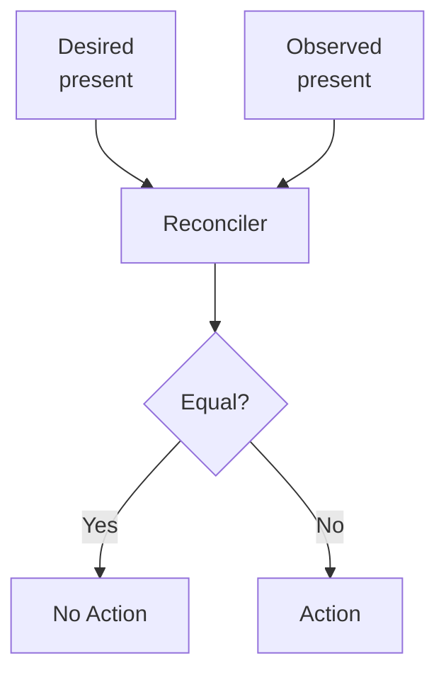

Resultado:

```text
No Action
```

O recurso convergiu.

# 21. Atualização do SSOT

O Manager recebe a observação e atualiza o Resource.

```mermaid
flowchart LR

    O["observer.observed"]
    O --> M["Manager"]

    M --> DB[(PostgreSQL)]

    DB --> S["Resource<br/>observed + conditions + lifecycle"]

    M --> U["manager.updated"]
```

Exemplo:

```text
lifecycle = Ready
desiredGeneration = 1
observedGeneration = 1
condition = Ready=True
```

# 22. Fluxo completo do Tenant

```mermaid
sequenceDiagram

    participant CLI
    participant API
    participant NATS
    participant Manager
    participant Observer
    participant Reconciler
    participant Executor
    participant Zitadel

    CLI->>API: POST /v1/tenants
    API->>NATS: requested.create

    NATS->>Manager: requested.create
    Manager->>Manager: validate
    Manager->>Manager: persist Resource
    Manager->>NATS: desired.create

    NATS->>Observer: desired.create
    Observer->>Zitadel: GET organization
    Zitadel-->>Observer: 404
    Observer->>NATS: observed.absent

    NATS->>Reconciler: desired.create
    NATS->>Reconciler: observed.absent

    Reconciler->>Reconciler: compare
    Reconciler->>NATS: action.create

    NATS->>Executor: action.create
    Executor->>Zitadel: POST organization
    Zitadel-->>Executor: 201 Created
    Executor->>NATS: completed.create

    NATS->>Observer: trigger observation
    Observer->>Zitadel: GET organization
    Zitadel-->>Observer: 200 OK
    Observer->>NATS: observed.present

    NATS->>Manager: observed.present
    Manager->>Manager: update SSOT
    Manager->>NATS: updated.changed

    CLI->>API: GET /v1/tenants/<id>
    API-->>CLI: lifecycle=Ready
```

# 23. Fluxo lógico simplificado

```mermaid
flowchart LR

    Request["Request"]
    Desired["Desired"]
    Observed["Observed"]
    Reconcile["Reconcile"]
    Action["Action"]
    Execute["Execute"]
    External["External System"]

    Request --> Desired

    Desired --> Reconcile
    Observed --> Reconcile

    Reconcile --> Action
    Action --> Execute
    Execute --> External
    External --> Observed

    Reconcile -->|"converged"| Ready["Ready"]
```

# 24. Fluxo de criação

```mermaid
flowchart TB

    A[Create Request]
    B[Persist Resource]
    C[Desired: present]
    D[Observed: absent]
    E[Action: create]
    F[Execute create]
    G[Observed: present]
    H[Converged]
    I[Lifecycle: Ready]

    A --> B
    B --> C
    C --> E
    D --> E
    E --> F
    F --> G
    C --> H
    G --> H
    H --> I
```

# 25. Fluxo de atualização

```mermaid
flowchart TB

    A[Desired changed]
    B[desiredGeneration++]
    C[Observed old generation]
    D[Reconciler]
    E[Action update]
    F[Executor]
    G[External System]
    H[Observer]
    I[Observed new generation]
    J[Converged]

    A --> B
    B --> D
    C --> D
    D --> E
    E --> F
    F --> G
    G --> H
    H --> I
    I --> D
    D --> J
```

# 26. Fluxo de remoção

A remoção também é declarativa.

```mermaid
flowchart TB

    D["Desired<br/>lifecycle = absent"]
    O["Observed<br/>lifecycle = present"]

    D --> R["Reconciler"]
    O --> R

    R --> A["Action: delete"]
    A --> E["Executor"]
    E --> X["External System"]

    X --> B["Observer"]
    B --> O2["Observed: absent"]

    O2 --> R
    R --> C["Converged"]
```

A plataforma não precisa representar a exclusão como um comando imperativo no `desired`.

# 27. Fluxo de drift

```mermaid
flowchart TB

    Desired["Desired<br/>ACME"]
    External["External System<br/>ACME Corp"]

    External --> Observer
    Observer["Observer"] --> Observed["Observed<br/>ACME Corp"]

    Desired --> Reconciler["Reconciler"]
    Observed --> Reconciler

    Reconciler --> Decision{"Drift?"}

    Decision -->|Yes| Action["Action: update"]
    Action --> Executor["Executor"]
    Executor --> External
```

O drift pode ter sido causado por:

- alteração manual;
- alteração por outro sistema;
- falha parcial;
- mudança externa;
- perda de estado;
- operação concorrente.

O mecanismo de correção permanece o mesmo.

# 28. Fluxo de falha

```mermaid
flowchart TB

    Action["Action"]
    Executor["Executor"]
    External["External System"]

    Action --> Executor
    Executor --> External

    External -->|failure| Retry["Retry"]

    Retry -->|temporary| Executor
    Retry -->|permanent| Failed["Failed"]

    Failed --> Condition["Condition / Error"]
```

Uma falha de execução não deve destruir o Desired.

O Desired permanece como fonte da intenção.

Isso permite retry e recuperação.

# 29. Falha após alteração externa

Este é um dos cenários mais importantes.

```mermaid
sequenceDiagram

    participant R as Reconciler
    participant E as Executor
    participant X as External
    participant O as Observer

    R->>E: action.create
    E->>X: create
    X-->>E: success

    Note over E: processo falha antes de publicar completed

    O->>X: GET
    X-->>O: resource exists
    O->>R: observed.present

    R->>R: compare Desired vs Observed
    R-->>R: converged
```

A arquitetura não depende de `completed` para recuperar o estado.

A realidade observada é a fonte de evidência.

# 30. Reconciliation periódica

Eventos não devem ser a única forma de disparar reconciliação.

O sistema pode possuir reconciliação periódica:

```mermaid
flowchart LR

    Timer["Periodic Trigger"]
    Timer --> Reconciler

    Desired["Current Desired"]
    Observed["Current Observed"]

    Desired --> Reconciler
    Observed --> Reconciler

    Reconciler --> Decision["Reconcile"]
```

Isso permite recuperação após:

- perda de mensagem;
- indisponibilidade temporária;
- restart;
- falha do consumidor;
- falha externa;
- inconsistência transitória.

O período deve ser definido de acordo com o domínio.

# 31. Reconciliation é idempotente

Uma mesma mensagem pode provocar múltiplas reconciliações.

```mermaid
flowchart TB

    D1["desired.create"]
    D2["desired.create<br/>duplicate"]
    O["observed.absent"]

    D1 --> R["Reconciler"]
    D2 --> R
    O --> R

    R --> A["action.create"]

    A --> E["Executor"]

    E --> X["External System"]

    X -->|already exists| Success["No harmful side effect"]
```

O Executor também deve ser idempotente ou utilizar mecanismos que tornem a operação segura.

# 32. Idempotência em cada camada

```mermaid
flowchart LR

    API["API"]
    Manager["Manager"]
    Reconciler["Reconciler"]
    Executor["Executor"]
    External["External"]

    API --> Manager
    Manager --> Reconciler
    Reconciler --> Executor
    Executor --> External

    API -.->|request idempotency| API
    Manager -.->|resource constraints| Manager
    Reconciler -.->|generation comparison| Reconciler
    Executor -.->|safe execution| Executor
    External -.->|provider semantics| External
```

Cada camada possui uma estratégia diferente.

Não existe uma única técnica universal de idempotência.

# 33. Mensageria

A comunicação utiliza o modelo semântico definido em `MESSAGING.md`.

Formato:

```text
<emitter>.<messageType>.<module>.<resourceType>.<resourceId>.<operation>
```

Exemplos:

```text
api.requested.ipm.tenant.<id>.create

manager.desired.ipm.tenant.<id>.create

observer.observed.ipm.tenant.<id>.absent

reconciler.action.ipm.tenant.<id>.create

executor.completed.ipm.tenant.<id>.create

observer.observed.ipm.tenant.<id>.present

manager.updated.ipm.tenant.<id>.changed
```

# 34. Quem publica e quem consome

O padrão define explicitamente:

| Mensagem | Publicador | Consumidores principais |
|---|---|---|
| `requested` | API | Manager |
| `desired` | Manager | Reconciler, Observer, outros interessados |
| `observed` | Observer | Reconciler, Manager, outros consumidores |
| `action` | Reconciler | Executor |
| `completed` | Executor | Manager, Observer, auditoria |
| `updated` | Manager | Console, auditoria, métricas, consumidores |
| `failed` | Executor/componente responsável | Manager, observabilidade, retry |

O consumidor não deve ser codificado no subject.

# 35. Matriz de responsabilidades

| Responsabilidade | API | Manager | Observer | Reconciler | Executor |
|---|---:|---:|---:|---:|---:|
| AuthN | ✓ | | | | |
| Schema validation | ✓ | ✓ | | | |
| Business validation | | ✓ | | | |
| SSOT | | ✓ | | | |
| Desired | | ✓ | | | |
| Observe external | | | ✓ | | |
| Observed | | | ✓ | | |
| Compare Desired/Observed | | | | ✓ | |
| Decide Action | | | | ✓ | |
| Execute Action | | | | | ✓ |
| External write | | | | | ✓ |
| Lifecycle | | ✓ | | | |
| Conditions | | ✓ | | | |
| Provider credentials | | | Read | | Write |

# 36. Separação de privilégios

A arquitetura permite aplicar princípio de menor privilégio.

```mermaid
flowchart LR

    Observer["Observer<br/>READ"]
    Executor["Executor<br/>WRITE"]

    Observer -->|"GET / LIST"| External["External System"]

    Executor -->|"POST / PATCH / DELETE"| External
```

Credenciais de escrita não devem estar disponíveis para:

```text
API
Manager
Observer
Reconciler
```

quando não forem necessárias.

# 37. Separação de falhas

Cada componente possui um domínio de falha diferente.

```mermaid
flowchart LR

    API["API"]
    Manager["Manager"]
    Observer["Observer"]
    Reconciler["Reconciler"]
    Executor["Executor"]

    API -.-> FA["API failure"]
    Manager -.-> FM["Persistence failure"]
    Observer -.-> FO["Provider read failure"]
    Reconciler -.-> FR["Decision failure"]
    Executor -.-> FE["Provider write failure"]
```

O objetivo é permitir que uma falha em um componente não exija indisponibilidade de toda a plataforma.

# 38. Escalabilidade

Os componentes podem escalar independentemente.

```mermaid
flowchart TB

    NATS[NATS]

    NATS --> M1[Manager 1]
    NATS --> M2[Manager 2]

    NATS --> O1[Observer 1]
    NATS --> O2[Observer 2]

    NATS --> R1[Reconciler 1]
    NATS --> R2[Reconciler 2]
    NATS --> R3[Reconciler 3]

    NATS --> E1[Executor 1]
    NATS --> E2[Executor 2]
```

A quantidade de instâncias deve ser determinada pelo comportamento do componente.

Por exemplo:

```text
Executor
    → pode exigir escala baseada em chamadas ao provider

Observer
    → pode exigir escala baseada em quantidade de recursos

Reconciler
    → pode exigir escala baseada em eventos

Manager
    → pode exigir escala baseada em throughput do SSOT
```

# 39. Concorrência

A unidade natural de concorrência deve ser o recurso.

Exemplo:

```text
Tenant A → reconciliation independente
Tenant B → reconciliation independente
Tenant C → reconciliation independente
```

```mermaid
flowchart TB

    NATS[NATS]

    NATS --> RA[Reconciler<br/>Tenant A]
    NATS --> RB[Reconciler<br/>Tenant B]
    NATS --> RC[Reconciler<br/>Tenant C]
```

Quando houver necessidade de serialização, ela deve ser definida explicitamente por `resourceId` ou `orderingKey`.

Não assumir ordenação global.

# 40. DesiredGeneration

A geração identifica uma versão lógica do estado desejado.

```mermaid
flowchart LR

    G1["DesiredGeneration 1"]
    G2["DesiredGeneration 2"]
    G3["DesiredGeneration 3"]

    G1 --> G2
    G2 --> G3
```

Exemplo:

```text
generation 1
    name = ACME

generation 2
    name = ACME Corp

generation 3
    name = ACME Corporation
```

O Reconciler deve evitar aplicar uma decisão baseada em uma geração antiga quando uma geração mais recente já estiver disponível.

# 41. ObservedGeneration

A observação pode indicar qual geração foi efetivamente observada.

```text
Desired:
generation = 5

Observed:
observedGeneration = 4
```

Indica:

```text
Observed ainda não representa generation 5
```

Após convergência:

```text
Desired:
generation = 5

Observed:
observedGeneration = 5
```

Ainda assim, condições específicas do recurso devem ser avaliadas.

# 42. Lifecycle

O lifecycle do Resource Control Loop é definido no recurso, não na mensageria.

Exemplo:

```mermaid
stateDiagram-v2

    [*] --> Pending
    Pending --> Reconciling
    Reconciling --> Ready
    Reconciling --> Failed
    Ready --> Reconciling
    Ready --> Deleting
    Failed --> Reconciling
    Deleting --> [*]
```

Um recurso pode permanecer em:

```text
Reconciling
```

durante múltiplos ciclos.

Isso é esperado.

# 43. Conditions

Conditions representam fatos ou condições consolidadas do recurso.

Exemplo:

```json
{
  "type": "Ready",
  "status": "True",
  "reason": "Reconciled",
  "message": "Tenant exists in Zitadel",
  "observedGeneration": 1,
  "lastTransitionAt": "2026-10-04T00:00:00Z"
}
```

O lifecycle e as conditions são persistidos no SSOT pelo Manager.

# 44. Operation

Uma operação acompanha uma solicitação assíncrona.

Exemplo:

```text
operationId
operationType
resourceId
desiredGeneration
status
createdAt
updatedAt
completedAt
```

A Operation não deve ser confundida com o Resource.

```text
Resource
    = objeto gerenciado

Operation
    = processamento de uma solicitação
```

# 45. CLI e experiência síncrona

A arquitetura pode ser assíncrona internamente sem obrigar o usuário a trabalhar de forma assíncrona.

Exemplo:

```text
sk ipm tenant create --name acme --wait
```

Fluxo:

```mermaid
sequenceDiagram
    participant CLI
    participant API
    participant ControlLoop

    CLI->>API: POST /tenants
    API-->>CLI: 202 + operationId

    loop polling
        CLI->>API: GET /tenants/<id>
        API-->>CLI: current state
    end

    Note over CLI: lifecycle = Ready
```

O `--wait` é uma conveniência do cliente.

Não altera o modelo interno.

# 46. Console e projeções

O Manager não deve conhecer detalhes da interface.

O Console pode consumir:

```text
manager.updated
```

e construir sua própria projeção.

```mermaid
flowchart LR

    Manager["Manager"]
    NATS["NATS"]
    Console["Console Projection"]

    Manager -->|updated| NATS
    NATS --> Console
```

Outros consumidores podem existir:

```text
Audit
Metrics
Alerts
Billing
Analytics
```

sem alterar o Manager.

# 47. Auditoria

Eventos de domínio podem ser consumidos por uma camada de auditoria.

```mermaid
flowchart TB

    NATS[NATS]

    NATS --> Audit[Audit]
    NATS --> Console[Console]
    NATS --> Metrics[Metrics]
    NATS --> Alerts[Alerts]
```

A auditoria não deve ser necessária para a operação normal do control loop.

Ela é um consumidor.

# 48. Recuperação após restart

Os componentes devem poder reiniciar sem perder a capacidade de convergir.

```mermaid
flowchart LR

    Restart[Component Restart]

    Restart --> ReadSSOT[Read SSOT]
    Restart --> ReadDesired[Read Desired]
    Restart --> ReadObserved[Read Observed]

    ReadSSOT --> Reconcile[Reconcile]
    ReadDesired --> Reconcile
    ReadObserved --> Reconcile

    Reconcile --> Continue[Continue Control Loop]
```

O sistema não deve depender exclusivamente da memória local do processo.

# 49. Recuperação após perda de mensagem

Caso uma mensagem seja perdida:

```mermaid
flowchart TB

    Desired[Desired persisted]
    Message[Desired message lost]
    Timer[Periodic reconciliation]

    Desired --> Message
    Message -->|lost| Timer

    Timer --> Reconciler
    Desired --> Reconciler
    Observed[Observed] --> Reconciler

    Reconciler --> Action
```

A persistência do estado e a reconciliação periódica permitem recuperação.

# 50. Padrão de dependências

A direção de dependência deve ser:

```mermaid
flowchart LR

    API --> Messaging
    Manager --> Messaging
    Observer --> Messaging
    Reconciler --> Messaging
    Executor --> Messaging

    Observer --> External
    Executor --> External

    Manager --> SSOT
```

Não deve existir:

```text
Reconciler → Executor diretamente
API → Executor diretamente
API → Observer diretamente
Observer → Executor diretamente
```

quando o objetivo for comunicação entre componentes do control loop.

# 51. Regra de ouro

A arquitetura pode ser resumida em:

```text
Manager
    ↓
Desired

Observer
    ↓
Observed

Desired + Observed
    ↓
Reconciler

Reconciler
    ↓
Action

Action
    ↓
Executor

Executor
    ↓
External System

External System
    ↓
Observer

Observer
    ↓
Observed

Observed
    ↓
Manager
```

Ou, de forma ainda mais simples:

```mermaid
flowchart TB

    Desired --> Reconciler
    Observed --> Reconciler

    Reconciler --> Action
    Action --> Executor
    Executor --> External
    External --> Observer
    Observer --> Observed
```

# 52. Resource Control Loop como padrão

O padrão completo pode ser abstraído para qualquer recurso:

```text
Resource
    │
    ├── Desired
    │
    ├── Observed
    │
    ├── Lifecycle
    │
    ├── Conditions
    │
    └── Generations
```

Control loop:

```text
             ┌───────────────┐
             │    Desired    │
             └───────┬───────┘
                     │
                     ▼
              ┌─────────────┐
              │ Reconciler  │
              └──────┬──────┘
                     │
                   Action
                     │
                     ▼
              ┌─────────────┐
              │  Executor   │
              └──────┬──────┘
                     │
                     ▼
              External System
                     │
                     ▼
              ┌─────────────┐
              │   Observer  │
              └──────┬──────┘
                     │
                  Observed
                     │
                     └──────────► Reconciler
```

# 53. Aplicação ao Tenant

Para Tenant:

```mermaid
flowchart TB

    TenantDesired["Tenant Desired"]
    TenantObserved["Tenant Observed"]

    TenantDesired --> Reconciler["Tenant Reconciler"]
    TenantObserved --> Reconciler

    Reconciler --> Action["Create / Update / Delete"]
    Action --> Executor["Tenant Executor"]

    Executor --> Zitadel["Zitadel Organization"]

    Zitadel --> Observer["Tenant Observer"]
    Observer --> TenantObserved
```

Componentes:

```text
cli-ipm-tenant
api-ipm-tenant
srv-ipm-tenant-manager
srv-ipm-tenant-observer
srv-ipm-tenant-reconciler
srv-ipm-tenant-executor
```

# 54. Aplicação a Agent

O mesmo padrão pode ser utilizado para Agent:

```mermaid
flowchart TB

    Desired["Agent Desired"]
    Observed["Agent Observed"]

    Desired --> Reconciler["Agent Reconciler"]
    Observed --> Reconciler

    Reconciler --> Action["Agent Action"]
    Action --> Executor["Agent Executor"]

    Executor --> Runtime["Agent Runtime"]

    Runtime --> Observer["Agent Observer"]
    Observer --> Observed
```

# 55. Aplicação a Runner

```mermaid
flowchart TB

    Desired["Runner Desired"]
    Observed["Runner Observed"]

    Desired --> Reconciler["Runner Reconciler"]
    Observed --> Reconciler

    Reconciler --> Action["Runner Action"]
    Action --> Executor["Runner Executor"]

    Executor --> Runtime["Runner Runtime"]
    Runtime --> Observer["Runner Observer"]

    Observer --> Observed
```

# 56. Aplicação a Tool

```mermaid
flowchart TB

    Desired["Tool Desired"]
    Observed["Tool Observed"]

    Desired --> Reconciler["Tool Reconciler"]
    Observed --> Reconciler

    Reconciler --> Action["Tool Action"]
    Action --> Executor["Tool Executor"]

    Executor --> Provider["External Tool Provider"]
    Provider --> Observer["Tool Observer"]

    Observer --> Observed
```

# 57. O padrão não exige seis processos

Um recurso simples pode implementar:

```mermaid
flowchart LR

    API --> Service
    Service --> External
```

desde que internamente mantenha as responsabilidades:

```text
Desired
Observed
Reconciliation
Execution
```

Entretanto, quando os requisitos de escala, segurança ou isolamento justificarem, as responsabilidades podem ser separadas:

```mermaid
flowchart LR

    API
    Manager
    Observer
    Reconciler
    Executor

    API --> Manager
    Manager --> Observer
    Manager --> Reconciler
    Reconciler --> Executor
```

A decisão deve ser baseada em responsabilidade e operação, não em uma regra artificial de quantidade de serviços.

# 58. Quando separar em processos

A separação é recomendada quando houver diferenças relevantes em:

```text
security boundary
scaling profile
failure domain
deployment lifecycle
resource consumption
external dependencies
credentials
availability requirements
```

Exemplo:

```text
Observer
    → read-only credential

Executor
    → write credential
```

Essa diferença já constitui uma forte justificativa para separação.

# 59. Quando não separar

Evitar fragmentação quando dois componentes:

- sempre escalam juntos;
- possuem exatamente o mesmo ciclo de vida;
- possuem as mesmas permissões;
- possuem as mesmas dependências;
- não possuem necessidade de isolamento;
- não possuem fronteira clara de responsabilidade.

O objetivo é **separação de responsabilidades**, não maximização do número de serviços.

# 60. Anti-padrões

## 60.1 API executando provider

```text
API → Zitadel
```

Evitar.

## 60.2 Reconciler executando provider

```text
Reconciler → Zitadel
```

Evitar quando existir Executor.

## 60.3 Observer corrigindo drift

```text
Observer → UPDATE
```

Evitar.

## 60.4 Manager executando operações externas

```text
Manager → POST provider
```

Evitar.

## 60.5 Reconciler dependendo de uma única mensagem

O Reconciler não deve depender da sequência:

```text
desired
  ↓
observed
  ↓
reconcile
```

Ele deve conseguir reconciliar a partir dos estados atuais.

## 60.6 Convergência baseada em ACK

```text
ACK = Ready
```

Incorreto.

## 60.7 Control loop baseado somente em eventos

Eventos aceleram a convergência, mas o sistema deve possuir mecanismos de recuperação, como:

```text
reconciliation periódica
```

quando aplicável.

# 61. Propriedades desejadas

Uma implementação madura do Resource Control Loop deve possuir:

```text
Declarative
Idempotent
Eventually Consistent
Recoverable
Observable
Auditable
Scalable
Least Privilege
Provider Independent
Transport Independent
```

# 62. Checklist de implementação

Antes de considerar um novo recurso conforme ao padrão, verificar:

### Resource

- [ ] Existe `resourceId` estável?
- [ ] Existe `desired`?
- [ ] Existe `observed`?
- [ ] Existe `desiredGeneration` quando necessário?
- [ ] Existe `observedGeneration` quando necessário?
- [ ] Lifecycle está definido?
- [ ] Conditions estão definidas?

### Manager

- [ ] É o owner do SSOT?
- [ ] É responsável pelo lifecycle?
- [ ] Publica `desired`?
- [ ] Processa `observed`?
- [ ] Não executa provider diretamente?

### Observer

- [ ] É read-only?
- [ ] Consegue observar a realidade?
- [ ] Publica `observed`?
- [ ] Pode executar periodicamente?

### Reconciler

- [ ] Consome `desired`?
- [ ] Consome `observed`?
- [ ] Compara os dois estados?
- [ ] Pode ser acionado por qualquer alteração?
- [ ] Produz `action`?
- [ ] Não executa a ação diretamente?

### Executor

- [ ] Consome `action`?
- [ ] Possui somente os privilégios necessários?
- [ ] Executa operações de forma idempotente?
- [ ] Publica `completed` ou `failed`?
- [ ] Não decide o estado desejado?

### Messaging

- [ ] Subject segue a gramática oficial?
- [ ] `messageType` é válido?
- [ ] `operation` é semanticamente preciso?
- [ ] `messageId` é único?
- [ ] `correlationId` é utilizado quando necessário?
- [ ] `causationId` é utilizado quando necessário?
- [ ] Reentrega é suportada?
- [ ] Ordering é explicitamente definido quando necessário?

# 63. Fonte de verdade

Este documento define o **Resource Control Loop** como padrão arquitetural da plataforma.

`MESSAGING.md` define a semântica das mensagens.

`NATS.md` define a implementação da mensageria utilizando NATS e NATS JetStream.

O contrato do Resource define:

```text
Resource
Desired
Observed
Lifecycle
Conditions
Generations
```

O Resource Control Loop define como esses conceitos participam de um processo contínuo de convergência.

A regra fundamental é:

```text
                    Desired
                       │
                       ▼
                ┌─────────────┐
                │ Reconciler  │◄──── Observed
                └──────┬──────┘
                       │
                    Action
                       │
                       ▼
                ┌─────────────┐
                │  Executor   │
                └──────┬──────┘
                       │
                       ▼
                External System
                       │
                       ▼
                ┌─────────────┐
                │  Observer   │
                └──────┬──────┘
                       │
                    Observed
                       │
                       └───────────► Reconciler
```

**O sistema não é considerado concluído quando uma ação é executada. O sistema é considerado convergido quando o `Observed` demonstra que a realidade corresponde ao `Desired`, conforme as regras do recurso.**