# Resource Control Loop

# 1. Introdução

O **Resource Control Loop** é o padrão arquitetural utilizado pela plataforma para gerenciar recursos de forma declarativa, assíncrona, idempotente e orientada à convergência.

O padrão define como a plataforma:

- recebe uma intenção;
- estabelece o estado desejado;
- observa a realidade;
- compara `desired` e `observed`;
- determina uma ação;
- executa a ação;
- observa novamente;
- atualiza o estado consolidado;
- converge continuamente para o estado desejado.

O padrão é independente da tecnologia utilizada para implementar a mensageria, persistência ou integração com sistemas externos.

Na implementação atual, NATS JetStream é utilizado como mecanismo de mensageria e PostgreSQL como SSOT, mas esses componentes são detalhes de implementação. O modelo e as garantias de gravação do SSOT estão em `SSOT.md`, e a implementação em PostgreSQL está em `POSTGRESQL.md`.

O Resource Control Loop é baseado no princípio:

```text
Desired → Observe → Reconcile → Act → Observe → Converge
```

# 2. Objetivo

Este documento define o padrão arquitetural oficial para componentes que gerenciam recursos da plataforma.

O objetivo é estabelecer uma estrutura consistente para recursos como:

```text
Organization
Agent
Runner
Tool
Identity
Vault
Project
Node
Volume
VM
...
```

O padrão deve permitir que diferentes recursos utilizem a mesma arquitetura conceitual sem que cada domínio crie um modelo próprio de controle.

# 3. Princípios

## 3.1 Declarativo sobre imperativo

O sistema deve representar **o estado que deseja alcançar**, e não uma sequência de comandos necessária para alcançá-lo.

```text
Desired
   │
   ▼
Reconciliation
   │
   ▼
Action
```

O `desired` não diz:

```text
"execute create now"
```

Ele diz:

```text
"este recurso deve existir"
```

O Reconciler determina como transformar a realidade atual na realidade desejada.

**Nota sobre `operation` no `desired`:** o `desired` é uma mensagem de estado e utiliza sempre a operação `changed` (`MESSAGING.md`). Ele não carrega verbo de ação: a decisão sobre `create`, `update` ou `delete` resulta exclusivamente da comparação entre `desired` e `observed`.

## 3.2 Desired e Observed são conceitos centrais

O controle é baseado em dois estados:

```text
Desired = o que queremos

Observed = o que existe
```

A decisão é:

```text
Desired
   vs
Observed
   ↓
Reconciliation
```

## 3.3 O Reconciler não executa

O Reconciler decide.

O Executor executa.

```text
Reconciler
    │
    │ Action
    ▼
Executor
```

O Reconciler não deve possuir credenciais ou lógica específica para alterar o sistema externo quando essa responsabilidade pertence ao Executor.

## 3.4 O Observer não corrige

O Observer observa.

Ele não deve alterar o sistema externo.

```text
Observer
   │
   │ read
   ▼
External System
```

A correção pertence ao Executor.

## 3.5 O Manager é a autoridade do recurso

O Manager é responsável pelo recurso no SSOT.

Responsabilidades principais:

- persistência;
- lifecycle;
- desired;
- generations;
- conditions;
- processamento das mensagens relevantes;
- publicação de eventos consolidados.

O Manager não deve assumir a responsabilidade de executar operações diretamente no sistema externo quando existe um Executor para essa finalidade.

## 3.6 Comunicação assíncrona

Os componentes não devem depender de chamadas síncronas entre si para executar o control loop.

Preferir:

```text
Component
    │
    ▼
 Messaging
    │
    ▼
Component
```

em vez de:

```text
Component A
    │ HTTP
    ▼
Component B
    │ HTTP
    ▼
Component C
```

## 3.7 Responsabilidade antes de processo

O padrão define **responsabilidades arquiteturais**, não uma quantidade obrigatória de processos.

Por exemplo:

```text
Manager
Observer
Reconciler
Executor
```

podem ser:

```text
4 processos
```

ou:

```text
2 processos
```

desde que as responsabilidades permaneçam claramente separadas.

A separação em processos independentes é preferível quando:

- possuem ciclos de escala diferentes;
- possuem permissões diferentes;
- possuem dependências diferentes;
- precisam de isolamento;
- possuem falhas independentes;
- possuem requisitos operacionais diferentes.

## 3.8 Estado do Reconciler

O Manager publica `desired`. O Observer publica `observed`. O Reconciler consome os dois, mais os resultados (`completed` e `failed`) das ações.

O estado do Reconciler é o último `desired` e o último `observed` de cada `resourceId`, obtidos **exclusivamente pela mensageria**. O Reconciler não acessa o SSOT.

```text
Manager  → desired  ┐
                    ├→ Reconciler (último desired + último observed por resourceId)
Observer → observed ┘
```

Regras:

- o transporte deve reter ao menos a última mensagem de `desired` e de `observed` por recurso (na implementação NATS, ver `NATS.md`);
- o estado mantido em memória é um cache descartável: após restart, **cada instância** do Reconciler o reconstrói a partir dessas mensagens retidas. O consumo é por instância, e não compartilhado, para que todas possuam o estado completo;
- o Reconciler não decide enquanto não possuir os dois estados, nem com `observed` inconclusivo ou desatualizado (ver *Observação inconclusiva*), nem com `desired` suspenso (ver *Fluxo de falha*);
- instâncias distintas podem tomar a mesma decisão. Isso é inofensivo porque a `action` possui `actionId` determinístico (ver *Identidade da Action*).

# 4. Modelo geral

O Resource Control Loop pode ser representado como:

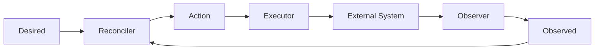

O ponto fundamental é que:

```text
Desired
```

e:

```text
Observed
```

são **entradas independentes do Reconciler**.

Não existe uma cadeia obrigatória:

```text
Desired → Observer → Observed → Reconciler
```

Existe:

```text
             Desired
                │
                ▼
           ┌──────────┐
           │Reconciler│
           └─────┬────┘
                ▲
                │
             Observed
```

# 5. Arquitetura de referência

A arquitetura completa é:

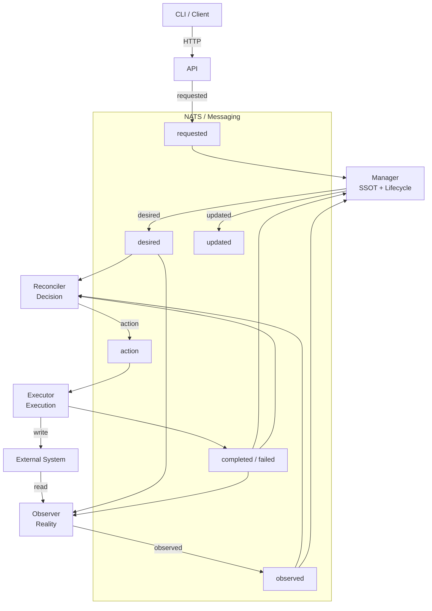

O Observer consome `desired` apenas para saber quais recursos observar. Ele não decide e não compara estados.

# 6. Componentes

# 6.1 API

A API é a porta de entrada do sistema.

Responsabilidades:

- autenticação;
- autorização;
- validação estrutural;
- geração de identificadores;
- criação de contexto de correlação;
- publicação de `requested`;
- consulta do SSOT;
- exposição do estado atual.

A API não deve:

- possuir o SSOT;
- executar reconciliação;
- chamar diretamente o sistema externo;
- implementar lógica de integração com o provider.

Fluxo:

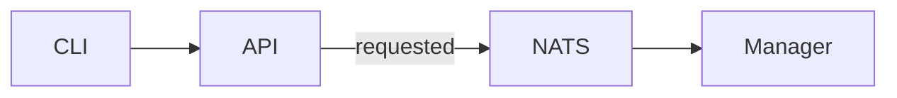

## 6.1.1 Interface HTTP

Cada tipo de recurso expõe a mesma interface, no plural do `resourceType` (por exemplo, `/v1/organizations`). As escritas são assíncronas: a API publica `requested` e responde `202 Accepted` com o `operationId`, sem esperar o Manager. As leituras vêm das views versionadas do SSOT (`POSTGRESQL.md`, decisão 0004).

| Método e rota | Efeito | Resposta |
|---|---|---|
| `POST /v1/<tipos>` | `requested` com operação `create`; a API atribui o `resourceId` (UUIDv7) | `202` com `resourceId` e `operationId` |
| `GET /v1/<tipos>/{resourceId}` | leitura do recurso consolidado (`phase`, `conditions`, `resourceVersion`) | `200` ou `404` |
| `GET /v1/<tipos>?limit=&cursor=` | lista paginada por cursor opaco, ordenada por `resourceId`; `limit` padrão 50, máximo 200 | `200` com `items` e `nextCursor` (ausente na última página) |
| `PATCH /v1/<tipos>/{resourceId}` | `requested` com operação `update`; o corpo traz `resourceVersion` | `202` com `operationId` |
| `DELETE /v1/<tipos>/{resourceId}?resourceVersion=` | `requested` com operação `delete` (`lifecycle = absent`) | `202` com `operationId` |
| `GET /v1/operations/{operationId}` | acompanhamento da Operation (estado e motivo de rejeição) | `200` ou `404` |

Regras:

- **Idempotência do pedido:** o cabeçalho opcional `Idempotency-Key` nas escritas é a chave do cliente da qual a API deriva o `operationId` (`SSOT.md`, decisão 0002). A chave não é armazenada nem transportada. Repetir a chave com o mesmo conteúdo devolve a Operation existente sem publicar de novo; com outro conteúdo, a API responde `422`.
- **Concorrência otimista:** `update` e `delete` exigem o `resourceVersion` lido. O conflito é decidido pelo Manager e aparece como Operation `rejected` com motivo `conflict`. A API pode antecipar um `409` quando a versão lida já difere, como conveniência.
- **Autorização:** a API autoriza o solicitante antes de publicar e filtra as leituras pelas Organizations autorizadas (`RESOURCE-CONTROL-SECURITY.md`, *Isolamento entre organizations*).
- **Privilégios por campo:** o contrato do recurso pode restringir campos a operadores. Na Organization, o dono altera só o `name`; `platformAccess` e `reconciliation` exigem `platform.admin` (`403` caso contrário).
- **Leitura da Operation:** só o solicitante (`requestedBy`) e os operadores (`platform.admin`) leem uma Operation. Uma Operation de solicitante `anonymous` não é legível por quem a criou (seção seguinte).
- **Erros:** `400` corpo inválido, `401` sem token válido, `403` sem permissão, `404` inexistente ou não autorizado, `409` conflito antecipado, `422` reuso da chave de idempotência, `429` limite de taxa, `503` `REQUESTED` cheio (rejeição repetível, `NATS.md`). Quando o contrato do recurso define regras de elegibilidade ou de cota, `403` leva um código estável no corpo (`api-error`): por exemplo, `EmailNotVerified` (e-mail do solicitante não verificado) e `QuotaExceeded` (cota de criação do dono excedida).

## 6.1.2 Escritas anônimas

Por padrão, toda escrita exige solicitante autenticado. A exceção deve estar declarada no contrato do recurso e registrada em decisão. Hoje existe uma só: o auto-cadastro de usuário (`POST /v1/users`, decisão 0014).

Uma escrita anônima:

- usa `requestedBy = anonymous` (um valor fixo, que não identifica a pessoa);
- tem **limite de taxa por origem** no gateway e na API, com valores conservadores e configuráveis;
- tem **resposta uniforme**: o mesmo `202` e o mesmo corpo, exista ou não o recurso ou o dado informado (por exemplo, o e-mail). Não pode haver diferença observável de status, de corpo nem, de forma relevante, de tempo;
- **não permite acompanhar a Operation**: o cliente anônimo não consulta `GET /v1/operations/{operationId}`, e por isso não há `--wait`. Isso impede que a consulta revele se o dado já existia;
- aplica a validação estrita e os limites de tamanho do contrato (`SCHEMA.md`);
- não carrega segredo: a credencial é definida pelo próprio usuário no provedor de identidade, fora do loop.

# 6.2 Manager

O Manager é o **owner do recurso no SSOT**.

Responsabilidades:

```text
Resource
Desired
Observed
Lifecycle
Conditions
Generation
Operation
```

Fluxo:

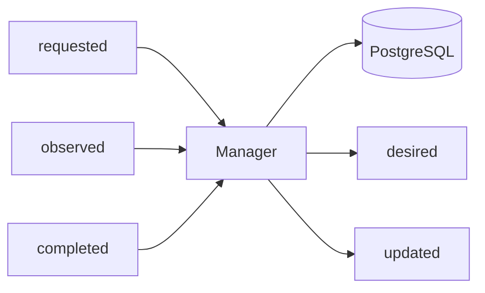

O Manager não precisa conhecer detalhes do provider.

Por exemplo, no caso de Organization, ele não precisa implementar chamadas para Zitadel.

# 6.3 Observer

O Observer transforma realidade externa em `observed`.

Responsabilidades:

- consultar sistemas externos;
- verificar existência;
- consultar configuração;
- coletar estado;
- produzir observações;
- detectar drift;
- executar observação periódica, independentemente de eventos, apenas para os recursos da sua partição (ver *Coordenação da observação*);
- observar o recurso após cada `completed` ou `failed`, com `causationId` igual ao `messageId` do resultado (ver *Observação inconclusiva*);
- informar `observedAt` e distinguir `present`, `absent` e `unknown` (ver *Observação inconclusiva*).

Fluxo:

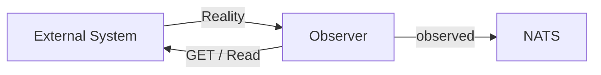

O Observer não deve:

```text
create
update
delete
```

diretamente no sistema externo.

# 6.4 Reconciler

O Reconciler é responsável exclusivamente pela **decisão de reconciliação**.

Ele consome:

```text
Desired
Observed
```

e produz:

```text
Action
```

Fluxo:

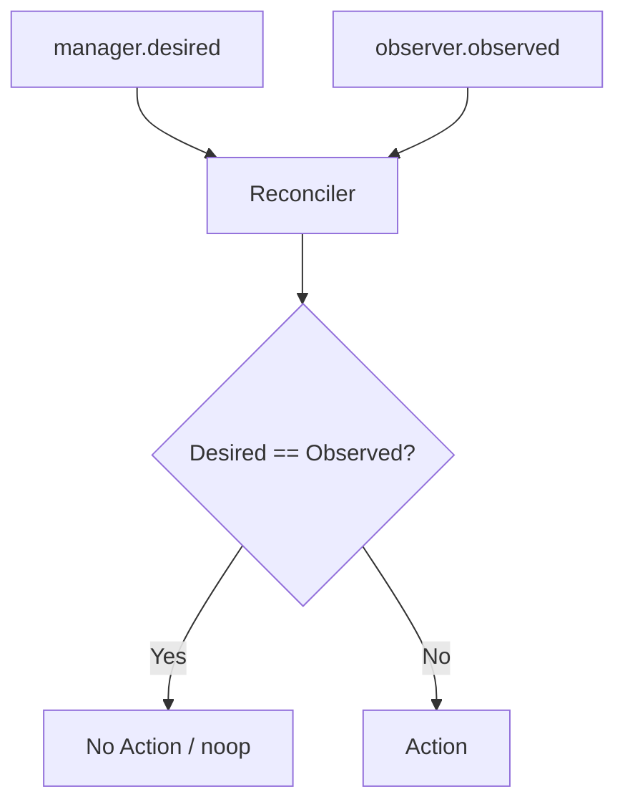

O Reconciler não deve:

- persistir o recurso como SSOT;
- chamar diretamente o provider;
- possuir lógica de API;
- executar a ação.

# 6.5 Executor

O Executor transforma `Action` em uma operação no sistema externo.

Fluxo:

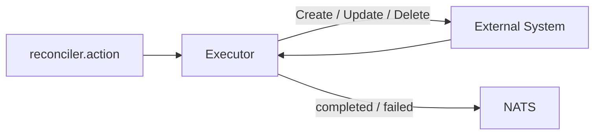

O Executor é o componente que possui as credenciais necessárias para alterar o sistema externo.

Isso permite aplicar menor privilégio:

```text
Observer
    → read-only

Executor
    → write
```

Por possuir a credencial de escrita, o Executor é o último ponto de controle antes do sistema externo. Ele deve revalidar cada `action` contra o `desired` vigente antes de escrever (ver *Segurança do loop*).

# 7. O fluxo completo

O fluxo completo pode ser dividido em seis fases:

```text
1. Request
2. Desired
3. Observation
4. Reconciliation
5. Action
6. Execution
```

Visualmente:


# 8. Fase 1 — Request

O cliente solicita uma alteração.

Exemplo:

```text
sk organization create --name acme
```

Fluxo:

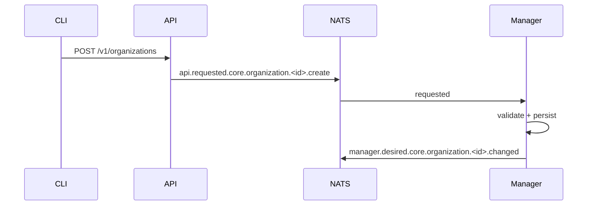

A API retorna rapidamente:

```text
202 Accepted
```

O processamento continua de forma assíncrona.

Requisitos:

- a API aceita uma chave de idempotência no `POST`: a repetição do mesmo pedido não cria outro recurso nem outro `desired`;
- atualizações devem informar a versão do recurso (`resourceVersion`, ver `MESSAGING.md`); uma versão desatualizada é rejeitada, e a atualização não sobrescreve silenciosamente outra concorrente;
- o Manager persiste o recurso e registra a publicação de `desired` na mesma transação (outbox, ver `SSOT.md` e `MESSAGING.md`), evitando o estado `persistido, mas não publicado`. A idempotência de entrada do Manager é semântica (chave de idempotência, monotonia de `observedAt` e `actionId`), e não depende de lembrar mensagens já vistas (`SSOT.md`).

# 9. Fase 2 — Desired

O Manager estabelece o estado desejado no SSOT.

Exemplo:

```json
{
  "resourceId": "organization-01",
  "desiredGeneration": 1,
  "desired": {
    "lifecycle": "present",
    "resourceName": "acme"
  }
}
```

Publicação:

```text
manager.desired.core.organization.organization-01.changed
```

O Desired é uma declaração.

Não significa que a Organization já existe.

```text
Desired = intenção
```

# 10. Fase 3 — Observation

O Observer consulta o sistema externo.

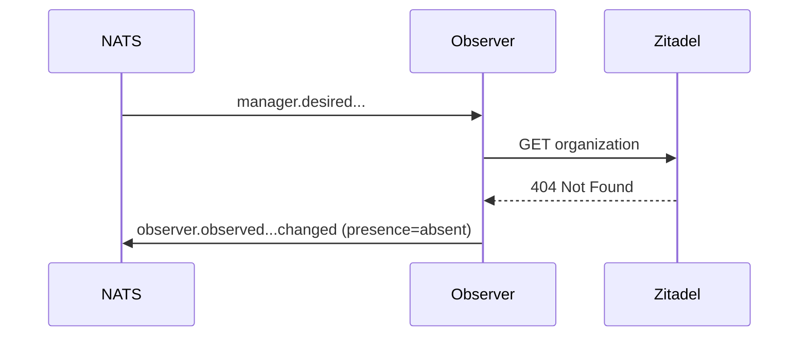

O resultado é:

```text
Observed = absent
```

## 10.1 Observação inconclusiva

Uma observação possui três resultados:

| Resultado | Significado |
|---|---|
| `present` | O recurso foi lido e existe. |
| `absent` | O provider confirmou, de forma inequívoca, que o recurso não existe. |
| `unknown` | A leitura falhou ou foi inconclusiva. |

Erro de leitura (timeout, 5xx, 401/403, limite de taxa) é `unknown`, nunca `absent`. Somente a confirmação inequívoca de ausência é `absent`.

Toda observação informa o resultado no campo `presence` e o momento em `observedAt` (`MESSAGING.md`). O Reconciler:

- não emite `Action` com base em `unknown`;
- não emite `Action` com base em observação mais antiga que o limite de validade definido pelo domínio (mais estrito para ações destrutivas);
- aguarda nova observação quando a atual for inconclusiva ou desatualizada;
- após `completed` ou `failed`, não decide uma nova ação para o recurso enquanto não receber a observação causada por esse resultado (ver abaixo).

Os prazos do loop são parâmetros do contrato do recurso (`SCHEMA.md`): `observationInterval` (período da observação periódica), `observationValidity` (limite de validade do `observed`), `actionDeadline` (prazo de uma `action` pendente) e `failureLimit` (falhas por geração).

### Ordenação causal após uma ação

Depois de `completed` ou `failed` de uma `action`, o Observer faz uma observação cujo `causationId` é o `messageId` desse resultado. O Reconciler só volta a decidir sobre o recurso quando recebe essa observação. Observações periódicas posteriores são admitidas depois dela.

Isso evita decidir com uma leitura anterior à execução sem depender de relógios sincronizados entre serviços.

Se a observação causada não chegar dentro do prazo definido pelo domínio (por exemplo, o Observer da partição está indisponível), o Manager registra a condition `ObservationStale`, e o Reconciler volta a aceitar a próxima observação conclusiva. O mesmo ocorre quando o recurso permanece `unknown` por mais que o prazo.

# 11. Fase 4 — Reconciliation

O Reconciler recebe os dois estados.

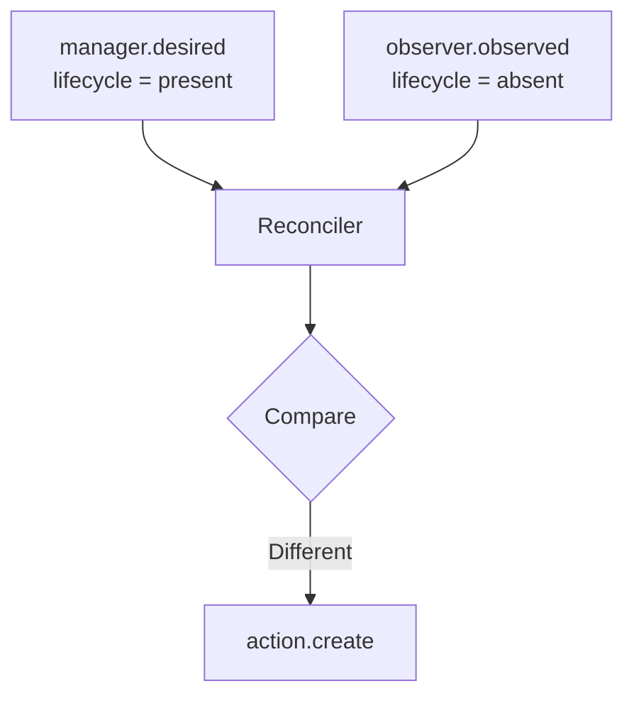

A decisão:

```text
Desired = present
Observed = absent

→ create
```

Publicação:

```text
reconciler.action.core.organization.<id>.create
```

# 12. Gatilhos da reconciliação

`desired` e `observed` são **entradas independentes** do Reconciler. Esta é uma propriedade fundamental do padrão.

O Reconciler pode ser acionado por:

| Gatilho | Exemplo |
|---|---|
| `desired` mudou | O Manager publica uma nova geração. O Reconciler usa o último `observed` retido, desde que seja conclusivo e esteja dentro do limite de validade, sem esperar nova mensagem. |
| `observed` mudou | Um administrador altera o sistema externo. O Observer publica a nova realidade, e o Reconciler detecta o **drift**. |
| Resultado de uma `action` | `completed` ou `failed` libera nova decisão, após a observação causada (ver *Observação inconclusiva*). |
| Reconciliação periódica | Recuperação de perda de mensagem, restart ou inconsistência transitória (ver *Reconciliation periódica*). |
| Retry / recovery | Nova tentativa após falha transitória, sob backoff. |

O estado utilizado é o descrito em *Estado do Reconciler*.

# 13. Drift

Drift ocorre quando:

```text
Desired != Observed
```

Exemplo:

Outro exemplo:

O Reconciler não precisa saber quem causou o drift.

Ele apenas responde:

```text
Desired != Observed
```

O drift pode ter sido causado por:

- alteração manual;
- alteração por outro sistema;
- falha parcial;
- mudança externa;
- perda de estado;
- operação concorrente.

O mecanismo de correção permanece o mesmo. Quando o drift se repete continuamente, aplicam-se as proteções descritas em *Proteções de carga e estabilidade*.

# 14. Fase 5 — Action

A Action representa uma decisão.

Exemplo:

```text
reconciler.action.core.organization.<id>.create
```

Payload:

```json
{
  "messageType": "action",
  "operation": "create",
  "actionId": "organization-01.1.create.obs-7f3a",
  "resourceId": "organization-01",
  "desiredGeneration": 1,
  "data": {
    "reason": "resourceNotFound"
  }
}
```

A Action não é o Desired.

```text
Desired
   ↓
"o que deve existir"

Action
   ↓
"o que precisa ser feito agora"
```

## 14.1 Identidade da Action

O `actionId` é **determinístico**: derivado de `resourceId`, `desiredGeneration`, `operation` e da **observação que motivou a decisão** (o `messageId` do `observed` conclusivo utilizado).

- A mesma decisão sobre o mesmo estado e a mesma observação produz o mesmo `actionId`, o que permite deduplicar.
- Uma nova observação produz um novo `actionId`, mesmo com a mesma geração e a mesma operação. Isso é necessário: se o recurso externo for removido depois de uma criação bem-sucedida, a nova decisão de `create` deve ser executada, e não descartada como duplicata.
- A deduplicação ocorre em três pontos: o publicador usa o `actionId` como chave de deduplicação do transporte (quando suportado), o Reconciler não reemite enquanto houver `action` pendente e o Executor consulta o desfecho já registrado (ver *Desfecho e deduplicação no Executor*). A deduplicação do Executor é obrigatória e não depende do transporte.
- O Reconciler não reemite uma `action` enquanto houver outra pendente para o recurso (sem `completed` ou `failed` correspondente). Ao expirar o prazo de ação definido pelo domínio, ele pode reemitir com o mesmo `actionId`.
- Instâncias do Reconciler com observações diferentes (corrida) podem gerar `actionId` diferentes para o mesmo recurso. O Executor as serializa e, por ser idempotente, a segunda não produz efeito adicional.
- Uma `action` baseada em geração obsoleta é descartada pelo Executor.

O campo é definido em `MESSAGING.md` (envelope).

# 15. Fase 6 — Execution

O Executor consome a Action.

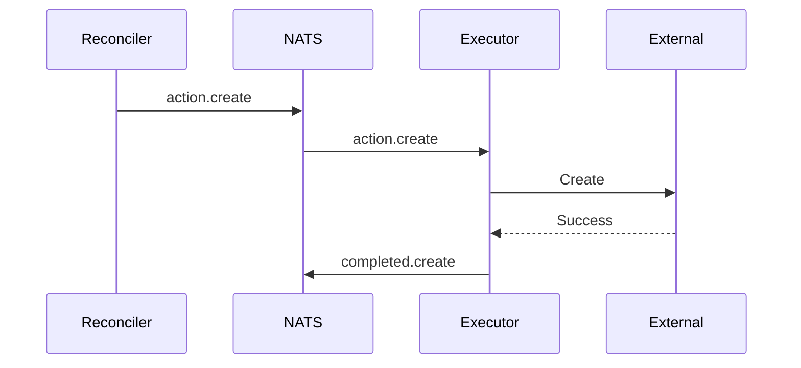

O Executor não decide se a ação é necessária.

Essa decisão pertence ao Reconciler.

## 15.1 Desfecho e deduplicação no Executor

Antes de executar, o Executor consulta o desfecho já registrado para o `actionId`, ou seja, o último `completed` ou `failed` publicado por ele para o recurso e a operação (lido do transporte, em modo somente leitura):

| Desfecho registrado | Comportamento |
|---|---|
| Nenhum | Executa. Isso inclui a execução interrompida por falha: a repetição é segura pela chave de correlação com o recurso externo (ver *Reconciliation é idempotente*). |
| `completed` | Não executa. Confirma a mensagem e republica o `completed` (idempotente). |
| `failed` permanente | Não executa. Republica o `failed`. |

O registro dura o tempo de retenção dos resultados no transporte. Passado esse prazo, a proteção contra execução repetida é a idempotência do próprio Executor.

Uma reemissão com o mesmo `actionId` só repete a execução quando não houver desfecho registrado.

# 16. Completed não significa convergência

Este princípio é obrigatório.

```text
executor.completed
        ≠
resource converged
```

`completed` significa:

> A operação solicitada foi executada com sucesso.

A convergência somente pode ser confirmada pela observação compatível.

# 17. Nova observação

Após a execução, o Observer verifica novamente, com `causationId` igual ao `messageId` do resultado. Se o recurso existe, publica `observed` com `presence=present`. Agora:

```text
Desired = present
Observed = present
```

# 18. Convergência

O Reconciler compara novamente:

Resultado:

```text
No Action
```

O recurso convergiu.

## 18.1 Comparação entre Desired e Observed

A pergunta "Desired == Observed?" deve ter definição explícita para cada recurso:

- **campos gerenciados:** apenas os campos declarados em `desired` participam da comparação; campos não declarados não geram drift;
- **normalização:** os valores são normalizados antes da comparação (caixa, ordenação de listas, formatação), conforme o contrato do recurso;
- **defaults do provider:** valores preenchidos pelo provider e não declarados em `desired` não constituem drift;
- **resultado:** iguais → `noop`; diferentes → `Action` determinada pela diferença.

Uma comparação mal definida produz `update` infinito. A definição é declarada por anotação nos campos do contrato do recurso (`managed`, `normalization` e `providerDefault`; ver `SCHEMA.md`).

# 19. Atualização do SSOT

O Manager recebe a observação e atualiza o Resource.

Exemplo:

```text
phase = Ready
desiredGeneration = 1
condition = Ready=True (desiredGeneration = 1)
```

# 20. Fluxo completo da Organization

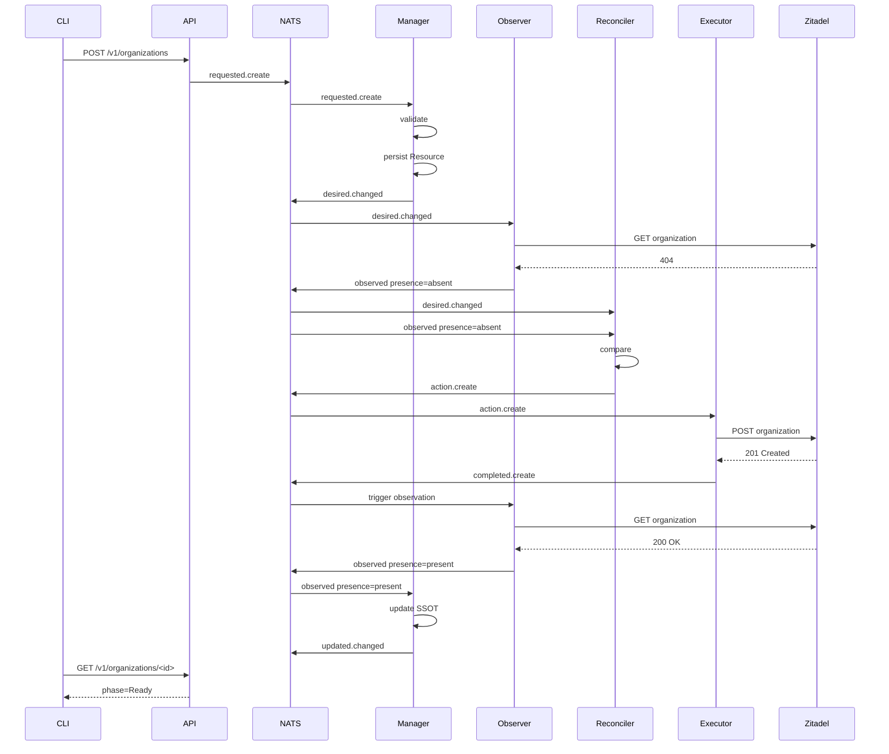

# 21. Fluxo de atualização

Uma alteração do `desired` incrementa `desiredGeneration`. O Reconciler compara o novo `desired` com o último `observed`, que ainda reflete a geração anterior, e decide `update`. Após a execução, o Observer observa o novo conteúdo e o Reconciler confirma a convergência pela comparação de conteúdo (ver *Comparação entre Desired e Observed*).

# 22. Fluxo de remoção

A remoção também é declarativa: o `desired` passa a `lifecycle = absent`. O Reconciler decide `delete` enquanto o `observed` indicar `present`, e converge quando a observação indicar `absent`.

A plataforma não precisa representar a exclusão como um comando imperativo no `desired`.

Após a convergência da remoção, o Manager remove o recurso do SSOT. O último `desired` (`lifecycle=absent`) permanece no transporte como tombstone até uma limpeza administrativa; Reconciler e Observer ignoram recurso com `lifecycle=absent` já convergido (`NATS.md` e `RESOURCE-CONTROL-SECURITY.md`).

**Limitação conhecida:** este padrão não define a ordem de remoção entre recursos dependentes (por exemplo, uma Organization com Agents). Enquanto não houver regra própria, a remoção de um recurso com dependentes deve ser tratada pelo domínio.

# 23. Fluxo de falha

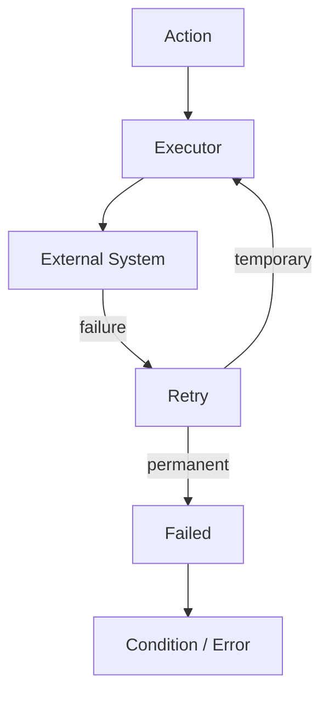

Uma falha de execução não deve destruir o Desired. O Desired permanece como fonte da intenção, o que permite retry e recuperação.

Retry, backoff, limite de tentativas e quarentena de mensagens seguem `NATS.md`. No nível do recurso:

- falha transitória mantém o recurso em `Reconciling`. O backoff entre tentativas é aplicado pelo Reconciler a partir do último `failed` do recurso, que o transporte retém;
- o Manager, dono do lifecycle, conta as falhas por geração a partir dos `failed` que consome. Ao atingir o `failureLimit`, marca o recurso como `Failed` e registra a causa em `conditions`;
- ao marcar `Failed`, o Manager republica o `desired` com a reconciliação **suspensa** (campo `reconciliation` do `desired`, ver `SCHEMA.md`). O Reconciler não decide enquanto o `desired` estiver suspenso, o que impede o ciclo contínuo contra o provider;
- a suspensão termina por nova geração de `desired` ou por intervenção explícita, em que o Manager republica o `desired` com a reconciliação ativa.

# 24. Falha após alteração externa

Este é um dos cenários mais importantes.

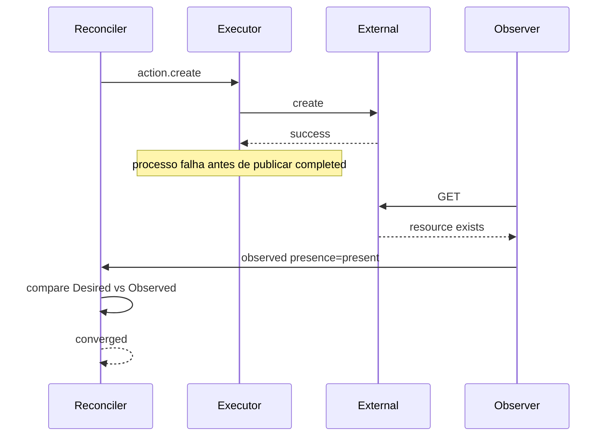

A arquitetura não depende de `completed` para recuperar o estado.

A realidade observada é a fonte de evidência.

# 25. Reconciliation periódica

Eventos não devem ser a única forma de disparar reconciliação.

O sistema deve possuir reconciliação periódica:

Isso permite recuperação após:

- perda de mensagem;
- indisponibilidade temporária;
- restart;
- falha do consumidor;
- falha externa;
- inconsistência transitória.

O período deve ser definido de acordo com o domínio.

Requisitos:

- o Observer observa periodicamente, para que `observed` não envelheça indefinidamente;
- o Reconciler reavalia periodicamente o estado que possui;
- os disparos periódicos usam jitter, para evitar rajadas sincronizadas.

# 26. Reconciliation é idempotente

Uma mesma mensagem pode provocar múltiplas reconciliações: `desired` duplicado, `observed` repetido ou decisões simultâneas de instâncias diferentes. O resultado deve ser o mesmo, sem efeito colateral indevido.

O Executor também deve ser idempotente ou utilizar mecanismos que tornem a operação segura.

Para que a repetição de um `create` (por exemplo, após timeout) não duplique o recurso, o Executor deve possuir uma chave de correlação com o recurso externo: um identificador externo determinístico, uma chave de idempotência aceita pelo provider ou uma consulta prévia quando o provider não garante unicidade.

# 26.1 Coordenação da observação

Cada instância do Reconciler e do Observer mantém o estado completo (ver *Estado do Reconciler*). Se todas as instâncias do Observer observassem todos os recursos, o provider receberia N vezes as leituras.

Por isso, a observação periódica de um recurso é feita por **uma instância por vez**. O mecanismo padrão é a **partição determinística por `resourceId`**: cada instância observa os recursos em que `hash(resourceId) mod número de réplicas` é igual ao índice estável da sua réplica.

- a indisponibilidade de uma instância deixa a sua partição sem observação até que ela retorne. O `observedAt` envelhece, o Reconciler não decide (ver *Observação inconclusiva*) e a condition `ObservationStale` sinaliza o problema;
- ao alterar o número de réplicas, a distribuição muda e alguns recursos podem ser observados por duas instâncias por um período. Observação é leitura, então o efeito é inofensivo;
- as decisões do Reconciler não precisam de partição, pois decisões duplicadas são deduplicadas por `actionId`. Se a carga exigir, a mesma regra pode ser aplicada ao Reconciler.

# 27. Idempotência em cada camada

Cada camada possui uma estratégia diferente. Não existe uma única técnica universal de idempotência.

| Camada | Estratégia |
|---|---|
| API | Chave de idempotência no pedido |
| Manager | Constraints do recurso, `resourceVersion` e outbox |
| Reconciler | Comparação de conteúdo, geração e `actionId` |
| Executor | Desfecho por `actionId` e chave de correlação com o recurso externo |
| Provider | Semântica própria do provider |

# 28. Mensageria

A comunicação utiliza o modelo semântico definido em `MESSAGING.md`.

Formato:

```text
<emitter>.<messageType>.<module>.<resourceType>.<resourceId>.<operation>
```

Exemplos:

```text
api.requested.core.organization.<id>.create

manager.desired.core.organization.<id>.changed

observer.observed.core.organization.<id>.changed

reconciler.action.core.organization.<id>.create

executor.completed.core.organization.<id>.create

manager.updated.core.organization.<id>.changed
```

O resultado da observação (`present`, `absent` ou `unknown`) é informado no campo `presence`, e não no endereço. Cada `messageType` é persistido em seu próprio Stream, com a retenção da sua classe de mensagem (trabalho, estado ou fato), conforme `NATS.md`.

# 29. Quem publica e quem consome

O padrão define explicitamente:

| Mensagem | Publicador | Consumidores principais |
|---|---|---|
| `requested` | API | Manager |
| `desired` | Manager | Reconciler, Observer, Executor (revalidação, somente leitura), outros interessados |
| `observed` | Observer | Reconciler, Manager, outros consumidores |
| `action` | Reconciler | Executor |
| `completed` | Executor | Manager, Observer (observação causada), Reconciler (rastreio de action pendente), Executor (desfecho, somente leitura), auditoria |
| `updated` | Manager | Console, auditoria, métricas, consumidores |
| `failed` | Executor/componente responsável | Manager (contagem de falhas), Observer (observação causada), Reconciler (backoff e action pendente), Executor (desfecho, somente leitura), observabilidade |

O consumidor não deve ser codificado no subject.

# 30. Matriz de responsabilidades

| Responsabilidade | API | Manager | Observer | Reconciler | Executor |
|---|---:|---:|---:|---:|---:|
| AuthN | ✓ | | | | |
| Schema validation | ✓ | ✓ | | | |
| Business validation | | ✓ | | | |
| SSOT | | ✓ | | | |
| Desired | | ✓ | | | |
| Observe external | | | ✓ | | |
| Observed | | | ✓ | | |
| Compare Desired/Observed | | | | ✓ | |
| Decide Action | | | | ✓ | |
| Execute Action | | | | | ✓ |
| External write | | | | | ✓ |
| Lifecycle | | ✓ | | | |
| Conditions | | ✓ | | | |
| Provider credentials | | | Read | | Write |

# 31. Separação de privilégios

A arquitetura permite aplicar princípio de menor privilégio.

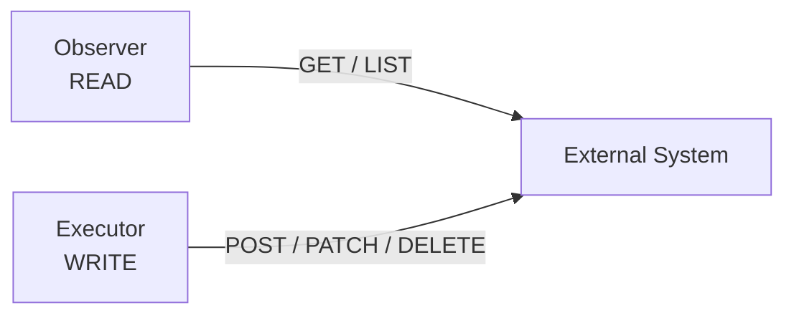

Credenciais de escrita não devem estar disponíveis para:

```text
API
Manager
Observer
Reconciler
```

quando não forem necessárias.

Cada serviço (módulo, tipo de recurso e papel) deve possuir identidade própria no barramento, com permissões restritas ao seu papel e ao seu tipo de recurso. Os requisitos completos estão em `RESOURCE-CONTROL-SECURITY.md`.

# 32. Separação de falhas

Cada componente possui um domínio de falha diferente:

| Componente | Falha |
|---|---|
| API | Indisponibilidade de entrada de pedidos |
| Manager | Falha de persistência: não aceita novos pedidos nem atualiza o SSOT |
| Observer | Falha de leitura do provider: `observed` envelhece (`unknown`) |
| Reconciler | Falha de decisão: nenhuma nova `action` |
| Executor | Falha de escrita no provider: `failed` e retry |

O objetivo é permitir que uma falha em um componente não exija indisponibilidade de toda a plataforma.

# 33. Escalabilidade

Cada serviço escala conforme o seu papel. Nem toda réplica adicional aumenta a vazão:

| Serviço | Réplicas servem para | Como a carga é dividida |
|---|---|---|
| Manager | Vazão e disponibilidade | Réplicas compartilham `requested`, `observed` e `result`; o SSOT garante a idempotência |
| Observer | Vazão de observação e disponibilidade | Partição por `resourceId` (ver *Coordenação da observação*) |
| Reconciler | Disponibilidade | Cada réplica mantém o estado completo e toma decisões equivalentes. Se a CPU exigir, aplicar a partição por `resourceId` |
| Executor | Disponibilidade | Uma `action` por vez por serviço (*single-flight*). A vazão é limitada pelo provider; particionar por `resourceId`, preservando o *single-flight* por recurso, só com carga medida |

# 34. Concorrência

A unidade natural de concorrência é o recurso: a reconciliação de recursos distintos é independente.

Quando houver necessidade de serialização, ela deve ser definida explicitamente por `resourceId` ou `orderingKey`. Não assumir ordenação global.

Para cada `resourceId`, apenas uma `action` deve estar em execução por vez (*single-flight*). Várias instâncias do Reconciler podem decidir o mesmo recurso; a serialização é responsabilidade do **Executor**, e não do Reconciler. O Executor deve garantir uma única execução por vez por recurso (por exemplo, consumindo uma `action` por vez por serviço) e permanecer idempotente, pois sob falha uma `action` pode ser entregue a outra instância enquanto a anterior ainda executa (`NATS.md`).

# 35. DesiredGeneration

A geração identifica uma versão lógica do estado desejado.

Exemplo:

```text
generation 1
    name = ACME

generation 2
    name = ACME Corp

generation 3
    name = ACME Corporation
```

O Reconciler deve evitar aplicar uma decisão baseada em uma geração antiga quando uma geração mais recente já estiver disponível.

# 36. ObservedGeneration

O sistema externo não conhece a geração do `desired`. Por isso, a convergência **não** é determinada por `observedGeneration`, e sim pela comparação de conteúdo entre `desired` e `observed` (ver *Comparação entre Desired e Observed*).

A geração serve para:

- descartar uma `action` baseada em geração obsoleta;
- identificar a que geração uma condition se refere.

`observedGeneration` só é confiável quando a geração é registrada no próprio recurso externo (por exemplo, como metadado gravado pelo Executor) e lida pelo Observer:

```text
Desired:
generation = 5

Recurso externo (metadado gravado pelo Executor):
generation = 4
```

Indica que o recurso externo ainda não reflete a geração 5.

Quando o provider não permite esse registro, `observedGeneration` não deve ser usado como evidência de convergência.

# 37. Lifecycle

O lifecycle do Resource Control Loop é definido no recurso, não na mensageria. A fase consolidada é o campo `phase`, mantido pelo Manager; ela não se confunde com `lifecycle` em `desired` (intenção de existência: `present` ou `absent`) nem com `presence` em `observed` (`SCHEMA.md`).

Exemplo:

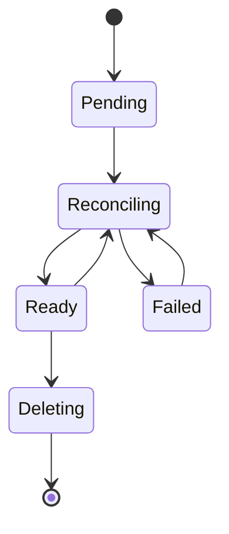

Um recurso pode permanecer em:

```text
Reconciling
```

durante múltiplos ciclos.

Isso é esperado.

O estado `Failed` é terminal para o ciclo automático: o `desired` fica com a reconciliação suspensa, e a saída segue as regras descritas em *Fluxo de falha*.

# 38. Conditions

Conditions representam fatos ou condições consolidadas do recurso.

Exemplo:

```json
{
  "type": "Ready",
  "status": "True",
  "reason": "Reconciled",
  "message": "Organization exists in Zitadel",
  "observedGeneration": 1,
  "lastTransitionAt": "2026-10-04T00:00:00Z"
}
```

O lifecycle e as conditions são persistidos no SSOT pelo Manager.

# 39. Operation

Uma operação acompanha uma solicitação assíncrona.

Exemplo:

```text
operationId
operationType
resourceId
desiredGeneration
status
createdAt
updatedAt
completedAt
```

A Operation não deve ser confundida com o Resource. Ela é um registro do SSOT mantido pelo Manager e exposto pela API; não trafega no envelope das mensagens, e o `correlationId` liga a Operation às mensagens do fluxo. O `operationId` é atribuído pela API e transportado no conteúdo do `requested` (`SCHEMA.md`); os estados da Operation, inclusive a rejeição com motivo, e a idempotência do pedido estão em `SSOT.md`.

```text
Resource
    = objeto gerenciado

Operation
    = processamento de uma solicitação
```

# 40. CLI e experiência síncrona

A arquitetura pode ser assíncrona internamente sem obrigar o usuário a trabalhar de forma assíncrona.

Exemplo:

```text
sk organization create --name acme --wait
```

Fluxo:

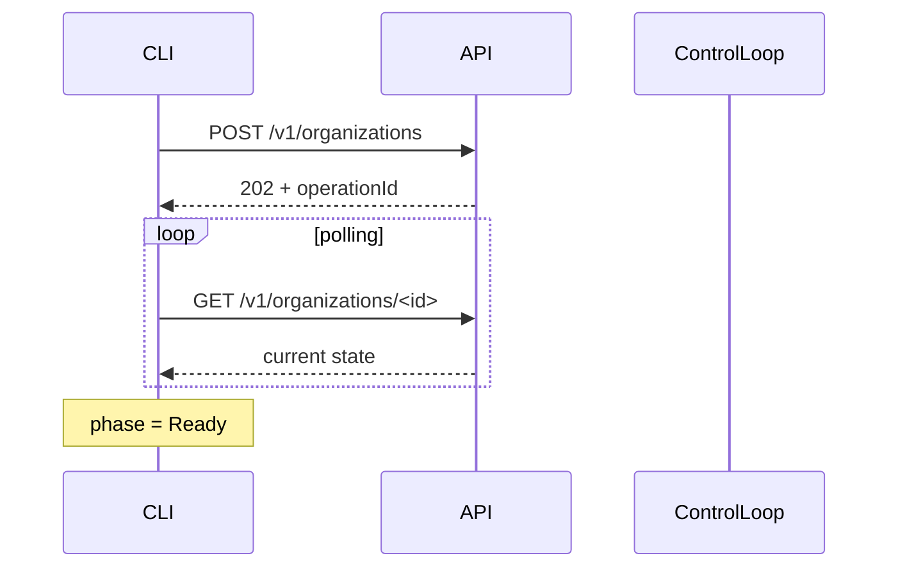

O `--wait` é uma conveniência do cliente.

Não altera o modelo interno.

# 41. Console, projeções e auditoria

O Manager não deve conhecer detalhes da interface. O Console, a auditoria, as métricas, os alertas e outros consumidores (billing, analytics) consomem `manager.updated` e os demais eventos e constroem suas próprias projeções, sem alterar o Manager.

A auditoria não deve ser necessária para a operação normal do control loop: ela é um consumidor.

# 42. Recuperação após restart

Os componentes devem poder reiniciar sem perder a capacidade de convergir.

Cada componente reinicia reconstruindo o último `desired` e o último `observed` de cada recurso a partir da mensageria. O estado em memória é descartável. Observer, Reconciler e Executor não acessam o SSOT (ver *Estado do Reconciler*).

Para evitar rajadas após o restart de muitos componentes, a reconciliação inicial deve usar jitter e limite de mensagens pendentes.

# 43. Recuperação após perda de mensagem

Caso uma mensagem seja perdida:

A retenção do último estado pela mensageria e a reconciliação periódica permitem recuperação.

# 44. Padrão de dependências

A direção de dependência é: API, Manager, Observer, Reconciler e Executor dependem da mensageria; Observer e Executor dependem do sistema externo; o Manager depende do SSOT.

Não deve existir:

```text
Reconciler → Executor diretamente
API → Executor diretamente
API → Observer diretamente
Observer → Executor diretamente
```

quando o objetivo for comunicação entre componentes do control loop.

Somente o Manager escreve no SSOT; a API o consulta apenas para leitura. Observer, Reconciler e Executor não acessam o SSOT e obtêm o estado de que precisam pela mensageria.

# 45. Resource Control Loop como padrão

O padrão se abstrai para qualquer recurso:

```text
Resource
    │
    ├── Desired
    │
    ├── Observed
    │
    ├── Lifecycle
    │
    ├── Conditions
    │
    └── Generations
```

O fluxo do padrão é o descrito em *Modelo geral*.

# 46. Aplicação à Organization

A Organization é um recurso da plataforma, no módulo `core` (`sk organization`), porque todos os demais módulos dependem dela.

Para Organization, o Executor escreve em uma organização do Zitadel e o Observer a lê. Na criação, o Executor aplica, nesta ordem e cada passo de forma idempotente:

1. a organização no Zitadel, com o `resourceId` como ID;
2. o Project Grant do projeto da plataforma para a organização, com as roles delegáveis (inicialmente `organization.get` e `organization.list`, até existirem membros).

O Executor da Organization **não cria usuários nem autoriza o dono**: o dono (`ownerUserId`, o usuário autenticado que a criou) já existe, pelo cadastro (seção seguinte), e já tem as roles de ação no projeto. Como o dono vive na organização `core` do Zitadel, e não na organização criada, o token não identifica a Organization: a API decide o pertencimento pelo `ownerUserId` guardado na plataforma (decisão 0010).

Os recursos derivados em outros sistemas (namespace do OpenBao, do Kubernetes) não são escritos por este Executor: são recursos dos próprios módulos, que referenciam o `organizationId`. Assim, cada Executor escreve em um único sistema externo.

O Executor cria a organização no Zitadel informando o `resourceId` como ID da organização (`organization_id`), em vez de deixar o Zitadel gerá-lo. Assim, o ID da organização no Zitadel é o mesmo `resourceId` (`SCHEMA.md`, *Organization e identificadores derivados*), e uma criação repetida (retry, reentrega) não produz uma segunda organização. O Zitadel responde HTTP 409 a um ID ou nome já usado (verificado na v4.19.4); o Executor então lê a organização pelo ID: se existe com o nome esperado, é sucesso idempotente (o mesmo vale para o Project Grant, que também responde 409 quando repetido); se existe com outro nome, ou não existe, é falha permanente.

Antes de publicar `requested`, a API exige solicitante autenticado, com e-mail verificado e a role `organization.create`. A **cota** de Organizations por dono é aplicada pelo Manager, na mesma unidade atômica do pedido, com trava consultiva por dono (decisão 0010): a pré-checagem da API não basta para criações concorrentes. Nomes reservados e já existentes são rejeitados como `validation`.

Componentes:

```text
cli-core-organization
api-core-organization
srv-core-organization-manager
srv-core-organization-observer
srv-core-organization-reconciler
srv-core-organization-executor
```

## 46.1 Aplicação ao User

O User é um recurso da plataforma, no módulo `core` (decisão 0014), criado pelo auto-cadastro (`sk register`), uma escrita anônima (seção 6.1.2). O Executor escreve em um único sistema externo, o Zitadel:

1. cria o usuário na organização `core`, com o `resourceId` como ID e **sem senha**: o `desired` do User não tem senha, porque `desired` fica retido no SSOT e na mensageria (`SCHEMA.md`);
2. aciona o e-mail de ativação do Zitadel, em que a pessoa define a senha na página do Zitadel. A senha nunca passa por CLI, API, SSOT nem mensageria;
3. autoriza o usuário no projeto da plataforma, que pertence à mesma organização `core`, com o conjunto de roles de ação do usuário cadastrado (`organization.create`, `organization.get`, `organization.list`, `organization.update`, `organization.delete`, `user.get` e `user.delete`).

Quando o e-mail já está cadastrado, o Executor não cria um segundo usuário e o pedido termina sem expor essa informação ao solicitante anônimo. O `desired` com `lifecycle = absent` não carrega dados pessoais (decisão 0014).

Componentes: `cli-core-user`, `api-core-user`, `srv-core-user-manager`, `srv-core-user-observer`, `srv-core-user-reconciler` e `srv-core-user-executor`.

# 47. Aplicação a outros recursos

O mesmo padrão se aplica a Agent, Runner e Tool. Mudam apenas o sistema externo e os componentes específicos do recurso:

| Recurso | Sistema externo alterado pelo Executor e lido pelo Observer |
|---|---|
| Agent | Agent Runtime |
| Runner | Runner Runtime |
| Tool | External Tool Provider |

Cada recurso possui seu próprio `desired`, `observed`, Reconciler, Executor e Observer.

# 48. O padrão não exige seis processos

Um recurso simples pode ser implementado em um único serviço (API e serviço, com o sistema externo), desde que internamente mantenha as responsabilidades:

desde que internamente mantenha as responsabilidades:

```text
Desired
Observed
Reconciliation
Execution
```

Entretanto, quando os requisitos de escala, segurança ou isolamento justificarem, as responsabilidades podem ser separadas:

A decisão deve ser baseada em responsabilidade e operação, não em uma regra artificial de quantidade de serviços.

O formato colapsado é o ponto de partida. A separação em componentes independentes exige justificativa registrada, conforme os critérios de *Quando separar em processos*.

# 49. Quando separar em processos

A separação é recomendada quando houver diferenças relevantes em:

```text
security boundary
scaling profile
failure domain
deployment lifecycle
resource consumption
external dependencies
credentials
availability requirements
```

Exemplo:

```text
Observer
    → read-only credential

Executor
    → write credential
```

Essa diferença já constitui uma forte justificativa para separação.

# 50. Quando não separar

Evitar fragmentação quando dois componentes:

- sempre escalam juntos;
- possuem exatamente o mesmo ciclo de vida;
- possuem as mesmas permissões;
- possuem as mesmas dependências;
- não possuem necessidade de isolamento;
- não possuem fronteira clara de responsabilidade.

O objetivo é **separação de responsabilidades**, não maximização do número de serviços.

# 51. Anti-padrões

## 51.1 API executando provider

```text
API → Zitadel
```

Evitar.

## 51.2 Reconciler executando provider

```text
Reconciler → Zitadel
```

Evitar quando existir Executor.

## 51.3 Observer corrigindo drift

```text
Observer → UPDATE
```

Evitar.

## 51.4 Manager executando operações externas

```text
Manager → POST provider
```

Evitar.

## 51.5 Reconciler dependendo de uma única mensagem

O Reconciler não deve depender da sequência:

```text
desired
  ↓
observed
  ↓
reconcile
```

Ele deve conseguir reconciliar a partir dos estados atuais.

## 51.6 Convergência baseada em ACK

```text
ACK = Ready
```

Incorreto.

## 51.7 Control loop baseado somente em eventos

Eventos aceleram a convergência, mas o sistema deve possuir mecanismos de recuperação. A reconciliação periódica é obrigatória.

# 52. Segurança do loop

Os requisitos de segurança do Resource Control Loop são definidos em [`RESOURCE-CONTROL-SECURITY.md`](RESOURCE-CONTROL-SECURITY.md). Este documento mantém apenas as invariantes que o padrão exige:

- cada serviço (módulo, tipo e papel) possui identidade própria e publica somente no seu próprio emissor e tipo de recurso;
- a `action` é a mensagem mais privilegiada do loop: somente o Reconciler a publica e somente o Executor a consome;
- o Executor revalida a `action` contra o `desired` vigente e consulta o desfecho do `actionId` antes de escrever no sistema externo;
- `observed` inconclusivo (`unknown`) ou desatualizado não autoriza `Action`;
- a identidade do solicitante (`requestedBy`) acompanha a operação de ponta a ponta;
- segredos trafegam somente por referência;
- a credencial de escrita pertence exclusivamente ao Executor;
- nenhum serviço de runtime possui permissão de purge ou de administração do transporte.

# 53. Proteções de carga e estabilidade

O loop corrige continuamente a realidade. Sem limites, ele pode sobrecarregar o provider ou disputar indefinidamente com outro agente.

- **Limite de taxa e backpressure:** o Executor limita a concorrência e a taxa de chamadas ao provider e respeita sinais de limite do provider (por exemplo, `Retry-After`).
- **Flapping:** quando o mesmo recurso diverge repetidamente após convergir, o Manager registra a condition `DriftLoop` e o Reconciler aplica backoff crescente até intervenção, em vez de corrigir indefinidamente.
- **Restart em massa:** jitter na reconciliação inicial e periódica, e limite de mensagens pendentes por consumidor.
- **Observação envelhecida:** a condition `ObservationStale` e o alerta correspondente sinalizam recursos sem observação conclusiva dentro do prazo do domínio.
- **Métricas mínimas:** latência até a convergência, idade da última reconciliação por recurso, idade do último `observed`, quantidade de `action` pendentes e taxa de falha por provider (ver `NATS.md`, observabilidade).
- **Pontos únicos de falha:** Manager, PostgreSQL e mensageria são dependências críticas. Com o Manager indisponível, o loop continua para o `desired` já publicado, mas não aceita novos pedidos nem atualiza o SSOT.

# 54. Propriedades desejadas

Uma implementação madura do Resource Control Loop deve possuir:

```text
Declarative
Idempotent
Eventually Consistent
Recoverable
Observable
Auditable
Scalable
Least Privilege
Provider Independent
Transport Independent
```

# 55. Checklist de implementação

Antes de considerar um novo recurso conforme ao padrão, verificar:

### Resource

- [ ] Existe `resourceId` estável?
- [ ] Existe `desired`?
- [ ] Existe `observed`?
- [ ] Existe `desiredGeneration` quando necessário?
- [ ] Existe `observedGeneration` quando necessário?
- [ ] Lifecycle está definido?
- [ ] Conditions estão definidas?

### Manager

- [ ] É o owner do SSOT?
- [ ] É responsável pelo lifecycle?
- [ ] Publica `desired`?
- [ ] Processa `observed`?
- [ ] Não executa provider diretamente?
- [ ] Persiste e registra a publicação de `desired` na mesma transação (outbox)?
- [ ] Conta as falhas por geração, marca `Failed` e suspende a reconciliação no `desired`?
- [ ] Registra `ObservationStale` quando não há observação conclusiva no prazo?

### Observer

- [ ] É read-only?
- [ ] Consegue observar a realidade?
- [ ] Publica `observed`?
- [ ] Executa periodicamente?
- [ ] Informa `observedAt`?
- [ ] Distingue `present`, `absent` e `unknown`?
- [ ] Observa apenas os recursos da sua partição?
- [ ] Observa após `completed` e `failed`, com `causationId` do resultado?

### Reconciler

- [ ] Consome `desired`?
- [ ] Consome `observed`?
- [ ] Compara os dois estados?
- [ ] Pode ser acionado por qualquer alteração?
- [ ] Reavalia periodicamente?
- [ ] Só decide com `desired` e `observed` conclusivos e dentro do limite de validade?
- [ ] Não reemite `action` pendente?
- [ ] Respeita `desired` suspenso e aplica backoff a partir do último `failed`?
- [ ] Aguarda a observação causada pelo resultado antes de decidir de novo?
- [ ] O `actionId` inclui a observação que motivou a decisão?
- [ ] A comparação entre `desired` e `observed` está definida para o recurso?
- [ ] Produz `action`?
- [ ] Não executa a ação diretamente?

### Executor

- [ ] Consome `action`?
- [ ] Possui somente os privilégios necessários?
- [ ] Revalida a `action` contra o `desired` vigente?
- [ ] Consulta o desfecho do `actionId` antes de executar?
- [ ] Possui chave de correlação com o recurso externo?
- [ ] Serializa a execução por recurso (*single-flight*)?
- [ ] Limita taxa e concorrência contra o provider?
- [ ] Executa operações de forma idempotente?
- [ ] Publica `completed` ou `failed`?
- [ ] Não decide o estado desejado?

### Messaging

- [ ] Subject segue a gramática oficial?
- [ ] `messageType` é válido?
- [ ] `operation` é semanticamente preciso?
- [ ] `messageId` é único?
- [ ] `correlationId` é utilizado quando necessário?
- [ ] `causationId` é utilizado quando necessário?
- [ ] Reentrega é suportada?
- [ ] Ordering é explicitamente definido quando necessário?

# 56. Fonte de verdade

Este documento define o **Resource Control Loop** como padrão arquitetural da plataforma.

`MESSAGING.md` define a semântica das mensagens.

`NATS.md` define a implementação da mensageria utilizando NATS e NATS JetStream.

`SCHEMA.md` define os contratos formais e a evolução dos schemas.

`RESOURCE-CONTROL-SECURITY.md` define os requisitos de segurança do padrão.

O contrato do Resource define:

```text
Resource
Desired
Observed
Lifecycle
Conditions
Generations
```

O Resource Control Loop define como esses conceitos participam de um processo contínuo de convergência.

**O sistema não é considerado concluído quando uma ação é executada. O sistema é considerado convergido quando o `Observed` demonstra que a realidade corresponde ao `Desired`, conforme as regras do recurso.**