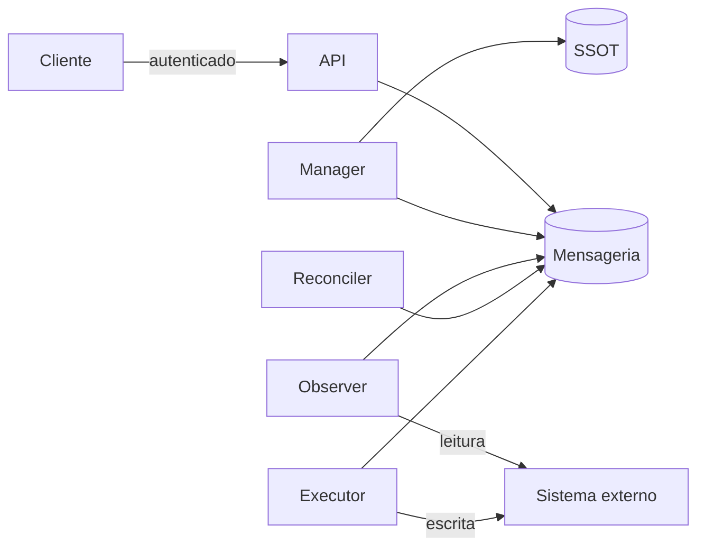

# Resource Control Security

> **Escopo:** requisitos de segurança do padrão Resource Control Loop.
>
> **Papel:** Fonte de Verdade da segurança específica do control loop.
>
> **Responsabilidade:** Definir ameaças, fronteiras de confiança, identidades, autorização, proteção da `action`, confiabilidade da observação, credenciais, rastreabilidade e limites de abuso dos componentes do loop, de forma independente de linguagem, broker e provider.

# 1. Introdução

O Resource Control Loop (`RESOURCE-CONTROL-LOOP.md`) separa quem decide (Reconciler) de quem executa (Executor) e de quem observa (Observer). Essa separação só protege o sistema se cada fronteira for imposta, e não apenas desenhada.

Este documento define como impor essas fronteiras.

Ele não substitui, e não duplica, as regras de:

```text
RESOURCE-CONTROL-LOOP.md
→ o que o padrão é e como o fluxo funciona

RESOURCE-CONTROL-SECURITY.md
→ como o padrão se protege

NATS.md
→ TLS, mTLS, ACLs, segredos e administração do broker

MESSAGING.md
→ segredos em mensagens e semântica das mensagens

SCHEMA.md
→ classificação e tratamento de dados sensíveis nos contratos
```

# 2. Objetivo

- impedir que uma mensagem forjada ou indevida cause escrita no sistema externo;
- impedir que uma observação falsa ou inconclusiva cause ação destrutiva;
- limitar o dano de um componente comprometido;
- permitir saber **quem** solicitou cada alteração;
- limitar o abuso e o impacto de erros em massa.

# 3. Princípios

Seguem os princípios do `AGENTS.md` (seção 4): menor privilégio, segurança por padrão e segredos fora do código e das mensagens.

Específicos deste padrão:

- **A `action` é o comando mais privilegiado do loop.** Quem a publica ou a consome precisa ser controlado.
- **O Executor é o último ponto de controle.** Ele não confia cegamente em quem lhe enviou a `action`.
- **Observação é evidência, não verdade.** Observação inconclusiva não autoriza decisão.
- **Negar por padrão.** Toda permissão no barramento é explícita.

# 4. Modelo de ameaças

## 4.1 Ativos

| Ativo | Por que importa |
|---|---|
| Credencial de escrita do provider | Permite criar, alterar e remover recursos reais. |
| `action` | Instrui o Executor a usar a credencial de escrita. |
| `desired` | Define a intenção; sua adulteração redefine o que o sistema faz. |
| `observed` | Alimenta a decisão do Reconciler. |
| SSOT | Registro de intenção e de estado consolidado. |

## 4.2 Ameaças principais

| Ameaça | Cenário | Controle |
|---|---|---|
| Falsificação de emissor | Componente comprometido publica `action` como se fosse o Reconciler | Seções 5 e 6 |
| Injeção de subject | `resourceId` com tokens extras ou wildcards redireciona mensagens | Seção 6 |
| `action` indevida ou obsoleta | `action` forjada, reentregue ou baseada em geração antiga leva o Executor a escrever | Seção 7 |
| Observação falsa ou inconclusiva | Erro 403/5xx interpretado como `absent` causa recriação ou remoção | Seção 8 |
| Vazamento de credencial | Credencial de escrita disponível a componente que só lê | Seção 9 |
| Repúdio | Não é possível saber quem pediu uma remoção | Seção 10 |
| Vazamento entre tenants | Mensagens ou recursos de um tenant visíveis a outro | Seção 11 |
| Abuso e exaustão | Pedidos em massa, remoções em massa ou loop de correção | Seção 12 |

# 5. Fronteiras de confiança e identidades

Cada componente possui **identidade própria** no barramento e no provider. Componentes que compartilham identidade não possuem fronteira de segurança entre si.



Fronteiras:

- cliente → API: autenticação e autorização do solicitante;
- componentes → mensageria: autenticação e autorização por subject;
- Manager → SSOT: único componente do loop com escrita no SSOT;
- Observer → provider: somente leitura;
- Executor → provider: única identidade com escrita.

# 6. Autorização no barramento

Publicação e assinatura são autorizadas separadamente (`NATS.md`).

## 6.1 Matriz de permissões

O emissor é o primeiro token do subject. Cada identidade só publica no próprio emissor.

| Identidade | Publica | Assina |
|---|---|---|
| API | `api.requested.>` | — |
| Manager | `manager.desired.>`, `manager.updated.>` | `api.requested.>`, `observer.observed.>`, `executor.completed.>`, `executor.failed.>` |
| Observer | `observer.observed.>` | `manager.desired.>`, `executor.completed.>` |
| Reconciler | `reconciler.action.>` | `manager.desired.>`, `observer.observed.>`, `executor.completed.>`, `executor.failed.>` |
| Executor | `executor.completed.>`, `executor.failed.>` | `reconciler.action.>`, `manager.desired.>` |

A matriz é conceitual. A implementação restringe cada permissão ao `module` e ao `resourceType` do componente (por exemplo, `reconciler.action.ipm.tenant.>`), e a configuração concreta pertence a `NATS.md`.

Consequências:

- somente o Reconciler publica `action`, e somente o Executor a consome;
- apenas o Manager publica `desired`;
- apenas o Observer publica `observed`;
- nenhuma identidade de aplicação possui `publish: >` ou `subscribe: >`;
- consumidores adicionais (auditoria, console, métricas) assinam somente o que precisam e não publicam no loop.

## 6.2 Validação de `resourceId`

O `resourceId` compõe o subject. Ele deve ser validado na entrada (API e Manager) para conter apenas caracteres que não criem tokens extras nem wildcards, conforme `NATS.md` (Identificadores). Um `resourceId` inválido é rejeitado, e não normalizado silenciosamente.

# 7. Proteção da `action`

## 7.1 Revalidação no Executor

Antes de escrever no sistema externo, o Executor verifica:

1. a `action` foi publicada por uma identidade autorizada (garantido pela autorização do barramento);
2. a `operation` pertence ao conjunto permitido para o recurso;
3. a `desiredGeneration` da `action` não é obsoleta em relação ao `desired` vigente;
4. a operação é coerente com o `desired` vigente (por exemplo, `delete` somente se o `desired` declara a ausência do recurso).

O Executor lê o `desired` vigente pela mensageria, em modo somente leitura. Ele não acessa o SSOT.

Uma `action` que não passa na revalidação **não é executada**: o Executor publica `failed` com a causa e não repete a execução.

## 7.2 Deduplicação

O Executor deduplica por `actionId` (ver `RESOURCE-CONTROL-LOOP.md`). Reentrega ou reemissão da mesma `action` não produz uma segunda escrita.

## 7.3 Assinatura da `action`

A assinatura criptográfica da `action` (para proteger contra um barramento comprometido) **não é exigida neste momento**. A autorização por subject mais a revalidação no Executor tratam o risco principal com menor complexidade.

Se o requisito mudar (por exemplo, barramento compartilhado com terceiros), a decisão deve ser registrada em `.decisions/`.

# 8. Confiabilidade da observação

`observed` é a entrada de decisões que podem destruir recursos. Por isso:

- a leitura do provider distingue `present`, `absent` e `unknown` (`RESOURCE-CONTROL-LOOP.md`, *Observação inconclusiva*);
- erro de leitura, falha de autorização ou limite de taxa é `unknown`, nunca `absent`;
- `absent` exige confirmação inequívoca do provider para o recurso exato;
- toda observação carrega `observedAt`;
- ação destrutiva (`delete`) exige observação conclusiva e dentro de um limite de validade estrito;
- o Executor, ao revalidar, não depende apenas do `observed` recebido: a coerência com o `desired` é verificada na seção 7.

## 8.1 Limite de remoções

O sistema deve limitar a quantidade de operações destrutivas por janela de tempo (por componente e por tenant). Ao atingir o limite, as demais permanecem pendentes e geram alerta, em vez de serem executadas.

Isso reduz o impacto de um `desired` ou de um `observed` incorretos aplicado em massa.

# 9. Credenciais do provider

| Componente | Credencial do provider |
|---|---|
| API | Nenhuma |
| Manager | Nenhuma |
| Observer | Somente leitura |
| Reconciler | Nenhuma |
| Executor | Escrita, com escopo mínimo |

Regras:

- credenciais são fornecidas por mecanismo seguro de secrets management e nunca versionadas, registradas em log ou incluídas em mensagens;
- o escopo da credencial do Executor se limita aos recursos e às operações necessários;
- a credencial é rotacionável sem alteração de código;
- `desired`, `action` e demais mensagens transportam **referências** a segredos, nunca o segredo (`MESSAGING.md` e `SCHEMA.md`);
- logs e mensagens de erro não expõem credenciais nem dados sensíveis do provider.

# 10. Identidade do solicitante e auditoria

Toda alteração deve ser atribuível a um solicitante.

- a API autentica o solicitante e registra sua identidade (ator) no contexto da requisição;
- o ator acompanha a operação em `requested`, `desired`, `action`, `completed` e `failed`, junto de `correlationId` e `causationId` (`MESSAGING.md`);
- o ator descreve **quem pediu**, e não quem executou: a identidade do componente executor já é conhecida pelo emissor;
- o contrato formal do campo pertence a `MESSAGING.md` e `SCHEMA.md`.

Auditoria:

- o fluxo `AUDIT` (`NATS.md`) é consumidor, e o loop não depende dele para operar;
- mesmo assim, o ator é obrigatório no loop: ele não é opcional como a retenção de auditoria;
- o registro de auditoria não deve ser alterável pelos componentes do loop.

# 11. Isolamento entre tenants

O tenant pertence ao contexto semântico do recurso, não ao subject (`MESSAGING.md`, Tenancy e contexto).

- a API autoriza o solicitante para o tenant do recurso antes de publicar `requested`;
- o Manager valida que o tenant do pedido corresponde ao do recurso;
- o Executor opera somente com o escopo do tenant presente no `desired` vigente;
- quando o transporte oferecer autorização por tenant ou namespace, ela pode ser usada sem alterar a semântica das mensagens;
- consultas via API retornam apenas recursos do tenant autorizado.

# 12. Abuso e limites

- a API aplica limite de taxa por solicitante e por tenant;
- o Executor limita concorrência e taxa de chamadas ao provider (`RESOURCE-CONTROL-LOOP.md`, *Proteções de carga e estabilidade*);
- flapping (`DriftLoop`) e remoções em massa geram alerta;
- limites devem ser configuráveis e possuir valores padrão conservadores.

# 13. Observabilidade de segurança

Devem ser observáveis, sem expor dados sensíveis:

- `action` rejeitada na revalidação, com a causa;
- tentativa de publicação ou assinatura negada;
- `observed` com `unknown` e sua duração;
- remoções limitadas por janela;
- uso da credencial de escrita (quem, qual recurso, qual operação);
- falhas de autenticação na API.

# 14. Anti-padrões

- compartilhar uma única identidade entre componentes do loop;
- conceder `publish: >` ou `subscribe: >` a um componente de aplicação;
- Executor que executa toda `action` recebida sem revalidar;
- tratar erro de leitura como `absent`;
- credencial de escrita no Observer, no Reconciler, no Manager ou na API;
- segredo no `desired`, na `action` ou em logs;
- operação sem ator identificável;
- exceder o limite de remoções "porque é urgente" sem decisão explícita.

# 15. Checklist de segurança por recurso

- [ ] Cada componente do loop possui identidade própria?
- [ ] As permissões de publicação e assinatura seguem a matriz da seção 6?
- [ ] O `resourceId` é validado antes de compor o subject?
- [ ] O Executor revalida `operation`, geração e coerência com o `desired`?
- [ ] O Executor deduplica por `actionId`?
- [ ] A observação distingue `present`, `absent` e `unknown`?
- [ ] Ação destrutiva exige observação conclusiva e recente?
- [ ] Existe limite de remoções por janela?
- [ ] Observer possui credencial somente leitura e Executor a de escrita com escopo mínimo?
- [ ] Nenhum segredo trafega em mensagens, logs ou erros?
- [ ] O ator acompanha a operação de ponta a ponta?
- [ ] O isolamento por tenant está definido?
- [ ] Os eventos de segurança da seção 13 são observáveis?

# 16. Fonte de verdade

Este documento define a segurança específica do Resource Control Loop.

```text
AGENTS.md
    >
RESOURCE-CONTROL-SECURITY.md
    >
implementação
```

`RESOURCE-CONTROL-LOOP.md` define o padrão. `NATS.md` define a configuração de segurança do broker. `MESSAGING.md` e `SCHEMA.md` definem o conteúdo e o contrato das mensagens.

Em caso de conflito, prevalece a regra mais restritiva.
